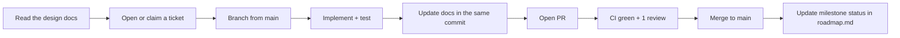

# CLAUDE.md — Engineering Handbook for PlacementIQ

> **Document type:** Engineering handbook and contributor guide
> **Status:** V1 — active
> **Owner:** Engineering
> **Last updated:** 2026-07-06

This is the handbook for anyone (human or AI) contributing to PlacementIQ. It defines how we work, not what we are building — for *what* and *why*, see the design documents.

Before you write any code, read these in order:

1. [`README.md`](README.md) — the project's public face.
2. [`docs/project.md`](docs/project.md) — scope, success metrics, and out-of-scope.
3. [`docs/architecture.md`](docs/architecture.md) — the pipeline, the components, and the boundaries.
4. [`docs/database.md`](docs/database.md) — the schema, dedup, versioning.
5. [`docs/agents.md`](docs/agents.md) — the per-component contracts.
6. [`docs/roadmap.md`](docs/roadmap.md) — what we are building next and why in that order.
7. This file — how we work.

If you only have time to read one document, read this one. If you only have time to read two, read this one and `docs/architecture.md`.

---

## Project Overview

PlacementIQ is a **data engineering + AI platform** that turns unstructured campus interview experiences into a queryable, analytics-driven intelligence layer. The chatbot is the interface; structured data is the product. The LLM is a bounded, validated component — not a reasoner.

**The non-negotiable stance:** the system is not a chatbot. Every answer is computed from a versioned structured database. The LLM is allowed to *extract* records from prose and to *render* answers from structured results. It is not allowed to *invent* facts.

Five canonical questions define the product:

1. *"What does Amazon ask most?"*
2. *"Compare Amazon vs Oracle."*
3. *"What DBMS concepts appear frequently?"*
4. *"Which companies ask System Design?"*
5. *"Which companies have the hardest Online Assessments?"*

If a feature cannot be expressed as a deterministic query against the Structured DB, it is a feature of V2 or later. V1 is a SQL-backed analytics product with a thin natural-language front-end and an inspectable confidence score.

---

## Engineering Philosophy

These principles are enforced at code review. A PR that violates one is a bug, even if it works.

1. **Design first, code second.** The design documents are the contract. If reality during implementation forces a deviation, the design documents are updated *first*, with rationale, in the same PR as the code change. A code change that diverges from the docs is a documentation bug, not a code bug.
2. **Data is the product, not the model.** If a feature can be a SQL query, it must be. The LLM is allowed to render an answer; it is not allowed to invent one.
3. **Bounded LLM use.** The LLM appears only in `Extraction`, `Validation`, `Router`, and `Answer Renderer` (see `docs/agents.md`). No other component may import an LLM SDK. A PR that adds a model call elsewhere is rejected.
4. **The boundary is physical.** A component's responsibility is enforced by the directory layout, the public interface, and the test surface — not by convention. Lint rules enforce import directions; see `Repository Structure` below.
5. **Failure is typed, not exceptional.** Every component returns either a typed success value or a typed failure value. An unexpected exception is itself a component failure.
6. **Tests are written alongside the code.** A PR without tests is incomplete. A test that requires the network or a live LLM is a smell.
7. **The system must be explainable.** Every schema choice, every pipeline stage, every component boundary has a stated rationale that an interviewer could challenge. "It just works" is not a rationale.
8. **The architecture outlives the stack.** SQLite → Postgres, Streamlit → React, single-machine → distributed workers — none of these are redesigns. The architecture is built so the next migration is a swap, not a rewrite.

---

## Development Workflow

Every change follows the same loop, regardless of size.



### Step-by-step

1. **Read the design docs** for the area you are touching. If the design doesn't cover your case, write a short design note in your PR description before writing code.
2. **Open or claim a ticket** describing the change, the milestone it belongs to, and the acceptance criteria (from `docs/roadmap.md`).
3. **Branch from `main`.** Branch names follow the convention below.
4. **Implement + test.** Code and tests in the same commits. No "I'll add tests later" commits.
5. **Update docs in the same commit** as the code that changed them. If you changed a component's contract, the change to `docs/agents.md` is part of the same PR. If you changed a table, the change to `docs/database.md` is part of the same PR.
6. **Open a PR** with: a one-paragraph summary, the milestone reference, a checklist of acceptance criteria met, and a "design implications" section (if any).
7. **CI green + at least one review** before merge. The reviewer uses the Code Review Checklist below.
8. **Merge to `main`** with a squash commit. Delete the branch.
9. **Update milestone status** in `docs/roadmap.md` if the PR closes a milestone's deliverable.

### Ticket template

A good ticket answers: *what* is changing, *why*, *which milestone*, *which acceptance criteria*. A bad ticket says "fix bug" or "add feature."

---

## Repository Structure

The directory layout *is* the architecture. Putting business logic in the wrong directory is a code-review failure.

```text
placementiq/
├── README.md
├── CLAUDE.md                              # this file
├── LICENSE
├── pyproject.toml
├── docs/
│   ├── project.md
│   ├── architecture.md
│   ├── database.md
│   ├── agents.md
│   └── roadmap.md
├── data/
│   ├── eval/                              # manual eval set (data, code, schema)
│   ├── fixtures/                          # HTML / JSON fixtures for tests
│   └── raw/                               # Raw HTML on disk (gitignored)
├── src/placementiq/
│   ├── agents/
│   │   ├── ingestion/                     # deterministic: crawler, fetcher, parser, rate_limit
│   │   │   └── adapters/                  # one SourceAdapter per source
│   │   ├── extraction/                    # LLM-bound: extractor, validator, schema, prompt
│   │   └── analytics/                     # router + renderer are LLM-bound; engine + confidence are SQL
│   │       └── templates/                 # one SQL template per canonical question
│   ├── database/                          # DB init, repositories, persistence, migrations
│   │   ├── raw_db.py
│   │   ├── structured_db.py
│   │   └── run_log.py
│   ├── models/                            # top-level shared Pydantic models — the cross-module type contract
│   ├── pipeline/                          # one orchestrator that wires the offline stages
│   ├── settings/                          # per-component settings modules (no global god-config)
│   ├── common/                            # cross-cutting utilities: hashing, time, paths, exceptions
│   ├── ui/
│   │   └── streamlit_app.py               # thin shell — no business logic
│   └── answer.py                          # public entrypoint: answer_question(q) -> RenderedAnswer
└── tests/
    ├── unit/
    ├── integration/
    ├── pipeline/                          # M2 vertical slice test
    ├── eval/                              # eval harness
    └── fixtures/
```

### Import rules (enforced by lint)

| Module | May import from | Must NOT import from |
|---|---|---|
| `agents/ingestion/*` | `database/`, `models/`, `common/`, stdlib, third-party | `agents/extraction/`, `agents/analytics/`, `ui/`, LLM SDK |
| `agents/extraction/*` | `database/`, `models/`, `common/`, stdlib, LLM SDK | `agents/ingestion/`, `agents/analytics/`, `ui/` |
| `agents/analytics/engine.py`, `agents/analytics/confidence.py` | `database/`, `models/`, `common/`, stdlib | `agents/ingestion/`, `agents/extraction/`, `ui/`, LLM SDK |
| `agents/analytics/router.py`, `agents/analytics/renderer.py` | `database/`, `models/`, `common/`, stdlib, LLM SDK (via a single named seam in `settings/`) | `agents/ingestion/`, `agents/extraction/`, `ui/` |
| `database/*` | `models/`, `common/`, stdlib, DB driver | `agents/`, `ui/` |
| `models/*` | `common/`, stdlib | `agents/`, `database/`, `ui/`, `pipeline/`, `settings/` |
| `pipeline/*` | any component, `common/`, stdlib | `ui/` |
| `settings/*` | stdlib, Pydantic | any other component (leaf modules) |
| `common/*` | stdlib | any other component |
| `ui/*` | `answer.py` only | everything else |
| `answer.py` | `agents/analytics/router.py`, `agents/analytics/engine.py`, `agents/analytics/confidence.py`, `agents/analytics/renderer.py` | `database/` directly, `agents/extraction/`, `agents/ingestion/` |

Violations are caught by a Ruff config (or equivalent) and fail CI. The config is in `pyproject.toml`; it is the contract.

---

## Coding Standards

### Language and style

- **Python 3.11+.** Use the modern type-hint syntax (`list[int]`, `X | None`).
- **PEP 8 + Black formatting** at default settings. No bikeshedding line length.
- **Ruff** for linting. The rules are: pycodestyle, pyflakes, isort, bugbear, security, and our custom import-direction rules.
- **mypy** in strict mode on `src/placementiq/database/` and `src/placementiq/agents/analytics/`. The persistence layer and the analytics engine are the safety-critical surface; they are typed to the teeth. Other modules are typed at the public-interface level.
- **Type hints on every public function.** Private helpers may use inference; public APIs do not.
- **Docstrings on every public module and class.** One-line summary; one-paragraph description; non-obvious behavior documented. `"""..."""` format, not `# ...`.
- **No comments that describe what the code does.** Comments describe *why* a non-obvious decision was made. If the code is obvious, it needs no comment. If it is not obvious, the comment explains the design choice, not the syntax.

### Naming

| Thing | Convention | Example |
|---|---|---|
| Files | `snake_case.py` | `structured_db.py` |
| Classes | `PascalCase` | `StructuredRecord` |
| Functions / methods | `snake_case` | `compute_content_hash` |
| Constants | `UPPER_SNAKE_CASE` | `MAX_FETCH_RETRIES = 3` |
| Pydantic models | `PascalCase`, no suffix | `RawExperience`, not `RawExperienceModel` |
| Tables (in SQL) | `snake_case`, plural or collective | `raw_experiences`, `pipeline_runs` |
| Public enum values | `snake_case` | `status="extraction_in_progress"` |
| Internal flags | `_leading_underscore` | `_clock` |

### Functions

- **One responsibility per function.** If the function's name requires "and," split it.
- **Side effects are explicit.** A function that writes to the DB is named `persist_*` or `write_*`; a function that reads is named `get_*` or `find_*`. No `process_*` or `handle_*` names.
- **Purity where possible.** A function that takes only inputs and returns only outputs, with no I/O, is the easiest to test. The Confidence Engine is the canonical example.
- **Early returns over nested `if`.** A function should not have four levels of indentation. If it does, extract a helper.

### Errors

- **Typed failure values, not exceptions.** A component that fails returns a typed value (`FetchFailure`, `ExtractionFailure`, etc.) that is part of its public contract.
- **Exceptions are bugs.** An unhandled exception means a contract was violated. The fix is in the component, not in a `try`/`except` wrapper.
- **No bare `except:`.** Catch the specific exception; let the rest propagate. If the catch is broad, it is a smell.
- **Errors carry context.** Every failure object has a `reason` and a `detail` (or equivalent). "Something went wrong" is not an error message.

### LLM calls

- **Structured output only.** Every LLM call uses the provider's structured-output / tool-use mode to constrain the response to a schema.
- **Versioned prompts.** The extraction prompt is loaded from a versioned file; the version is in the prompt's filename or in a manifest. No `f"Extract from {text}"` strings in code.
- **Cached by `(content_hash, prompt_version, model_version)`.** The cache is the dedup mechanism for extraction.
- **Every attempt is logged** to `extraction_attempts` with cost, tokens, latency, result.

---

## Architecture & Design Rules

These are not guidelines; they are the contract. A PR that violates one is rejected at review.

1. **Raw data is immutable.** No public API mutates or deletes a `raw_experiences` row. The only operation is idempotent insert.
2. **Structured data is append-only with versioning.** New versions are inserts. Old versions are preserved.
3. **The LLM appears only in `Extraction`, `Validation`, `Router`, and `Answer Renderer`.** No other component may import an LLM SDK. A PR that adds a model call elsewhere is rejected.
4. **No component writes raw SQL.** All reads and writes go through the Persistence Layer's typed methods.
5. **The Analytics Engine never reads the Raw DB.** It is read-only against the Structured DB, and only for `status = 'active'` records.
6. **The Confidence Engine is a pure function.** No I/O, no LLM, no hidden state.
7. **The Answer Renderer never introduces new facts.** It consumes a structured `AnalyticsResult` and may not re-query the database or introduce entities not present in the result.
8. **The UI is a thin shell.** The Streamlit app imports only `answer.py`. It does not own business logic, does not call the database, and does not call the LLM directly.
9. **Adding a new source requires only a new `SourceAdapter`.** No pipeline, schema, or analytics change.
10. **Adding a new canonical question requires a new template in the Analytics Engine and a new route in the Router.** Adding a template without a Router route is a bug.
11. **The architecture is the contract.** Design changes update `docs/architecture.md` first; the code change follows in the same PR.
12. **The Persistence Layer is the only path to the database.** Even tests go through it. Tests that need a fixture DB use the Persistence Layer's test hooks.

### How to propose an architectural change

Architectural changes are rare and treated as a separate workstream.

1. Open a PR titled `[ARCH] <one-line summary>`.
2. The PR description contains: the current state, the proposed state, the trade-offs, the migration path, and a rollback plan.
3. The PR updates the relevant design doc (`architecture.md` / `database.md` / `agents.md`) in the same commit. The doc change is the substance; the code change follows.
4. The PR requires **two** reviewers, at least one of whom is the architecture owner.
5. No "drive-by" architectural changes inside a feature PR.

---

## Database & Agent Development Guidelines

### Database work

- **Schema changes update `docs/database.md` first.** The doc is the source of truth; the migration follows.
- **Migrations are versioned and forward-only.** No "fix the schema" commits that mutate a past migration.
- **The schema-check test must pass.** A schema-drift bug between the doc and the live DB is a CI failure, not a discussion.
- **All inserts are idempotent.** A unique constraint plus `ON CONFLICT DO NOTHING` (or the equivalent in application logic) is the default.
- **The supersede-and-insert pattern is a single transaction.** Atomicity is not optional.
- **All timestamps and IDs are injected in tests.** No `datetime.now()` or `uuid.uuid4()` in the storage layer.
- **JSON columns are for opaque metadata only.** Anything queried by analytics is a real column with an index.

### Agent / component work

- **A new component requires a spec in `docs/agents.md`.** The spec is the contract; the implementation follows.
- **The LLM boundary is non-negotiable.** If your component needs to "just call the LLM once," it is the wrong shape. Either move the LLM call into a defined component (Extractor / Validator / Router / Renderer) or rethink the design.
- **The test surface mirrors the public interface.** A component's tests cover its entrypoints, its failure modes, and its side effects. A test that requires another component to be running is a smell.
- **Mock the LLM at the SDK boundary.** A "mock LLM" is a class that implements the same interface as the real SDK client. Swapping it in tests is a one-line change.
- **The extraction prompt is versioned.** A change to the prompt bumps `prompt_version` and produces a new extraction cache namespace.

---

## Documentation Standards

Documentation is part of the deliverable. A PR that changes code without updating the relevant doc is incomplete.

### What lives where

| Doc | Owns |
|---|---|
| `README.md` | Public landing page. Recruiter-/interviewer-facing. |
| `docs/project.md` | The "what" and "why" of V1. SRS, scope, success metrics. |
| `docs/architecture.md` | The "how" of the system. Pipelines, components, boundaries. |
| `docs/database.md` | The schema. Tables, columns, constraints, indexes, queries. |
| `docs/agents.md` | Per-component contracts. Responsibilities, interfaces, failure modes. |
| `docs/roadmap.md` | The execution plan. Milestones, deliverables, acceptance criteria. |
| `CLAUDE.md` | This file. How we work. |

### Doc-update rules

- **Code and doc in the same commit.** "I'll update the docs later" is a bug.
- **Mermaid diagrams when a picture is clearer than prose.** One diagram per major concept, not decorative ones.
- **Tables when they improve scannability.** Don't force a comparison into prose.
- **No marketing language in design docs.** They are internal. `README.md` is the place for tone.
- **"Why" is mandatory.** Every schema choice, every pipeline stage, every component boundary has a stated rationale. If a doc says "we use X" without saying why, the doc is incomplete.
- **Examples in code blocks, not screenshots.** Screenshots rot. Code blocks copy-paste.

### When to add a new doc

Add a new design doc when a concept does not fit any of the existing five. New docs follow the same rules: one source of truth, one owner, cross-linked from the other docs.

---

## Git Workflow & Commit Message Conventions

### Branches

| Type | Pattern | Example |
|---|---|---|
| Feature | `feat/<milestone>-<short>` | `feat/m2-single-experience` |
| Fix | `fix/<short>` | `fix/parser-empty-unicode` |
| Refactor | `refactor/<short>` | `refactor/persistence-idempotency` |
| Docs | `docs/<short>` | `docs/agents-llm-boundary` |
| Architecture | `arch/<short>` | `arch/confidence-formula-v1` |
| Chore | `chore/<short>` | `chore/bump-pydantic` |

### Commit messages

We use **Conventional Commits**. The format is:

```text
<type>(<scope>): <subject>

<body>

<footer>
```

- **Subject** is imperative mood, lowercase, no period, ≤ 72 chars. Example: `feat(extraction): cache by prompt_version`.
- **Body** explains *why*, not *what*. The diff shows what; the body explains the reasoning.
- **Footer** references the milestone or ticket: `Refs: M6`, `Closes: #142`.
- **Breaking changes** are marked with `!` after the type: `feat(storage)!: rename RawExperience.id`. The body must explain the migration path.

### Merging

- **Squash merge to `main`.** The PR title becomes the commit message subject; the PR body becomes the body.
- **No merge commits.** History is linear.
- **Delete the branch** after merge.

### Releases

- V1 is tagged as `v1.0.0`. Patch releases are `v1.0.1`, etc.
- A `CHANGELOG.md` entry is added in the same PR that bumps the version.

---

## Testing Expectations

Testing is not a phase; it is part of writing the code.

### What every PR must have

- **Unit tests for new logic.** Every new function gets at least one happy-path test and one failure-path test.
- **A test for the changed component's failure modes.** A component that returns typed failures has a test for each failure type.
- **No new raw SQL in non-database modules.** If the PR adds SQL outside `database/`, the test that catches it is the import-direction lint, and the PR is rejected.
- **No new live LLM calls in tests.** Tests use the mock LLM client. The end-to-end smoke test is the one exception, and it is not part of normal CI.

### Coverage targets

| Module | Target |
|---|---|
| `src/placementiq/database/` | ≥ 90% |
| `src/placementiq/agents/analytics/` | ≥ 90% |
| `src/placementiq/agents/extraction/` | ≥ 80% |
| `src/placementiq/agents/ingestion/` | ≥ 80% |
| `src/placementiq/ui/` | ≥ 60% (UI is mostly declarative) |
| Overall | ≥ 80% |

Coverage is a guardrail, not a goal. A PR that hits the number with shallow tests is rejected at review.

### Test categories

- **Unit** — a single component, fixture-based, no other components running.
- **Integration** — a component with the Persistence Layer, no LLM, no network.
- **Pipeline** — the M2 vertical slice, with a mock LLM. Asserts the offline loop end-to-end.
- **Eval** — the manual eval set against the live Extractor/Validator. Runs in CI; fails the build on regression.
- **Smoke** — one URL → one answer with a live LLM. Nightly + on release only.

### Determinism

- **No `datetime.now()` in production code.** The clock is injected.
- **No `uuid.uuid4()` in production code.** IDs come from a strategy.
- **No `random.random()` without a seeded RNG in tests.** The seed is in the test, not the production code.
- **Fixtures are checked in as data, not generated at test time.** A test that depends on a generated fixture is fragile.

---

## Code Review Checklist

A reviewer answers "yes" to every box below before approving. If any box is "no," the PR is not ready.

### Architecture

- [ ] Does the change respect the LLM boundary? (LLM only in `Extraction`, `Validation`, `Router`, `Renderer`.)
- [ ] Does the change go through the Persistence Layer for all storage access?
- [ ] Does the change respect the import-direction rules? (Lint passes.)
- [ ] Does the change introduce a new component? If so, is its spec in `docs/agents.md`?

### Data

- [ ] Is raw data still immutable?
- [ ] Is structured data still append-only with versioning?
- [ ] Are inserts still idempotent?
- [ ] Is the supersede-and-insert still a single transaction?
- [ ] If the schema changed, is `docs/database.md` updated in this PR?

### Code quality

- [ ] Are types on every public function?
- [ ] Are docstrings on every public module and class?
- [ ] Are failures typed, not exceptional?
- [ ] Are tests covering both happy and failure paths?
- [ ] Is coverage above the per-module target?

### Documentation

- [ ] Is the relevant design doc updated in this PR?
- [ ] Is the doc update in the same commit (or clearly cross-linked)?
- [ ] Does the doc explain *why*, not just *what*?

### Process

- [ ] Does the PR reference the milestone it belongs to?
- [ ] Does the PR's description list the acceptance criteria it satisfies?
- [ ] Are all CI checks green?

---

## Best Practices

These are the habits that make the difference between a project and a product.

### Read before you write

- **Read the relevant design doc before opening a PR.** A 20-minute read saves a 2-hour review cycle.
- **Read the diff before reviewing.** Skim the PR description for the *why*; read the code for the *what*; read the test for the *proof*.

### Small PRs

- **One logical change per PR.** If the PR description requires "and," it is two PRs.
- **Under 400 lines of diff** is a soft target. Larger PRs are reviewed in pieces.
- **Refactor before feature.** If a feature requires cleanup, the cleanup is a separate PR that ships first.

### Make it work, then make it right, then make it fast

- **Working code first.** A green test is the floor.
- **Right code second.** Once it works, refactor for clarity, type the public interface, add docstrings.
- **Fast code only if measured.** Profile before optimizing. The Confidence Engine is the only place we expect to optimize in V1.

### Defensive programming, not paranoid programming

- **Validate inputs at the boundary.** A function that takes user input validates it; a function that takes internal data trusts it.
- **Use Pydantic for boundaries, not for paranoia.** A Pydantic model on the public API is a contract. A Pydantic model on a private helper is noise.
- **Log at the boundary, not at every function.** A component logs its entry and exit; it does not log every internal call.

### Use the tools

- **The linter is the law.** If Ruff complains, fix the code, do not silence the rule.
- **mypy is the type system.** A `type: ignore` is allowed only with a one-line comment explaining why. A PR that adds three or more is rejected.
- **The pre-commit hook is your friend.** Run it locally before pushing. CI is the slow loop.

### Document trade-offs

- **Every non-obvious decision has a comment** explaining the trade-off and the alternatives considered.
- **Every architectural decision has a doc update.** The doc explains the trade-off, the alternatives, and the rationale for the chosen path.
- **Every "we'll do this later" has a ticket.** A TODO without a ticket is a forgotten TODO.

---

## Guidelines for Claude Code

This section is for AI coding sessions. The rules here are the ones most often violated by capable assistants, and the most expensive to fix after the fact.

### Before writing code

- **Read the design docs.** Run `ls docs/` and read at least `project.md`, `architecture.md`, and `agents.md` before touching any file.
- **Find the milestone.** Open `docs/roadmap.md` and locate the milestone the work belongs to. The acceptance criteria there are the contract.
- **Check the existing tests.** Run the test suite to know the baseline. A new failure after your change is a regression, not a feature.
- **Read the relevant existing code** before extending it. Do not duplicate; do not contradict.

### When writing code

- **Match the existing style.** If the file uses 2-space indents, do not introduce 4. If the file uses `X | None`, do not introduce `Optional[X]`. The code is consistent with itself before it is consistent with any external style guide.
- **Write the test first when the logic is non-trivial.** A failing test, then the code that makes it pass, then a refactor. This is the discipline that keeps tests honest.
- **Do not bypass the Persistence Layer.** If you find yourself writing raw SQL in a non-storage module, stop and import the right function instead.
- **Do not import an LLM SDK outside the four named components.** If your change needs an LLM call, it belongs in `Extraction`, `Validation`, `Router`, or `Renderer`. If you think it doesn't, write a one-paragraph justification in the PR description before writing the code.
- **Type the public interface.** A function that returns `Any` is a bug. The Confidence Engine and the Persistence Layer are typed to the teeth; everything else is typed at the public API.

### When writing documentation

- **The doc is part of the change.** A code change without the corresponding doc update is incomplete. The reviewer will reject it.
- **Explain why, not what.** "We use SHA-256 because it is deterministic, stdlib, and not collision-prone for our input size" is a rationale. "We use SHA-256" is not.
- **Update the doc that owns the concept.** Don't add a paragraph about the schema to `architecture.md`; add it to `database.md` and link from `architecture.md`.

### When proposing changes

- **State the trade-off.** A change that has no trade-off is suspicious. The honest version is "we considered A, B, and C; we picked B because..."
- **State the impact.** Which components change? Which tests need to be added? Which doc needs to be updated? Which milestone does this belong to?
- **State the rollback plan.** If the change ships and breaks something, how do we revert without breaking more?

### What to never do

- **Never rewrite working code** because the new version is "cleaner." Refactor small and incremental. A 500-line diff is a code-review red flag.
- **Never add a feature that bypasses the LLM boundary.** This includes "just call the LLM once here" and "this is a one-off." It is not.
- **Never merge a PR that fails CI.** The CI is the safety net. Bypassing it is bypassing the contract.
- **Never change the schema without updating `docs/database.md`.** The doc is the source of truth.
- **Never commit secrets, raw HTML from production, or eval labels that contain PII.** Pre-commit hooks catch this; respect them.
- **Never assume a test passes because no error was raised.** A test that does not assert anything is not a test.

### Working in this codebase

- **The directory layout is the architecture.** Putting a fetcher in `agents/analytics/` or a SQL query in `ui/` is a code-review failure.
- **The Persistence Layer is the only DB entry point.** Even in tests, even in scripts.
- **The five canonical questions are the spec.** If a feature does not serve at least one of them, it is V2.
- **The eval set is the contract.** The LLM's quality is measured against it. If you change the extraction schema, the eval set must be re-labeled to match.

---

## Things to Avoid

A non-exhaustive list of patterns that look reasonable and are wrong in this codebase.

| Anti-pattern | Why it's wrong | What to do instead |
|---|---|---|
| Calling the LLM from the Analytics Engine | Breaks the "not a chatbot" contract. | Compute the answer with SQL; let the Renderer produce prose. |
| Reading the Raw DB from the Analytics Engine | Violates the data-layer contract; analytics is on the Structured DB. | If a question needs raw text, it is a V2 retrieval feature, not a V1 analytics feature. |
| Free-form company names from the LLM | Breaks the controlled vocabulary; makes "Amazon" vs "Amazon.com" vs "AWS" three different rows. | Constrain the LLM to `companies.canonical_name`; add the alias to `company_aliases`. |
| Free-form topic names from the LLM | Breaks the controlled vocabulary; makes topic aggregation meaningless. | Constrain the LLM to existing topic IDs; grow the vocabulary from the eval set, not from the LLM. |
| Storing raw HTML in the database | Bloats the DB; couples the storage layer to the source format. | Store raw HTML on the filesystem; store metadata in `raw_experiences`. |
| Storing mutable raw records | Breaks immutability; breaks dedup; breaks the eval harness. | Raw records are write-once. Re-extraction creates new structured versions. |
| Using a global config object | Makes tests non-deterministic; makes the import graph tangled. | Inject config (clock, ID generator, model name) at the call site. |
| "Quick fix" LLM prompts in code | Prompts are versioned contracts, not strings. | Put the prompt in `agents/extraction/prompt.py` with a `prompt_version`; load it from there. |
| Catching all exceptions with `except Exception` | Hides real bugs. | Catch the specific exception. Let the rest propagate. |
| Returning `Optional[X]` when a typed failure exists | Loses the failure reason; forces callers to None-check. | Return `X \| TypedFailure`. |
| Optimizing before measuring | Adds complexity for unmeasured gain. | Profile first. The only V1 bottleneck we expect is the LLM call, and that is bounded by cost, not by code. |
| Adding a vector DB "for search" | Risks the chatbot regression; SQL is enough for V1. | Add embeddings as a V1.1+ secondary path, with the same boundary discipline. |
| Adding auth / user accounts | V1 has no auth surface; this is feature creep. | V2. |
| Reading source code in the Renderer | Breaks the "LLM is a renderer, not a reasoner" rule. | The Renderer consumes `AnalyticsResult`. Period. |
| A PR that mixes refactor and feature | Hard to review; hard to revert. | One PR per logical change. Refactor first if needed. |
| "Just" or "for now" in a code comment | "Just" never is; "for now" never goes away. | Either do it right or open a ticket. |
| A `*` select in analytics SQL | Wastes I/O; breaks the contract that analytics returns typed columns. | Name the columns explicitly. |
| A `Raw SQL` query in a non-storage module | Bypasses the Persistence Layer; breaks the schema-drift test. | Add a typed method to the Persistence Layer. |
| Bypassing CI with `--no-verify` or force-pushes to `main` | The CI is the safety net. | Fix the CI failure. If the failure is wrong, fix the CI. |

---

## Definition of Done for Every Feature

A feature is *done* when **all** of the following are true. No exceptions.

| # | Criterion | Check |
|---|---|---|
| F1 | The feature is in scope for the current milestone (see `docs/roadmap.md`). | ☐ |
| F2 | The design is in the relevant design doc. (If not, the design is part of this PR.) | ☐ |
| F3 | The code is in the right module per the import rules. | ☐ |
| F4 | The LLM boundary is respected. (LLM only in the four named components.) | ☐ |
| F5 | The Persistence Layer is the only DB entry point used. | ☐ |
| F6 | Public functions are typed and have docstrings. | ☐ |
| F7 | Tests cover happy and failure paths; coverage meets the per-module target. | ☐ |
| F8 | The relevant design doc is updated in the same PR. | ☐ |
| F9 | The PR description references the milestone and lists the acceptance criteria met. | ☐ |
| F10 | CI is green: tests, lint, types, schema-check, eval. | ☐ |
| F11 | At least one reviewer has approved via the Code Review Checklist. | ☐ |
| F12 | The milestone status in `docs/roadmap.md` is updated if the PR closes a deliverable. | ☐ |

If any box is unchecked, the feature is not done. "I'll fix it in a follow-up" is a ticket, not a Definition of Done.

---

*End of document. For what we're building, see `docs/project.md`. For how it's built, see `docs/architecture.md`. For the schema, see `docs/database.md`. For the components, see `docs/agents.md`. For the plan, see `docs/roadmap.md`.*
