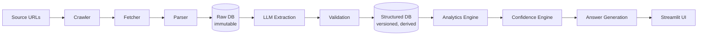
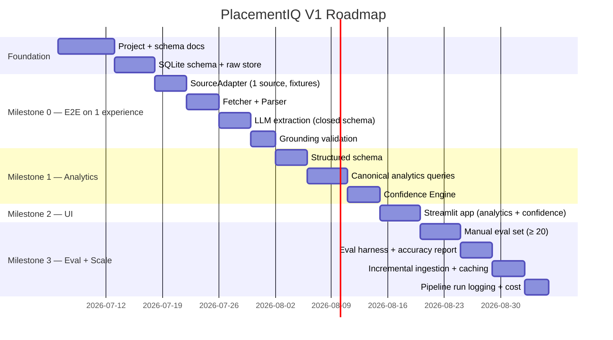

<div align="center">

# PlacementIQ

### *Placement intelligence, derived from real interview data — not from a language model.*

</div>

<br>

<div align="center">

[](#development-status)
[](#technology-stack)
[-003B57?style=flat-square&logo=sqlite&logoColor=white)](#technology-stack)
[](#technology-stack)
[](#license)
[](docs/project.md)

</div>

---

## 🚧 Active Development — Version 1

> This project is **under active development**. The V1 architecture is frozen in [`docs/project.md`](docs/project.md), and the team is building the foundation (schema, end-to-end pipeline on a single experience) before scaling. Public installation, demo, and screenshots will be available once **Milestone 0** is green.

---

## 📖 Overview

**PlacementIQ** is a data engineering + AI platform that turns hundreds of unstructured campus interview experiences into a queryable, analytics-driven intelligence layer. Students ask questions like *"What does Amazon ask most?"* or *"Compare Amazon vs Oracle"* and receive answers that are **cited, versioned, and traceable back to the source experiences** they came from.

The chatbot is the interface. The product is the data. The intelligence comes from a deterministic pipeline — **not from a language model's prior**.

> 🎥 **Demo & 📸 Screenshots:** *Coming with Milestone 2. See [Current Progress](#-current-progress) below.*

---

## 📌 Table of Contents

1. [Why PlacementIQ?](#-why-placementiq)
2. [The Problem](#-the-problem)
3. [Our Solution](#-our-solution)
4. [Key Features](#-key-features)
5. [Engineering Philosophy](#-engineering-philosophy)
6. [High-Level Architecture](#-high-level-architecture)
7. [Technology Stack](#-technology-stack)
8. [Project Structure](#-project-structure)
9. [Current Progress](#-current-progress)
10. [Development Status](#-development-status)
11. [Skills Demonstrated](#-skills-demonstrated)
12. [Getting Started](#-getting-started)
13. [Roadmap](#-roadmap)
14. [Future Improvements](#-future-improvements)
15. [Contributing](#-contributing)
16. [License](#-license)
17. [Long-Term Vision](#-long-term-vision)

---

## 💡 Why PlacementIQ?

Most "AI interview prep" tools are chatbots that answer from a language model's prior. They look right, but they cannot be cited, cannot be reproduced, and cannot be trusted.

PlacementIQ takes a different stance:

| | Typical chatbot | PlacementIQ |
|---|---|---|
| **Source of answers** | LLM prior | Structured DB derived from real interview experiences |
| **Provenance** | None | Every claim links to the source experience it came from |
| **Comparison queries** | Paraphrased prose | Real distributions across companies, topics, and rounds |
| **Confidence** | "Trust me" | Inspectable score with named components |
| **Reproducibility** | None | Same raw input → same structured output |

The LLM is used in **exactly one place**: turning public interview prose into typed records. After that, the system reasons with SQL.

---

## ❗ The Problem

Students preparing for campus placements repeat the same manual workflow for every target company:

- Read dozens of interview experience write-ups across blogs, forums, and internal groups.
- Mentally tally which topics appeared, which rounds were hardest, which questions were repeated.
- Re-do the analysis from scratch for the next company.
- Try to remember which questions came from which source and how recent they were.

This workflow is **repetitive, error-prone, non-scalable, and non-shareable**.

The data already exists. The barrier is **information extraction at scale** — heterogeneous sources, ambiguous vocabulary, and a trust deficit that no naive chatbot can fix.

---

## ✅ Our Solution

A **data pipeline + analytics engine** that:

1. **Crawls** a defined, allowlisted set of public sources via pluggable adapters.
2. **Fetches and parses** raw HTML into normalized text, with full attribution.
3. **Stores** raw data immutably, deduplicated by content hash.
4. **Extracts** structured fields (company, role, topics, rounds, questions, difficulty, outcome) using an LLM constrained to a closed JSON schema.
5. **Validates** every extracted field against the source text — ungrounded fields are rejected, not silently stored.
6. **Stores** structured data in a versioned, derived database.
7. **Answers** student questions as deterministic SQL queries against that database.
8. **Scores confidence** from measurable factors: sample size, grounding rate, source diversity, recency, and extraction quality.
9. **Renders** a cited, natural-language answer through a Streamlit UI.

The chatbot is the thinnest layer in the system. Everything underneath it is reproducible, auditable, and engineered.

---

## ⭐ Key Features

- 🔍 **Queryable analytics** — *"What does Amazon ask most?"* and *"Compare Amazon vs Oracle"* are real queries, not generated prose.
- 🔗 **Full provenance** — every answer links back to the experience(s) that produced it.
- 🧮 **Inspectable confidence** — the score and its components are visible to the user.
- 🧊 **Immutable raw data** — once written, never modified. Re-extraction creates new versions, never rewrites history.
- 🔁 **Incremental ingestion** — only new content is processed on subsequent runs.
- 🧱 **Closed-schema LLM extraction** — the model produces JSON against a fixed schema; topic and company values are constrained to a controlled vocabulary.
- ✅ **Grounding validation** — a second pass verifies each extracted field against the source text.
- 🧩 **Pluggable source adapters** — adding a new source is one new file; the pipeline does not change.
- 🧪 **Testable in isolation** — every pipeline stage has fixture-based tests that do not require the network or the LLM.

> Full rationale for each design decision lives in [`docs/project.md`](docs/project.md).

---

## 🧭 Engineering Philosophy

This project is **design-first**. Before any code is written, the architecture, schema, and contract are specified and frozen in documentation. The documentation is not commentary on the code — **the documentation is the source of truth, and the code implements it.**

Five principles guide every decision:

1. **Data is the product, not the model.** If a feature can be a SQL query against the structured DB, it must be. The LLM is allowed to render an answer, never to invent one.
2. **The LLM is a bounded, validated component.** It is invoked only at the Extraction stage, against a closed schema, with a deterministic verifier. Its output is treated as a candidate until verified.
3. **Raw data is sacred.** Once a raw record is written, it is not modified. Re-extraction writes a new version of the structured record; it never rewrites raw.
4. **Idempotency is not optional.** Every stage must be safe to re-run on the same input. Dedup is implemented via SHA-256 of normalized text. Caching is the default.
5. **Build the loop before the scale.** Milestone 0 is one experience, end-to-end, on a single machine. We do not parallelize or distribute what does not yet work.

This discipline is what makes the system **interview-defensible**: every schema choice, every pipeline stage, every component boundary has a stated rationale and can withstand a Staff-level review.

---

## 🏗 High-Level Architecture



The boundary is **load-bearing**: the LLM touches data **only after** it has been fetched, parsed, and stored as raw text. Everything above the LLM is deterministic. Everything below it is derived, validated, and versioned.

This is what makes the system *not a chatbot*. The chatbot is the last box on the right.

---

## 🛠 Technology Stack

| Layer | Choice | Rationale |
|---|---|---|
| Language | Python 3.11+ | Data + AI ecosystem; mature tooling across the stack |
| HTTP | httpx | Async-native, typed, modern |
| HTML parsing | BeautifulSoup4 + selectolax | Tolerant on real-world markup; C-backed throughput |
| LLM | Anthropic Claude (official SDK) | Strong structured output, cost-efficient for extraction |
| Schema | Pydantic v2 | Type-safe models that double as JSON schemas |
| Storage | SQLite (V1) → Postgres-portable | Single-file V1, designed for painless migration |
| UI | Streamlit (decoupled from analytics) | Fast V1 iteration; analytics layer replaceable |
| Testing | pytest | Standard, fixture-friendly |
| Types / lint | mypy, ruff, black | Strict at the core, fast, opinionated |

The schema, dedup mechanism, and pipeline are written portably so the storage layer is a one-line swap, not a redesign.

---

## 📁 Project Structure

```text
placementiq/
├── README.md              # Project landing page (this file)
├── docs/                  # Design-first documentation
│   ├── project.md         # SRS + product design (the single source of truth)
│   ├── database.md        # Schema, dedup, versioned records       (in progress)
│   ├── architecture.md    # Module boundaries and runtime         (in progress)
│   ├── agents.md          # LLM extraction, schema, verifier      (in progress)
│   ├── roadmap.md         # Milestone breakdown                   (in progress)
│   └── CLAUDE.md          # Contributor onboarding                (in progress)
├── src/                   # Source code (follows Milestone 0)
│   └── placementiq/
│       ├── ingestion/     # Crawler, Fetcher, Parser, SourceAdapter
│       ├── extraction/    # LLM extraction, validation
│       ├── analytics/     # Analytics engine + Confidence Engine
│       └── ui/            # Streamlit app
└── tests/                 # Test suite (follows Milestone 0)
```

> The doc tree is not decoration — it is the design. The architecture is frozen in `project.md`; the schema is the contract in `database.md`; the code implements both.

---

## 📊 Current Progress

| Milestone | Focus | Status | Notes |
|---|---|---|---|
| **Foundation** | Project + schema docs, SQLite raw store | ✅ Done / ⏳ In progress | `project.md` shipped; `database.md` next |
| **M0 — E2E on 1 experience** | SourceAdapter, Fetcher, Parser, LLM extraction, grounding | ⏳ In progress | First deployable artifact |
| **M1 — Analytics + Confidence** | Structured schema, canonical queries, confidence formula | 🔜 Next | |
| **M2 — UI** | Streamlit app with source attribution + confidence panel | 📋 Planned | Demo & Screenshots land here |
| **M3 — Eval + Scale** | Manual eval set, accuracy report, incremental ingestion | 📋 Planned | |

**Live demo and screenshots are intentionally deferred** until the UI milestone. Architecture, schema, and pipeline-stage tests will be demonstrated through fixtures and CLI output from Milestone 0 onward.

---

## 🚧 Development Status

> **V1 is under active development.**



The first deployable artifact is **a working end-to-end loop on a single experience**, not a half-built crawler. If Milestone 0 is not green, nothing else ships.

---

## 🧠 Skills Demonstrated

This project is built to exercise and demonstrate concrete engineering competencies:

- **Data engineering** — schema design, content-hash deduplication, immutable raw store, versioned derived records, pipeline run observability.
- **Information extraction** — closed-schema LLM extraction, controlled vocabularies, grounding verification.
- **Analytics engineering** — deterministic SQL queries against a structured store, five canonical question types.
- **AI orchestration** — bounded LLM use, caching, cost discipline, verifier-driven validation.
- **Software design** — separation of concerns (UI decoupled from analytics), pluggable adapters, versioned data, fixture-based testability.
- **Engineering judgment** — explicit trade-offs, documented at the time they are made; the architecture is a constraint, not a suggestion.

---

## 🚀 Getting Started

> ⚠️ Installation, demo, and screenshots will be available once **Milestone 0** lands.

**Planned quickstart (V1):**

```bash
# Clone
git clone https://github.com/<org>/placementiq.git
cd placementiq

# Install
python -m venv .venv
source .venv/bin/activate
pip install -e .

# Run the offline pipeline on a single experience
placementiq ingest --source <adapter> --url <url>

# Launch the UI
streamlit run src/placementiq/ui/app.py
```

**Recommended reading order for evaluators** (recruiters, interviewers, contributors):

1. [`README.md`](README.md) — *what* and *why*
2. [`docs/project.md`](docs/project.md) — the SRS, the design rationale, the success metrics
3. `docs/database.md` — the schema (next to be written)
4. `docs/architecture.md` — the module boundaries

---

## 🗺 Roadmap

The full V1 roadmap is shown in the [Development Status](#-development-status) section above. In short:

- **Milestone 0** — one experience, end-to-end, on a single machine.
- **Milestone 1** — Analytics + Confidence Engine on the five canonical questions.
- **Milestone 2** — Streamlit UI with source attribution + confidence panel.
- **Milestone 3** — Eval harness, accuracy report, incremental ingestion hardening.

---

## 🔭 Future Improvements

These are **out of scope for V1** by design, but the architecture is built to absorb them without rewrites:

- **Postgres migration** when corpus size or concurrency demands it. Schema is written portably.
- **FastAPI + React frontend** replacing Streamlit. The analytics layer is already decoupled from the UI.
- **Additional source adapters** (Reddit, college internal portals, user uploads).
- **Cross-source entity resolution** beyond content-hash dedup.
- **Hierarchical topic taxonomy** with semi-curated expansion.
- **Embedding-based semantic search** as a *secondary* retrieval path, never replacing SQL analytics.
- **User accounts, saved queries, and query history.**
- **Public API for partner colleges.**

---

## 🤝 Contributing

PlacementIQ is a V1 build with a deliberately small surface area. The full engineering principles and contribution conventions live in [`docs/CLAUDE.md`](docs/CLAUDE.md) (in progress).

The short version:

1. **Data is the product.** If a feature can be a SQL query against the structured DB, it must be.
2. **The LLM is a bounded, validated component.** It extracts. It does not reason.
3. **Build the loop before the scale.** Milestone 0 is one experience, end-to-end.
4. **Every component is independently testable.** Tests use fixtures, not the network or the LLM.

If you want to contribute, the highest-leverage areas right now are: implementing a `SourceAdapter` for a new source, expanding the manual eval set, and contributing to the topic taxonomy. Open an issue before opening a PR.

---

## 📄 License

TBD. See [`LICENSE`](LICENSE) once the license is selected.

---

## 🌱 Long-Term Vision

PlacementIQ is a small, focused instance of a general idea: **derive intelligence from data, not from model priors.** The same architecture — deterministic ingestion, grounded extraction, versioned structured data, inspectable confidence, and a thin natural-language interface on top — applies to any domain where public, unstructured experiences need to become queryable, trustworthy analytics.

The V1 product is placement intelligence. The long-term direction is a **reusable, well-engineered pattern for turning prose into trustworthy structured data, with a confidence score that humans can act on.**

---

<div align="center">

*PlacementIQ — Data Engineering + AI + Analytics. Not a chatbot.*

</div>
