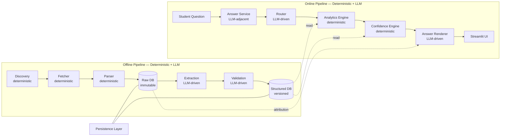
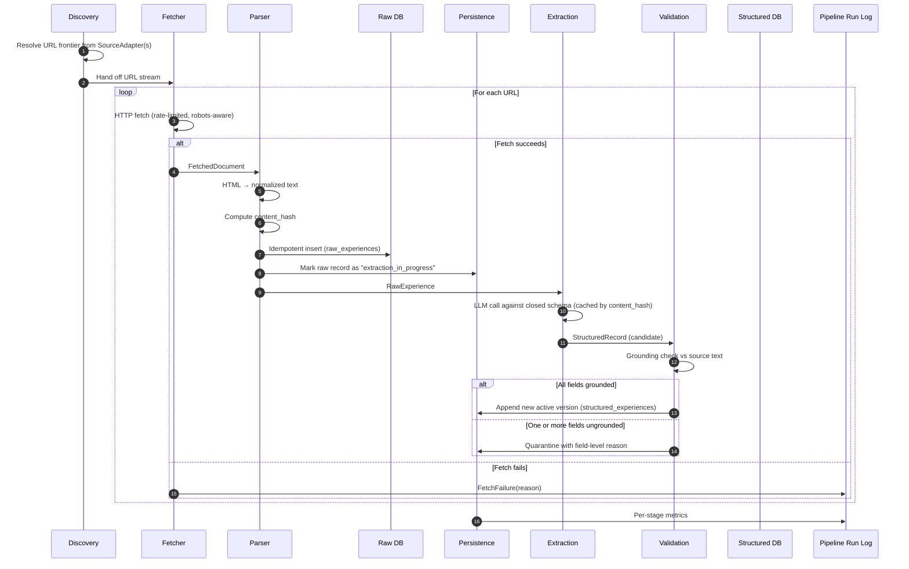
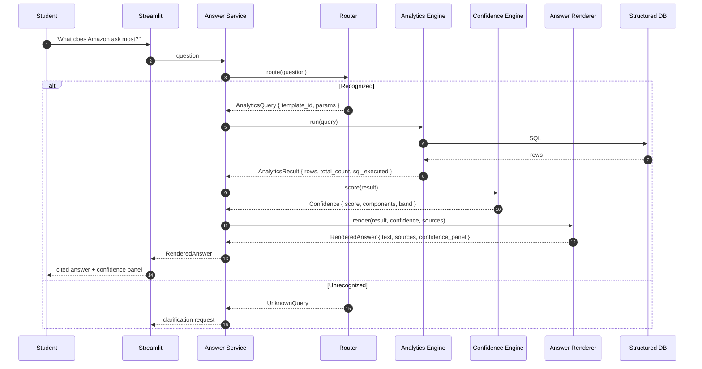

# PlacementIQ — Agent & Component Specification

> **Document type:** Per-component contract (responsibility, interface, behavior)
> **Status:** V1 — frozen, pending Milestone 0
> **Owner:** Engineering
> **Last updated:** 2026-07-06

This document defines **what every component in PlacementIQ is responsible for, what it must not do, and how it behaves under failure**. It is the per-component companion to [`docs/architecture.md`](architecture.md) and is read alongside [`docs/database.md`](database.md).

Two important terminological notes:

- **"Agent" in this document means "named component with a single responsibility, an interface contract, and an independent test surface."** It is *not* a claim that every component uses an LLM. The LLM-driven components are explicitly called out as such.
- **The Discovery and Fetcher components are not LLM-driven in V1.** Earlier versions of the brief called them "agents" because they were imagined as LLM-controlled. The frozen V1 architecture made them deterministic. They are documented here under their original names to preserve traceability with `project.md` and `architecture.md`, but their implementation is rule-based and tested without any model.

For the pipeline as a whole, see [`docs/architecture.md`](architecture.md). For the storage layer they read and write, see [`docs/database.md`](database.md). For the system goals and rationale, see [`docs/project.md`](project.md).

---

## Agent Design Principles

The principles below are enforced at code review. A component that violates one is a bug, even if it works.

1. **Single responsibility.** Each component does one thing. If a component's description requires the word "and," it is two components.
2. **Bounded LLM use.** The LLM is invoked only inside the components explicitly named as LLM-driven (Extraction, Validation, Answer). Every other component is deterministic and tested without a model.
3. **No cross-component state.** Components communicate only through the typed contracts specified in this document. No module-level globals, no shared mutable caches, no implicit ordering assumptions.
4. **Failure is a typed value, not a crash.** Every component returns either a typed success value or a typed failure value. An unexpected exception is itself a failure of the component, not the system.
5. **Idempotency is a property of the component, not the run.** Calling a component's entrypoint twice with the same input is safe and inexpensive. Components that cannot meet this are explicitly documented.
6. **Test surface mirrors the public interface.** A component's tests cover its entrypoints, its failure modes, and its side effects. A test that requires the network, the LLM, or another component is a smell — the component is leaking a dependency.
7. **The pipeline does not know what the LLM is doing inside a component.** The Extractor, the Validator, and the Answer Renderer each have a model. The pipeline sees only typed inputs and typed outputs. This is what makes them swappable.
8. **Determinism is the default; LLM is the exception.** If a behavior can be implemented as a pure function, a SQL query, or a state machine, it must be. LLM calls are reserved for the three jobs that genuinely need them.

---

## Overall Agent Architecture

The full pipeline has ten named components. Five are LLM-driven or LLM-adjacent; five are purely deterministic.

Two physical things to internalize:

- **The LLM appears in exactly three offline/online boxes**: `Extraction`, `Validation`, and `Answer Renderer`. The Router is LLM-adjacent because it is a small classifier (V1 uses an LLM with structured output; a classifier or rules engine is a drop-in replacement).
- **The Persistence Layer is not a component in the pipeline.** It is the storage contract that every other component signs against. No component writes raw SQL; every component goes through the Persistence Layer's typed interface. The Persistence Layer is what makes the schema portable, the tests deterministic, and the migration to Postgres mechanical.

---

## Agent Communication Flow

There are two flows to internalize: the **offline** flow, which turns a published experience into a structured record, and the **online** flow, which turns a question into a cited answer.

### Offline flow

**Two invariants of this flow:**

1. **A single failed item never blocks the run.** Every component returns typed failures; the orchestrator records them and moves on.
2. **The LLM is called only after the raw record is in the Raw DB.** This is the boundary that makes the LLM a controlled dependency, not a free-floating one.

### Online flow

**Two invariants of this flow:**

1. **The LLM is never the source of a fact.** The Renderer consumes a structured `AnalyticsResult`; it may use an LLM to produce fluent prose, but it cannot introduce new facts or re-query the database.
2. **The online pipeline has no back-channel to the offline pipeline.** If the corpus is stale, the Confidence Engine surfaces that as a low recency component. The system degrades honestly.

---

## Individual Component Specifications

Every component is specified by the same ten fields. This is the contract. Code review enforces it; tests assert against it; future contributors do not get to redefine the boundaries quietly.

---

### Discovery

| Field | Value |
|---|---|
| **Type** | Deterministic (rule-based) |
| **LLM** | None |

**Purpose.** Produce a deterministic, de-duplicated URL frontier for one or more allowlisted sources.

**Responsibilities.**
- Maintain the registry of `SourceAdapter` instances.
- Invoke each adapter to obtain its URL list (with pagination, if applicable).
- Normalize URLs (strip tracking parameters, enforce canonical form).
- Deduplicate URLs within a single run (in-memory set).
- Hand the de-duplicated stream to the Fetcher.

**Non-Responsibilities.**
- Does not perform HTTP fetches. The Fetcher owns the wire.
- Does not parse pages. The Parser owns the page.
- Does not decide *whether* a source is allowed. That is a configuration concern, set upstream when the `SourceAdapter` is registered.
- Does not retry on failure. The Fetcher is the retry boundary.

**Inputs.** A list of `SourceAdapter` instances, plus run configuration (which sources to crawl, the page range per source).

**Outputs.** A stream of `URLFrontierItem { url, source_id, adapter_metadata }`.

**Dependencies.** `SourceAdapter` registry. No HTTP client, no parser, no LLM.

**Failure Handling.**
- If an adapter raises a `SourceLayoutError`, the run logs the error and the affected URLs are skipped. Other adapters are unaffected.
- If an adapter returns an empty URL list, the run logs a warning and continues. Empty sources are not errors.
- The Discovery component itself does not raise on per-source failure.

**Logging & Monitoring.**
- Per-adapter URL counts (discovered, deduplicated, handed off).
- Per-adapter duration.
- Any `SourceLayoutError` with adapter name and reason.

**Testing Strategy.**
- Fixture-based: each adapter is tested against a recorded HTML list page. No network.
- Pure-function test: given a list of fixture adapters, the output URL stream is asserted exactly.
- Failure-mode test: an adapter that raises a layout error does not fail the run.

**Future Improvements.**
- V1.1: cross-run URL dedup via a persistent frontier (avoids re-scanning the same list pages on every run).
- V2: a small heuristic to estimate "freshness" of a source so high-value sources are crawled more often.

---

### Fetcher

| Field | Value |
|---|---|
| **Type** | Deterministic (HTTP client) |
| **LLM** | None |

**Purpose.** Retrieve raw HTTP responses with rate limiting, `robots.txt` compliance, and a fetch cache.

**Responsibilities.**
- HTTP transport (DNS, TLS, connection pooling).
- Rate limiting per source (token bucket or equivalent, configured from `sources.rate_limit_rps`).
- `robots.txt` resolution and compliance.
- Per-URL fetch cache: same URL on the same machine returns the cached response within the cache TTL.
- Retry with exponential backoff for transient errors (5xx, timeout, connection reset). Max 3 attempts.

**Non-Responsibilities.**
- Does not parse HTML. The Parser owns the page.
- Does not deduplicate by content. The Parser's content hash is the canonical dedup key.
- Does not retry on 4xx (other than 429) or on `robots.txt` disallow. Those are hard fails.
- Does not decide what is a "valid" interview experience. That is the Parser's job.

**Inputs.** A `URLFrontierItem`.

**Outputs.** `FetchedDocument { url, status_code, headers, raw_bytes, fetched_at, attribution }` or `FetchFailure { url, reason, attempts }`.

**Dependencies.** HTTP client (e.g., httpx), `robots.txt` parser, local fetch cache.

**Failure Handling.**
- **Network errors** (timeout, connection reset, DNS failure): retry with backoff up to 3 attempts. Persistent failure → `FetchFailure(reason="network")`.
- **5xx**: same as network.
- **4xx** (except 429): no retry, hard fail with `FetchFailure(reason="http_4xx", status)`.
- **429**: respect the `Retry-After` header; one retry.
- **`robots.txt` disallow**: no retry, `FetchFailure(reason="robots_disallowed")`.
- The Fetcher never crashes the run. A failed URL is one item in the run log.

**Logging & Monitoring.**
- URL, status code, latency, bytes, retry count, cache hit/miss, failure reason.
- Aggregated: total fetches, total failures by reason, total bytes downloaded, total wall-clock.

**Testing Strategy.**
- The HTTP client is mocked at the transport layer (no real network).
- `robots.txt` parser is tested with fixture robots files.
- Retry behavior is tested by injecting a transport that fails N times then succeeds.
- Rate limiting is tested by clock injection and a stub time source.

**Future Improvements.**
- V2: per-host adaptive rate limiting (slower if the source is returning 429s).
- V2: per-source header injection (e.g., User-Agent policy) driven by `sources.policy_notes`.

---

### Parser

| Field | Value |
|---|---|
| **Type** | Deterministic (rule-based) |
| **LLM** | None |

**Purpose.** Normalize a `FetchedDocument` into a `RawExperience` and persist it immutably.

**Responsibilities.**
- HTML → text normalization (whitespace, scripts, styles, nav, footers, comments removed).
- Source-specific selector logic (delegated to the `SourceAdapter`'s `extract_experience` method, not the Parser core).
- SHA-256 computation of normalized text (`content_hash`).
- Idempotent insert into `raw_experiences`. A second insert of the same content returns the existing row.
- Parser version stamping on the record.

**Non-Responsibilities.**
- Does not validate that the content is *about* an interview. A page that is not an interview experience still gets stored as a raw record; the Extractor will fail to extract anything from it, and that failure is recorded downstream.
- Does not call the LLM. The Parser is a pure HTML-to-text transform plus a hash.
- Does not deduplicate URLs. The Fetcher already does that within a run; the Parser deduplicates by content across runs.

**Inputs.** A `FetchedDocument` that the Fetcher has already accepted.

**Outputs.** A `RawExperience` row in the Raw DB (idempotent), and the `id` of the row.

**Dependencies.** HTML parser, hashlib, Persistence Layer (for the raw insert).

**Failure Handling.**
- **Empty document after normalization**: no insert, `ParseFailure(reason="empty")`.
- **Normalization exception**: no insert, `ParseFailure(reason="exception", trace)`.
- **Persistence error**: surfaced to the orchestrator. The Parser does not silently swallow storage errors.

**Logging & Monitoring.**
- URL, content hash, byte length, parser version, success/failure reason.
- Aggregated: total parses, total failures by reason, mean byte length.

**Testing Strategy.**
- Fixture-based: each `SourceAdapter` has a fixture HTML file. Parsing the fixture produces a known `RawExperience`.
- Idempotency test: parsing the same content twice returns the same `id` and does not duplicate the row.
- Failure test: an HTML file that normalizes to empty produces `ParseFailure` and no row.

**Future Improvements.**
- V1.1: a "v2" parser can be shipped by bumping `parser_version`; old raw records carry their `parser_version` so re-parsing is targeted.

---

### Persistence Layer

| Field | Value |
|---|---|
| **Type** | Deterministic (storage abstraction) |
| **LLM** | None |

**Purpose.** Be the only path through which any component reads or writes persistent storage.

**Responsibilities.**
- Provide typed methods for every table in `docs/database.md`.
- Enforce schema invariants at the boundary (immutability of `raw_experiences`, append-only versioning of `structured_experiences`, `status = 'active'` for analytics).
- Manage transactions (the supersede-and-insert pattern is one transaction).
- Inject deterministic IDs and timestamps in tests; use real ones in production.
- Abstract over the storage backend so SQLite (V1) and Postgres (V2) are interchangeable to the rest of the system.

**Non-Responsibilities.**
- Does not contain business logic. The Persistence Layer does not know what an "interview" is. It knows tables, columns, and constraints.
- Does not call the LLM. The LLM is upstream; the Persistence Layer only persists what the Extractor and Validator produce.
- Does not perform analytics. Analytics is a separate component that calls the Persistence Layer in read-only mode.

**Inputs.** Typed request objects (e.g., `InsertRawExperienceRequest { ... }`, `InsertStructuredExperienceRequest { ... }`).

**Outputs.** Typed response objects (e.g., `RawExperience`, `StructuredExperience`, `Success` / `StorageError`).

**Dependencies.** Storage driver (SQLite in V1, Postgres in V2), Pydantic models shared with the rest of the system.

**Failure Handling.**
- **Unique constraint violation on insert**: returns the existing row (idempotent insert).
- **Foreign key violation**: returns `StorageError(reason="fk_violation", detail)`. This indicates a bug upstream.
- **Transaction rollback on supersede-and-insert failure**: the prior `active` row remains `active`; the new row is not inserted.

**Logging & Monitoring.**
- Per-call duration (slow-query log).
- Transaction counts, rollback counts.
- Storage layer errors grouped by reason.

**Testing Strategy.**
- Fixture database per test, in-memory or temp file, with the schema applied.
- Transaction rollback test: a forced error mid-supersede leaves the prior row untouched.
- Schema validation test: the schema in the database matches the canonical DDL.

**Future Improvements.**
- V2: connection pooling for Postgres.
- V2: read replica routing for the Analytics Engine.

---

### Extraction Agent

| Field | Value |
|---|---|
| **Type** | LLM-driven (closed-schema, JSON-mode) |
| **LLM** | Yes — structured-output extraction against a fixed schema |

**Purpose.** Convert `normalized_text` into a typed `StructuredRecord` against a closed JSON schema.

**Responsibilities.**
- Build the extraction prompt from a versioned template (`prompt_version`).
- Issue the LLM call (with structured output / tool use constrained to the schema).
- Parse the response, validate it against the Pydantic model.
- Honor the extraction cache: same `(content_hash, prompt_version, model_version)` → cache hit, no LLM call.
- Record every attempt in `extraction_attempts` (cost, tokens, latency, result).
- One retry for transient errors (timeout, 5xx); no retry for malformed output.

**Non-Responsibilities.**
- Does not verify grounding. That is the Validator's job, deliberately split.
- Does not write to the Structured DB. The Persistence Layer does that after the Validator passes.
- Does not invent topics, companies, or roles. The LLM is constrained to IDs that exist in `companies`, `topics`, etc.
- Does not parse HTML. The Parser already did that.
- Does not decide what is "good enough." A schema-valid record is forwarded to the Validator, even if the result looks weak.

**Inputs.** A `RawExperience` (specifically, its `normalized_text` and attribution).

**Outputs.** A `StructuredRecord` (Pydantic) or `ExtractionFailure { reason, detail }`.

**Dependencies.** LLM SDK, Pydantic schema, extraction cache, Persistence Layer (for the attempt log).

**Failure Handling.**
- **LLM transient error (timeout, 5xx)**: one retry. Persistent failure → `ExtractionFailure(reason="provider_error")`.
- **Malformed JSON / schema violation**: no retry. `ExtractionFailure(reason="schema_violation", detail)`. The same prompt will produce the same failure.
- **Refusal**: no retry. `ExtractionFailure(reason="refusal")`. Likely indicates the prompt needs to be amended.
- **Context overflow**: `ExtractionFailure(reason="context_overflow")`. Indicates the experience is too long; needs special handling (chunks) which is V1.1+.

**Logging & Monitoring.**
- `content_hash`, `model_version`, `prompt_version`, tokens in/out, latency, cost (USD), cache hit/miss, result.
- Aggregated: success rate, mean cost per record, refusal rate by prompt version.

**Testing Strategy.**
- **Mock LLM client**: the test verifies the prompt, the schema, the cache, and the failure mapping. The mock returns canned responses.
- **Snapshot test**: given a fixture raw text, the extracted record matches a known good output for the current prompt/model.
- **Failure-mapping test**: each failure reason is produced by the right input shape.
- **Eval harness**: the labeled dataset is the contract. The Extraction Agent's accuracy is measured end-to-end on the eval set.

**Future Improvements.**
- V1.1: chunk-and-merge for very long experiences.
- V2: self-consistency (sample N extractions, take the majority answer) when the corpus warrants the cost.
- V3: a learned router that picks the cheapest model likely to succeed on a given content length.

---

### Validation Agent

| Field | Value |
|---|---|
| **Type** | LLM-driven (verifier) |
| **LLM** | Yes — per-field entailment check against the source text |

**Purpose.** Verify that every extracted field is entailed by the source text. This is the only place in the system where a second LLM call is justified.

**Responsibilities.**
- For each field in the `StructuredRecord`, verify that the value is grounded in `normalized_text`.
- Produce a per-field grounding flag (`grounded` / `ungrounded` / `weak`) and an evidence pointer (a substring of the source that supports the value).
- If any required field is `ungrounded`, the entire record is **quarantined** (no partial storage).
- Write the `grounding_summary_json` to the persisted record (or to the quarantine record).
- Record the validator version (`validator_version`) on the structured record.

**Non-Responsibilities.**
- Does not re-extract. If a field is wrong, the record is rejected; a new version is produced by re-running the Extractor.
- Does not fix extraction errors. The Validator is a gate, not a corrector.
- Does not decide "almost grounded." The decision is grounded / weak / ungrounded, and the threshold for quarantine is documented in the agent's spec.
- Does not write to the Structured DB. The Persistence Layer does that after validation passes.

**Inputs.** A `StructuredRecord` (candidate) + the originating `RawExperience`.

**Outputs.** `ValidatedRecord { record, grounding_summary }` or `ValidationFailure { record, field_failures }`.

**Dependencies.** Verifier (LLM with structured output), Persistence Layer (for the versioned write).

**Failure Handling.**
- The Validator is deterministic given a verifier implementation. There is no retry. A failure means a real grounding problem, not a transient error.
- If the verifier itself errors out, that is a Validator implementation bug and is logged loudly.

**Logging & Monitoring.**
- `content_hash`, fields grounded count, fields rejected count, per-field reason.
- Aggregated: grounding rate by field, grounding rate by company, grounding rate by prompt version.

**Testing Strategy.**
- **Positive fixture**: an extraction that is well-grounded produces a fully-grounded `ValidatedRecord`.
- **Negative fixture**: an extraction with a hallucinated company or topic is caught and the record is quarantined.
- **Partial fixture**: an extraction where 9 of 10 fields are grounded and 1 is ungrounded — the entire record is quarantined, not stored as 9-of-10.
- **Verifier version regression test**: a previously-good extraction still passes under the new validator.

**Future Improvements.**
- V1.1: a rule-based pre-check for "free-text fields that must appear verbatim" (e.g., `company_alias` must match a substring of the source).
- V2: human-in-the-loop sampling — a fraction of `grounded` records are spot-checked, and disagreements are added to the eval set.

---

### Analytics Engine

| Field | Value |
|---|---|
| **Type** | Deterministic (SQL) |
| **LLM** | None |

**Purpose.** Execute a deterministic query against the Structured DB and return a structured result.

**Responsibilities.**
- Maintain the registry of canonical query templates (one per supported question type).
- Validate that an incoming `AnalyticsQuery` matches a registered template.
- Bind parameters safely (no string concatenation, parameterized SQL only).
- Execute the query against the Structured DB through the Persistence Layer in read-only mode.
- Return rows, total count, and the SQL that was executed (for audit and for the answer renderer to cite).

**Non-Responsibilities.**
- Does not call the LLM. This is the load-bearing boundary.
- Does not read the Raw DB. The Structured DB is the only source.
- Does not score confidence. The Confidence Engine does that.
- Does not render answers. The Answer Renderer does that.
- Does not invent query templates at runtime. Templates are registered at startup; new templates ship as code with tests.

**Inputs.** An `AnalyticsQuery { template_id, params, filters }`.

**Outputs.** An `AnalyticsResult { rows, total_count, sql_executed, executed_at }`.

**Dependencies.** Structured DB (read-only), Persistence Layer.

**Failure Handling.**
- **Unknown template**: `AnalyticsError(reason="unknown_template")`. Indicates a Router bug.
- **Parameter binding error**: `AnalyticsError(reason="invalid_param")`. Indicates a Router or contract bug.
- **SQL execution error**: `AnalyticsError(reason="sql_error", detail)`. Indicates a template bug. Caught in tests, not in production.
- **Empty result**: returns an empty `rows` array, not an error. "Amazon has no data" is a valid answer, not a failure.

**Logging & Monitoring.**
- `template_id`, bound params (sanitized), row count, latency.
- Aggregated: query distribution by template, mean latency, slow-query log.

**Testing Strategy.**
- **Fixture DB per query template**: each template has a known fixture and a known correct result.
- **Active-only filter test**: a DB with `active` and `superseded` records returns only `active`.
- **Quarantine-exclusion test**: a quarantined record is never returned by analytics.
- **Parameterization test**: invalid params produce a typed error, not a SQL injection or crash.

**Future Improvements.**
- V1.1: a templated "open query" that combines pre-existing templates at runtime (e.g., "show me everything from Amazon sorted by date").
- V2: materialized views for hot templates.
- V2: read-replica routing.

---

### Confidence Engine

| Field | Value |
|---|---|
| **Type** | Deterministic (pure function) |
| **LLM** | None |

**Purpose.** Compute an inspectable confidence score for an `AnalyticsResult`.

**Responsibilities.**
- Read the per-result metadata: sample size, source diversity, grounding rate, recency, extraction quality.
- Apply the documented confidence formula (deterministic, weighted additive score mapped to bands).
- Return the score, the per-component breakdown, the band (`low` / `medium` / `high`), and a short rationale string suitable for the UI's confidence panel.
- Handle missing inputs explicitly: a component that cannot be computed is reported as `0.0` and labelled, never silently dropped.

**Non-Responsibilities.**
- Does not decide whether to show the answer. The renderer (or the UI) decides what to do with a low-confidence score; the Confidence Engine only computes it.
- Does not call the LLM. The score is a function of measurable inputs.
- Does not mutate the `AnalyticsResult`. The result is consumed; the score is computed alongside it.
- Does not "learn" weights. The formula is hand-tuned and versioned.

**Inputs.** `AnalyticsResult` + `AnalyticsMetadata { sample_size, source_diversity, grounding_rate, recency_days, extraction_quality }`.

**Outputs.** `Confidence { score, components, band, rationale }`.

**Dependencies.** None at runtime (pure function). The formula is documented in `docs/architecture.md` and versioned in code.

**Failure Handling.**
- **Missing metadata**: the missing component is reported as `0.0` and the rationale mentions it. The score is still produced; it is never suppressed.
- **Out-of-range inputs**: clamped to the documented bounds. The clamping itself is logged for visibility.

**Logging & Monitoring.**
- `template_id`, per-component values, final score, band.
- Aggregated: score distribution by template, by company, by recency bucket.

**Testing Strategy.**
- **Pure-function tests**: synthetic inputs → known scores and bands. The formula is regression-tested on dozens of cases.
- **Edge cases**: zero sample size, all-same-source corpus, every field ungrounded.
- **Monotonicity tests**: increasing sample size cannot decrease confidence; decreasing grounding rate cannot increase it. These are the *invariants* of the formula, not just the values.

**Future Improvements.**
- V1.1: a calibration harness that compares the score against a held-out labeled set of "was this answer useful?" judgments.
- V2: per-component explanations ("your grounding rate is 70% because 30% of records were quarantined at validation").

---

### Answer Service

The Answer Service is a thin orchestrator on the online path. It is not LLM-driven itself, but it composes the LLM-driven Router and Answer Renderer.

| Field | Value |
|---|---|
| **Type** | Deterministic orchestrator + LLM-adjacent components |
| **LLM** | Indirect (via Router and Answer Renderer) |

**Purpose.** Be the single public entrypoint for answering a student question. Compose Router → Analytics → Confidence → Renderer, in that order, with explicit error handling at each boundary.

**Responsibilities.**
- Expose the `answer(question) -> RenderedAnswer | AnswerError` contract that the UI calls.
- Call the Router. Handle `UnknownQuery` by returning a typed `AnswerError(clarification_needed)`.
- Call the Analytics Engine. Handle `AnalyticsError` by surfacing it as a structured failure (not a crash).
- Call the Confidence Engine. Always — even on a single-row result.
- Call the Answer Renderer with the structured result, the confidence, and the source pointers.
- Compose the final `RenderedAnswer { text, sources, confidence_panel }`.
- Record the question, the resolved template, and the latency in the run log (V1.1+).

**Non-Responsibilities.**
- Does not perform analytics itself. It calls the Analytics Engine.
- Does not score confidence itself. It calls the Confidence Engine.
- Does not render prose itself. It calls the Answer Renderer.
- Does not call the database. The Analytics and Confidence engines do that.

**Inputs.** A question string from the UI.

**Outputs.** A `RenderedAnswer` or an `AnswerError`.

**Dependencies.** Router, Analytics Engine, Confidence Engine, Answer Renderer.

**Failure Handling.**
- `UnknownQuery` → `AnswerError(reason="clarification_needed", suggested_questions)`.
- `AnalyticsError` → `AnswerError(reason="data_error", detail)`. This is rare and indicates a real bug; it is logged loudly.
- Renderer fallback (see below) is invoked transparently; the user sees a generic render, not an error.

**Logging & Monitoring.**
- Question text, resolved template, total latency, confidence band, error reason (if any).
- Aggregated: question distribution by template, mean latency, clarification rate, error rate.

**Testing Strategy.**
- **Composition test**: with a fixture DB and stubbed components, each canonical question produces a known `RenderedAnswer` shape.
- **Error-path test**: each component failure surfaces the right `AnswerError`.
- **Confidence-always test**: a result with low confidence is rendered with a low-confidence panel, not hidden.

**Future Improvements.**
- V1.1: log every question + answer for the eval set's continuous improvement loop.
- V2: caching of common questions at this layer.

---

### Answer Renderer

| Field | Value |
|---|---|
| **Type** | LLM-driven (text rendering from structured input) |
| **LLM** | Optional — used for prose; the renderer can fall back to a template |

**Purpose.** Turn a structured `AnalyticsResult` + `Confidence` into a natural-language answer that cites sources and shows the confidence panel.

**Responsibilities.**
- Choose a render template for the result type (e.g., topic-frequency, comparison, round-distribution).
- Use the LLM to produce fluent prose **from the structured result**. The LLM is a renderer, not a reasoner.
- Append the source list (URLs of the experiences that contributed to the result).
- Append the confidence panel (score, components, band, rationale).
- On template-miss or LLM error, fall back to a generic template that lists the rows verbatim with the confidence panel.

**Non-Responsibilities.**
- Does not introduce new facts. If a fact is not in the `AnalyticsResult` or the source pointers, it does not appear in the answer.
- Does not re-query the database. The Renderer is read-only with respect to inputs.
- Does not call the Router, the Analytics Engine, or the Confidence Engine. The Answer Service composes them.
- Does not decide what to show. It renders what it is given.

**Inputs.** `AnalyticsResult` + `Confidence` + source pointers.

**Outputs.** `RenderedAnswer { text, sources, confidence_panel }`.

**Dependencies.** LLM SDK (optional, for prose), render templates.

**Failure Handling.**
- **No template for this result type**: fall back to a generic template. Log the miss.
- **LLM error**: fall back to a templated rendering. Log the error. Never crash.
- **Empty result**: render a "no data" message with an empty confidence panel. This is a valid answer, not a failure.

**Logging & Monitoring.**
- `template_id`, render latency, fallback used (yes/no), LLM call (if any).
- Aggregated: fallback rate, mean render latency, LLM cost per render.

**Testing Strategy.**
- **Snapshot tests**: each render template produces a stable output for a given input.
- **Faithfulness test**: the LLM prose contains no fact that is not in the structured result. This is enforced by a small check on the output: every entity in the prose must trace back to a row in the result.
- **Fallback test**: a missing template or a forced LLM error triggers the generic render, not a crash.

**Future Improvements.**
- V1.1: per-template faithfulness checkers (e.g., for comparisons, ensure both companies are named).
- V2: cached LLM renders keyed on `(template_id, result_hash)`.

---

## Agent Interface Summary

The table below is the contract surface. Every other component in the system calls one of these interfaces. Nothing else crosses module boundaries.

| Component | Public Interface | Returns | Type of LLM Use |
|---|---|---|---|
| Discovery | `discover(adapters, run_config) -> Iterator[URLFrontierItem]` | URL stream | None |
| Fetcher | `fetch(item) -> FetchedDocument \| FetchFailure` | Document or typed failure | None |
| Parser | `parse(doc) -> RawExperience \| ParseFailure` | Raw row (persisted) | None |
| Persistence Layer | Typed methods per table; one per CRUD pattern in `docs/database.md` | Typed row or `StorageError` | None |
| Extraction | `extract(raw) -> StructuredRecord \| ExtractionFailure` | Candidate record | Closed-schema extraction |
| Validation | `validate(record, raw) -> ValidatedRecord \| ValidationFailure` | Validated record or quarantine | Per-field entailment check |
| Analytics Engine | `run(query) -> AnalyticsResult \| AnalyticsError` | Result rows | None |
| Confidence Engine | `score(result, meta) -> Confidence` | Score + components | None |
| Answer Service | `answer(question) -> RenderedAnswer \| AnswerError` | Composed answer | Indirect (composes Router + Renderer) |
| Answer Renderer | `render(result, confidence) -> RenderedAnswer` | Rendered text | Optional prose |

Two things to note:

- **Only `| Failure` returns are typed, not exceptions.** Every component's failure path is part of its public contract.
- **The LLM is named in only three rows.** Everything else is deterministic, and any code that violates this is rejected at code review.

---

## Engineering Rules

These rules are non-negotiable. A component that violates one is a bug.

1. **The LLM appears only in `Extraction`, `Validation`, `Router`, and `Answer Renderer`.** No other component may import an LLM SDK.
2. **The LLM never writes to the database directly.** All persistence is through the Persistence Layer.
3. **No component imports raw SQL.** All reads and writes go through the Persistence Layer's typed methods.
4. **The LLM is never the source of a fact in the answer.** The Renderer consumes a structured `AnalyticsResult`; it may not re-query the database and may not introduce entities not present in the result.
5. **The Analytics Engine never reads the Raw DB.** It is read-only against the Structured DB and only for `status = 'active'` records.
6. **The Confidence Engine is a pure function of its inputs.** No I/O, no LLM, no hidden state.
7. **The Answer Renderer never decides what to show.** It renders what it is given; the Answer Service decides composition and the UI decides presentation.
8. **The Router never executes analytics.** It maps questions to templates and stops there.
9. **The Persistence Layer never contains business logic.** It knows tables, columns, and constraints; it does not know what an "interview" is.
10. **Every component is independently testable.** A component test does not require the network, the LLM, or another component to be running.
11. **Every component logs in the same shape.** Per-call duration, per-call identifier, per-call input fingerprint (or sanitized params), per-call result category. The Pipeline Run Log reads from this uniform shape.
12. **Failure is a typed return value, not an exception.** A component that crashes on a bad input is a bug.
13. **The pipeline does not know what the LLM is doing inside a component.** Components that use the LLM expose a typed input/output contract; the rest of the system sees the contract, not the model.
14. **A new source requires a new `SourceAdapter`.** No pipeline, schema, or analytics change.
15. **A new canonical question requires a new template in the Analytics Engine and a new route in the Router.** Adding a template without a Router route is a bug.

---

## Future Evolution of the Agent System

The V1 component set is the foundation. The following changes are anticipated in V2+; the V1 contracts accommodate them without redesign.

### V2

- **Pluggable LLM providers.** The Extraction, Validation, Router, and Renderer components accept a `ModelProvider` interface. Swapping Claude for another model is a one-line change per component.
- **Self-consistency in Extraction.** Sample N extractions, take the majority answer. The component's interface is unchanged; only the internal `attempt_extraction` flow gains an N parameter.
- **Background eval worker.** The `evaluation_runs` table is populated by a scheduled job rather than a manual run. The Eval Harness component is added; it calls the Extraction and Validation components exactly as the live pipeline does.

### V3

- **Active learning for the topic taxonomy.** A new component, `TopicProposalAgent`, surfaces candidate topics the extractor has seen but which are not in the controlled vocabulary. It produces `topic_proposals` rows for human review.
- **Cross-source entity resolution agent.** When the same experience is published on two sources with different formatting, this component produces a `linked_experiences` row that joins them. The current `content_hash` dedup catches identical content; this component catches paraphrased duplicates.
- **Federated router.** When multiple PlacementIQ instances exist (e.g., across colleges), the Router can route to a local or remote `Analytics Engine`. The component's interface is unchanged; only the deployment differs.

---

*End of document. For the pipeline architecture, see `docs/architecture.md`. For the schema, see `docs/database.md`. For the SRS, see `docs/project.md`.*
