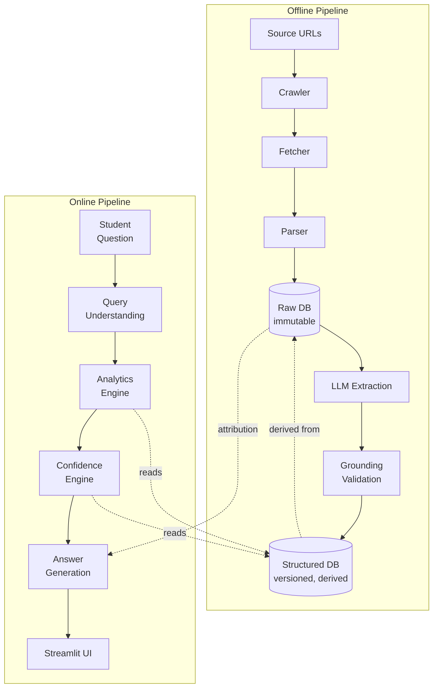
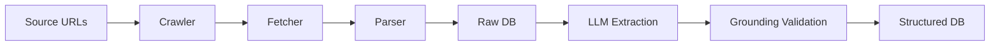
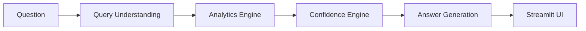
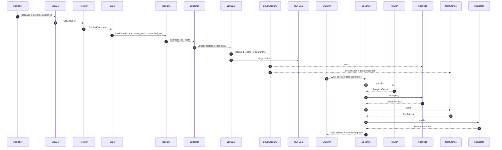
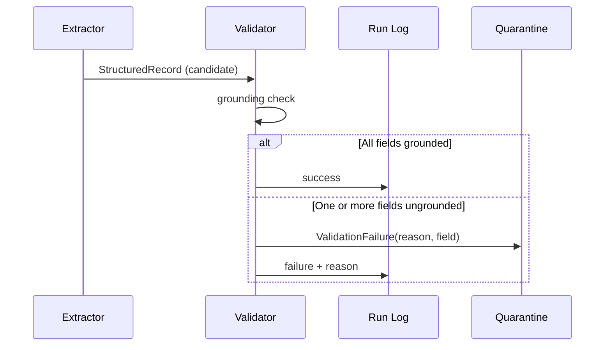

# PlacementIQ — Architecture

> **Document type:** Technical Architecture Blueprint (implementation contract)
> **Status:** V1 — frozen, pending Milestone 0
> **Owner:** Engineering
> **Last updated:** 2026-07-06

This document defines **how** PlacementIQ is built. It is the implementation contract for the entire system. Every module, table, agent, and API must align with what is specified here. If reality during implementation forces a deviation, this document is updated first and the deviation is justified.

For **what** PlacementIQ is and **why** it exists, see [`docs/project.md`](project.md). For the schema, see [`docs/database.md`](database.md) (forthcoming). For the LLM extraction contract, see [`docs/agents.md`](agents.md) (forthcoming).

---

## Architecture Goals

The architecture exists to make the following properties true at all times — not as aspirations, but as enforced properties of the system.

| # | Goal | What it means in practice |
|---|---|---|
| G1 | **Structured data is the source of truth** | No component answers a user question by reasoning over text or calling an LLM. All answers are computed from the Structured DB. |
| G2 | **The LLM is a bounded, validated component** | The LLM is invoked in exactly one place (Extraction), against a closed schema, with a deterministic verifier. Its output is a candidate, not a fact. |
| G3 | **Raw data is immutable** | Once a raw record is written, it is never modified. Re-extraction creates new versions of the structured record, never rewrites raw. |
| G4 | **Every pipeline stage is idempotent** | Re-running any stage on the same input produces the same output and does no work it does not need to do. Dedup is the default. |
| G5 | **Every component is independently testable** | Each stage has fixture-based tests that do not require the network, the LLM, or the previous stage. |
| G6 | **The architecture outlives the V1 stack** | SQLite → Postgres, Streamlit → React, single-machine → distributed workers — none of these transitions should require a redesign. |
| G7 | **The architecture is interview-defensible** | Every component, every boundary, every interface has a stated rationale. A Staff Engineer reading this doc should be able to challenge it on its own terms. |

---

## Design Principles

The principles below are the rules that resolve design disagreements. When in doubt, the principle wins.

1. **Data is the product, not the model.** If a feature can be implemented as a query against the Structured DB, it must be. The LLM is allowed to *render* an answer, never to *invent* one.
2. **The LLM is a controlled dependency, like a database driver.** It has a narrow contract, a schema, a verifier, and a cache. It is not invoked from arbitrary code paths.
3. **Immutability is a feature, not a constraint.** Versioned data is what makes the eval harness powerful, the pipeline reproducible, and regressions debuggable.
4. **Determinism is the default; non-determinism is the exception.** Anything that can be a SQL query, a deterministic function, or a pure transformation, must be. The LLM is the only non-deterministic stage.
5. **Boundaries are physical, not aspirational.** A component's responsibility is enforced by the directory layout, the public interface, and the test surface — not by convention.
6. **The simplest correct design is preferred.** Reuse existing primitives (SQL, the filesystem, hashlib) before introducing new infrastructure.

---

## Overall System Architecture

PlacementIQ has two pipelines, one shared datastore boundary, and one rendering surface.



Two physical things to internalize:

- **The LLM exists in exactly one box**: `LLM Extraction`. It does not appear in the online pipeline at all. `Answer Generation` is a deterministic rendering step that may use a model for prose — but it consumes a *structured result*, never raw source data, and it cannot introduce facts.
- **The Structured DB is the only thing the online pipeline reads from.** This is the contract that makes "not a chatbot" a system property, not a slogan.

---

## Offline Pipeline

The offline pipeline turns public interview experiences into versioned, validated, structured records. Every stage has a single responsibility, a typed contract, and a failure mode that does not corrupt later stages.



### Stage 1 — Crawler

| Aspect | Specification |
|---|---|
| **Purpose** | Produce a deterministic, de-duplicated URL frontier for one or more allowlisted sources. |
| **Inputs** | One or more `SourceAdapter` instances. |
| **Outputs** | A sequence of canonical URLs to fetch. |
| **Owns** | URL normalization, list-page parsing, paginated traversal, in-memory dedup of the URL set. |
| **Does not own** | HTTP fetching, rate limiting, parsing of the experience page itself. |
| **Failure cases** | Source returns an unexpected list-page layout → adapter raises a typed `SourceLayoutError`. Individual URLs that fail at the Fetcher stage do not fail the Crawler. |
| **Retry strategy** | Crawler is deterministic; no retry at this stage. The Fetcher is the retry boundary. |
| **Logging** | URLs discovered, URLs handed off, URL frontier size, per-adapter counts. |

**Interface contract:** `Crawler.run(adapters: list[SourceAdapter]) -> Iterator[URLFrontierItem]`. Pure (no I/O beyond what the adapters expose), repeatable, fixture-testable.

### Stage 2 — Fetcher

| Aspect | Specification |
|---|---|
| **Purpose** | Retrieve raw HTTP responses with rate limiting, `robots.txt` compliance, and a fetch cache. |
| **Inputs** | `URLFrontierItem` (URL + adapter metadata). |
| **Outputs** | `FetchedDocument { url, status_code, headers, raw_bytes, fetched_at, attribution }`. |
| **Owns** | HTTP transport, rate limiting, `robots.txt` resolution, fetch cache, retry with backoff. |
| **Does not own** | HTML parsing, content hashing, raw storage. |
| **Failure cases** | Network error, timeout, 4xx/5xx, `robots.txt` disallow. Failed items are recorded with a reason; they do not crash the pipeline. |
| **Retry strategy** | Exponential backoff with jitter for transient errors (5xx, timeouts, connection resets). Hard fail (no retry) for 4xx and for `robots.txt` disallow. Maximum 3 attempts per URL per run. |
| **Logging** | URL, status code, latency, bytes, retry count, cache hit/miss. |

**Interface contract:** `Fetcher.fetch(item: URLFrontierItem) -> FetchedDocument | FetchFailure`. Side effects (cache writes, logs) are explicit.

### Stage 3 — Parser

| Aspect | Specification |
|---|---|
| **Purpose** | Normalize a `FetchedDocument` into a `RawExperience` and persist it immutably. |
| **Inputs** | `FetchedDocument` (already passed Fetcher). |
| **Outputs** | `RawExperience { id, url, normalized_text, content_hash, attribution, fetched_at, parser_version }`, written to the Raw DB. |
| **Owns** | HTML → text normalization, content hashing (SHA-256 of normalized text), raw record insertion, parser version stamping. |
| **Does not own** | Anything related to the LLM, schema validation, or structured records. |
| **Failure cases** | Empty document after normalization, normalization exception. Failure is recorded with reason; record is not inserted. |
| **Retry strategy** | Parser is deterministic; no retry. If the input is broken, the input is bad, not the parser. |
| **Logging** | URL, content hash, normalized length, parser version, success/failure reason. |

**Interface contract:** `Parser.parse(doc: FetchedDocument) -> RawExperience`. The content hash is computed here and is the dedup key for the entire pipeline. **The hash belongs to the Parser, not the Fetcher**, because only the Parser knows what "normalized text" means.

### Stage 4 — Raw Database

The Raw DB is the immutable substrate. It is described in detail in [`docs/database.md`](database.md); the contract from the architecture's perspective is:

- **Write-only at the API level.** There is no public method to mutate or delete a raw record.
- **Keyed by `content_hash`.** Inserting the same content twice is a no-op (returns the existing record).
- **Attribution is mandatory.** Every record carries the URL, source adapter, fetch timestamp, and parser version.
- **Reads are selective.** The only consumer of the Raw DB in V1 is the LLM Extraction stage (which reads `normalized_text` for un-extracted records) and the Answer Generation stage (for source citation).

### Stage 5 — LLM Extraction

| Aspect | Specification |
|---|---|
| **Purpose** | Convert `normalized_text` into a typed `StructuredRecord` against a closed JSON schema. |
| **Inputs** | A `RawExperience` (specifically, its `normalized_text` and attribution). |
| **Outputs** | A candidate `StructuredRecord` (Pydantic model). On schema failure: `ExtractionFailure`. |
| **Owns** | The extraction prompt, the closed JSON schema, the LLM call, response parsing, schema validation, the per-`content_hash` extraction cache. |
| **Does not own** | Source-text verification, rejection of ungrounded fields, structured DB writes. |
| **Failure cases** | LLM timeout, malformed JSON, schema violation, refusal, context-length overflow. Each maps to a typed `ExtractionFailure` with reason. |
| **Retry strategy** | One retry for transient errors (timeout, 5xx). No retry for malformed output (would produce the same failure). |
| **Logging** | content_hash, model version, prompt version, tokens in/out, latency, cost (USD), success/failure reason, cache hit/miss. |

**Interface contract:** `Extractor.extract(raw: RawExperience) -> StructuredRecord | ExtractionFailure`. The extraction cache is keyed on `(content_hash, prompt_version, model_version)`, so any of those three changing produces a cache miss and a re-extraction — which is correct, because the output is now different in a meaningful way.

**Cache policy:** the cache is a derived view, not a separate store. The source of truth is the Structured DB (versioned). The cache only exists to avoid an LLM call when the result would be discarded by validation.

### Stage 6 — Grounding Validation

This is the only place in the system where a second LLM call is justified. The reasons are documented in [`docs/project.md` §3 / §20.1](project.md); the architectural contract is:

| Aspect | Specification |
|---|---|
| **Purpose** | Verify that every extracted field is entailed by the source text. |
| **Inputs** | `StructuredRecord` (candidate) + `RawExperience` (source). |
| **Outputs** | `ValidatedRecord` (record + per-field grounding flags) **or** `ValidationFailure` (with field-level reason). |
| **Owns** | The grounding check, the rejection of ungrounded fields, the production of per-field evidence pointers into the source text. |
| **Does not own** | LLM extraction, structured DB writes, schema validation (which happens earlier). |
| **Failure cases** | Any field that cannot be grounded in the source is rejected. The record is *not* partially stored — if any required field fails grounding, the entire record is quarantined. |
| **Retry strategy** | None. Validation is deterministic given a verifier implementation; transient failures are bugs, not retry candidates. |
| **Logging** | content_hash, fields grounded count, fields rejected count, rejection reasons. |

**Interface contract:** `Validator.validate(record: StructuredRecord, raw: RawExperience) -> ValidatedRecord | ValidationFailure`. The per-field grounding flags are persisted with the record and are the input to the Confidence Engine.

**Why this is its own stage, not bundled with Extraction:** validation is the *only* operation in the system that can be wrong about ground truth, and bundling it with extraction would mean a single failure breaks two responsibilities. The split also means validation can be re-run on existing candidates when the verifier implementation changes, without re-calling the LLM.

### Stage 7 — Structured Database

The Structured DB is the versioned, derived store. Schema details live in [`docs/database.md`](database.md); the architectural contract is:

- **Append-only at the row level.** Every accepted extraction creates a new version of the record. Old versions are retained.
- **Current-version view is a derived index.** The "latest valid version" of an experience is a view, not a write.
- **Foreign keys reference canonical entities** (companies, topics, rounds), which are themselves controlled-vocabulary tables.
- **Reads serve three consumers**: the Analytics Engine, the Confidence Engine, and the Answer Generation stage (for source attribution).

---

## Online Pipeline

The online pipeline turns a free-form student question into a cited, confident, deterministic answer.



### Stage 1 — Query Understanding

| Aspect | Specification |
|---|---|
| **Purpose** | Map a free-form question to a structured analytics query. |
| **Inputs** | A natural-language question. |
| **Outputs** | `AnalyticsQuery { template_id, params, filters }`. |
| **Owns** | Intent classification, entity extraction (company, role, topic, time window), template selection. |
| **Does not own** | Data access, answer rendering, confidence. |
| **Failure cases** | Question cannot be mapped to a known template. Returns a typed `UnknownQuery` and the UI asks for clarification. |
| **Logging** | Question text, resolved template, extracted entities, latency. |

**Implementation note (non-binding):** V1 will use a small, LLM-based router with a closed set of templates. The router has a structured-output contract; it does not generate the answer. The router can be replaced by a fine-tuned classifier or a rules engine without touching downstream stages — that's the point of the interface.

**Interface contract:** `Router.route(question: str) -> AnalyticsQuery | UnknownQuery`. Pure, repeatable, fixture-testable.

### Stage 2 — Analytics Engine

| Aspect | Specification |
|---|---|
| **Purpose** | Execute a deterministic query against the Structured DB and return a structured result. |
| **Inputs** | `AnalyticsQuery`. |
| **Outputs** | `AnalyticsResult { rows, total_count, sql_executed, params, executed_at }`. |
| **Owns** | The five canonical query templates, the SQL they expand to, parameter binding, execution. |
| **Does not own** | Confidence scoring, natural-language rendering, UI. |
| **Failure cases** | SQL error (template bug), no rows returned (returns empty result, not an error). |
| **Retry strategy** | None. SQL is deterministic; failures are bugs. |
| **Logging** | template_id, params, row count, latency. |

**Interface contract:** `AnalyticsEngine.run(query: AnalyticsQuery) -> AnalyticsResult`. **Critically: this stage never calls an LLM and never reads the Raw DB.** All facts come from the Structured DB.

The five canonical templates (defined in `project.md`) are encoded as named functions or parametrized SQL — not as free-form queries. The template registry is a finite, versioned set.

### Stage 3 — Confidence Engine

| Aspect | Specification |
|---|---|
| **Purpose** | Compute an inspectable confidence score for an `AnalyticsResult`. |
| **Inputs** | `AnalyticsResult` + raw analytics metadata (sample size, source diversity, grounding rate, recency, extraction quality). |
| **Outputs** | `Confidence { score, components, band, rationale }`. |
| **Owns** | The confidence formula, the band mapping (e.g., low / medium / high), the rationale string. |
| **Does not own** | The analytics computation, the answer rendering. |
| **Failure cases** | Missing inputs (e.g., no grounding data available) → score is computed with the missing component explicitly zeroed and labelled. The score is never silently dropped. |
| **Retry strategy** | None. Deterministic function. |
| **Logging** | template_id, components, final score, band. |

**Interface contract:** `ConfidenceEngine.score(result: AnalyticsResult, meta: AnalyticsMetadata) -> Confidence`. The components are returned as a structured object so the UI can render them — **a black-box probability would violate the architecture.**

The exact formula is defined in `agents.md` (forthcoming). The architectural commitment is that it is **deterministic, inspectable, and visible to the user**.

### Stage 4 — Answer Generation

| Aspect | Specification |
|---|---|
| **Purpose** | Render a `Confidence`-annotated `AnalyticsResult` into a natural-language answer. |
| **Inputs** | `AnalyticsResult` + `Confidence` + relevant source attribution pointers. |
| **Outputs** | `RenderedAnswer { text, sources, confidence_panel }`. |
| **Owns** | The render templates, the source-citation layout, the confidence-panel formatting. |
| **Does not own** | Analytics computation, confidence computation, source retrieval (it consumes pre-resolved pointers). |
| **Failure cases** | Render template missing for a result type → fallback to a generic template with a typed warning, never a crash. |
| **Retry strategy** | None. |
| **Logging** | template_id, render latency, fallback used (yes/no). |

**Critical contract:** the renderer may use an LLM to produce fluent prose **from the structured result**, but it cannot introduce new facts and it cannot re-query the database. If a fact is not in `AnalyticsResult` + source pointers, it does not appear in the answer.

**Interface contract:** `Renderer.render(result: AnalyticsResult, confidence: Confidence) -> RenderedAnswer`.

### Stage 5 — Streamlit UI

The UI is a thin shell. It:

- Accepts the question and displays it.
- Calls a single internal function `answer_question(question: str) -> RenderedAnswer` (or its async equivalent).
- Renders `text`, `sources`, and `confidence_panel`.
- Handles loading and error states.

The UI does not own business logic, does not call the database, does not call the LLM directly, and does not compute analytics. **This is what makes the UI replaceable** with a FastAPI + React frontend without touching the analytics layer.

---

## Component Responsibilities

The table below is the single-source-of-truth for "who owns what." If a task doesn't appear in a component's row, that component is not responsible for it.

| Component | Responsibility | Inputs | Outputs | Depends on |
|---|---|---|---|---|
| **SourceAdapter** | Provide a URL frontier for one source | Adapter config | `URLFrontierItem` stream | None |
| **Crawler** | Orchestrate adapters into a deduped frontier | List of `SourceAdapter` | URL stream | `SourceAdapter` |
| **Fetcher** | Retrieve HTTP responses safely | `URLFrontierItem` | `FetchedDocument` / `FetchFailure` | HTTP client, fetch cache |
| **Parser** | Normalize HTML to text and write to Raw DB | `FetchedDocument` | `RawExperience` (persisted) | BeautifulSoup, selectolax, hashlib, Raw DB |
| **Raw DB** | Store raw experiences immutably | `RawExperience` | `RawExperience` queries | Filesystem + SQLite (V1) |
| **Extractor** | LLM-based structured extraction | `RawExperience` | `StructuredRecord` / `ExtractionFailure` | LLM SDK, extraction cache, Pydantic schema |
| **Validator** | Grounding check | `StructuredRecord` + `RawExperience` | `ValidatedRecord` / `ValidationFailure` | Verifier (LLM or rule-based) |
| **Structured DB** | Store versioned, validated records | `ValidatedRecord` | Structured queries | SQLite (V1), Pydantic models |
| **Router** | Map question to query template | Question string | `AnalyticsQuery` / `UnknownQuery` | LLM SDK (or classifier) |
| **Analytics Engine** | Execute canonical queries | `AnalyticsQuery` | `AnalyticsResult` | Structured DB |
| **Confidence Engine** | Score confidence | `AnalyticsResult` + metadata | `Confidence` | Structured DB (read-only), formula |
| **Renderer** | Produce cited natural-language answer | `AnalyticsResult` + `Confidence` | `RenderedAnswer` | Render templates, LLM SDK (optional) |
| **Streamlit UI** | Display question and answer | User input | UI state | `answer_question(...)` |
| **Pipeline Orchestrator** | Run offline stages end-to-end | Run config | Run report | All offline stages |
| **Pipeline Run Log** | Record per-stage metrics | Stage events | Queryable run history | SQLite (V1) |

---

## Data Flow

### End-to-end: from a single published interview to a student answer



**Two observations about this flow that matter:**

1. **The offline pipeline is event-sourced, not request-driven.** The student's question does not trigger ingestion. The online pipeline reads a Structured DB that is *already* populated, possibly stale by minutes, hours, or days — and that is fine, because the answer is based on aggregated distributions, not real-time data.
2. **The online pipeline has no back-channel to the offline pipeline.** It cannot ask for fresh ingestion. If the corpus is stale, the Confidence Engine surfaces that as a low recency component — the system degrades gracefully.

### Failure flow: invalid extraction



Quarantine is a state, not a sink. Quarantined records are visible to operators, retained for debugging, and never enter the Structured DB.

---

## Module Boundaries

The directory layout *is* the architecture. If a contribution would put business logic in the wrong directory, it is rejected by code review.

The package is organised around **architectural components**, not implementation stages. A single top-level `agents/` package groups the processing components; their stage-of-the-pipeline (ingestion, extraction, analytics) is expressed as a sub-package, so the LLM boundary — load-bearing for safety — remains encoded in the directory tree.

```text
src/placementiq/
├── agents/
│   ├── ingestion/         # Deterministic: crawler, fetcher, parser, rate_limit
│   │   └── adapters/      # SourceAdapter implementations (one per source)
│   ├── extraction/        # LLM-bound: extractor, validator, schema, prompt
│   └── analytics/         # Router + Renderer are LLM-bound; engine + confidence are deterministic SQL
│       └── templates/     # SQL templates, one per canonical question
├── database/              # DB init, repositories, persistence, migrations
│   ├── raw_db.py          # Raw DB read/write interface
│   ├── structured_db.py   # Structured DB read/write interface
│   └── run_log.py         # Pipeline run metrics
├── models/                # Top-level shared Pydantic models — the cross-module type contract
├── pipeline/              # One orchestrator that wires the offline stages end-to-end
├── settings/              # Per-component settings modules (no global god-config)
├── common/                # Cross-cutting utilities: constants, exceptions, hashing, time, paths
└── ui/                    # Streamlit shell — no business logic
    └── streamlit_app.py
└── answer.py              # Public entrypoint: answer_question(q) -> RenderedAnswer
```

**Why a flat `agents/` was rejected.** Collapsing ingestion, extraction, and analytics into a flat namespace would have erased the directory-level distinction between LLM-bound components (extractor, validator, router, renderer) and deterministic ones (crawler, fetcher, parser, analytics SQL). That distinction is structural safety, not style: the import-direction lint depends on it. The chosen layout preserves it.

**Why a `services/` package was rejected.** A `services/` package without a stable, well-defined responsibility will collect miscellaneous logic within a week. Infrastructure concerns live with the component that owns them, or in a dedicated package that emerges naturally during implementation. We introduce new top-level packages only when a responsibility cannot be cleanly expressed within the existing architecture.

**Boundary rules:**

- `agents/ingestion/*` is deterministic. It must never import the LLM SDK. It only writes to `database.raw_db`.
- `agents/extraction/*` is LLM-bound. It reads from `database.raw_db` and writes to `database.structured_db` via the structured interface.
- `agents/analytics/engine.py` and `agents/analytics/confidence.py` are deterministic SQL. They read from `database.structured_db` only and never touch the Raw DB. `agents/analytics/router.py` and `agents/analytics/renderer.py` are the only LLM-bound analytics components, and they import the LLM SDK through a single, named seam in `settings/` — never ad-hoc.
- `models/*` is the top-level shared Pydantic contract. Every cross-module type is defined here, not inside the component that happens to use it. `database/` re-uses these models for typed reads/writes; it does not redefine them.
- `pipeline/*` is the single offline orchestrator. It may import from any component but must not contain business logic itself — only stage wiring and run logging.
- `answer.py` is the only public entrypoint of the online pipeline. It owns: Router → Analytics → Confidence → Renderer.
- `ui/*` calls `answer.py`. It does not import from `agents/`, `database/`, or `models/` directly.
- `settings/*` modules are leaf modules. They contain typed configuration objects and are imported by exactly one component. They do not import from any other component.
- `common/*` contains cross-cutting utilities only: hashing, time, paths, exceptions, constants. It does not import from any component.

A linter rule enforces these import directions. (Configuration of the linter is in `docs/CLAUDE.md` — forthcoming.)

---

## Architectural Decisions

Each decision below was made explicitly. The rationale is not "we felt like it" — it's load-bearing.

### Why two databases?

Raw and structured data have fundamentally different access patterns, lifecycles, and integrity requirements.

| Property | Raw DB | Structured DB |
|---|---|---|
| Mutability | Immutable | Append-only (versioned) |
| Schema | Free-form text + attribution | Strict typed schema |
| Write pattern | Once per experience | Once per validated extraction version |
| Read pattern | During extraction + answer attribution | Online, on every student query |
| Optimization | Sequential write throughput | Indexed read latency |
| Source of truth for... | "What did the source say?" | "What does the system know?" |

Collapsing them into a single store would force one of two compromises: either the structured store carries the noise of raw text (hurting online performance), or the raw store enforces structured typing (making ingestion brittle and expensive). Separation is the cleaner contract.

### Why immutable raw data?

Three reasons, in priority order:

1. **Reproducibility.** A re-extraction that uses a different model or prompt must not change what the source said. The Raw DB is the only thing that lets us compare extraction v1 vs extraction v2 honestly.
2. **Auditability.** When a reviewer asks "where did this claim come from?", the answer is a specific immutable record. If raw data can change, the trail breaks.
3. **Idempotency.** Immutability is what makes the dedup story clean: the same content hash always means the same thing.

### Why versioned structured data?

The same three reasons, plus one more:

4. **Eval harness.** Comparing v1 vs v2 of an extraction against a labeled set is a single SQL query against the versioned table. Without versioning, we lose the ability to know whether a "regression" is a new bug or a corrected one.

The cost of versioning (one extra `valid_from` / `valid_to` column, or a `version` column) is negligible in SQLite and trivial in Postgres.

### Why deterministic analytics?

Because the alternative is a chatbot. A query like *"What does Amazon ask most?"* is a SQL aggregation. If we let the LLM answer it, we reintroduce hallucination, lose provenance, and break the entire premise of the system. Deterministic analytics is the boundary that keeps the LLM where it belongs: in extraction, not in reasoning.

### Why SQL, not LLM reasoning, for the answer?

See above. But also: SQL queries are **testable as unit tests**. A canonical question has a known correct answer for a given fixture of the Structured DB. An LLM-generated answer does not. We need the former to run an eval harness and to ship with confidence.

### Why separate Analytics and Confidence?

They have different inputs, different tests, and different failure modes.

- Analytics: *"did we compute the right number?"* — testable as a unit test against a fixture.
- Confidence: *"should the student trust the number?"* — testable against a labeled set where we know the ground truth quality.

Coupling them would mean every change to the confidence formula risks changing the answer, and vice versa. They are independent components, with an explicit data contract between them.

### Why is Streamlit isolated from analytics?

Two reasons:

1. **Streamlit is a V1 placeholder.** A real production UI will be FastAPI + React (or similar). If analytics logic lives in the UI directory, that migration is a rewrite, not a swap.
2. **UI code is the worst place to test business logic.** Streamlit reruns on interaction; tests against UI code are flaky. By isolating analytics behind `answer.py`, every analytics behavior is testable in a normal pytest run.

### Why the SourceAdapter abstraction?

- **Adding a new source is one new file.** No pipeline changes, no schema changes.
- **Each source is testable in isolation** with a fixture HTML file.
- **The Crawler is source-agnostic.** It does not know whether it's crawling GeeksforGeeks or a college internal portal.
- **The legal/ToS policy is encoded in the adapter** — robots.txt, rate limits, attribution. If a source's policy changes, one file is updated.

### Why an LLM for the Query Router?

The Router has three options: rules, fine-tuned classifier, or LLM with structured output. V1 picks the LLM path because:

- The set of templates is small (~5 in V1), but the surface of natural-language questions is large. Rules are brittle at small scale.
- Structured output makes the LLM path deterministic-enough: same input → same template, with the LLM acting as a controlled classifier.
- The Router can be swapped for a classifier later without changing the downstream contract. That's the point of the interface.

### Why is the Validation stage allowed a second LLM call, but no other stage is?

Because validation is the only operation in the system that needs to evaluate entailment against arbitrary prose. This is genuinely a job for an LLM (or a much more elaborate NLP pipeline). The validation LLM is also constrained: it returns a per-field grounding flag plus a pointer into the source text, not a free-form verdict. It is bounded and auditable.

---

## Error Handling Strategy

Errors are typed, contained, and observable. The pipeline never silently drops a record and never crashes on a single bad input.

### Failure categories

| Category | Examples | Handling |
|---|---|---|
| **Network** | Timeout, 5xx, connection reset | Fetcher retries with backoff (max 3). Persistent failure → `FetchFailure`, recorded in run log. |
| **Source layout** | Selector returns empty, page structure changed | Adapter raises `SourceLayoutError`. URL is flagged for adapter maintenance; no retry. |
| **Parsing** | Empty normalization, normalization exception | Record is not written; reason is logged. The source URL is re-queued at the next ingestion run. |
| **LLM transient** | Timeout, 5xx from provider, rate limit | One retry. Persistent failure → `ExtractionFailure(reason="provider_error")`. |
| **LLM output** | Malformed JSON, schema violation, refusal | No retry. Treated as `ExtractionFailure(reason="schema_violation" / "refusal")`. |
| **Grounding** | One or more fields ungrounded | Record is quarantined. **No partial storage.** The reason is field-level and persisted. |
| **Analytics SQL** | Bug in a template | Loud failure, no fallback. Template bugs are caught in tests before deployment. |
| **Renderer** | Template missing for result type | Fallback to a generic template with a typed warning logged. Never crash. |
| **Unknown query** | Router cannot map the question | `UnknownQuery` returned. UI asks for clarification. |

### Retry policy

| Stage | Retries | Notes |
|---|---|---|
| Fetcher | 3 with exponential backoff | Only for transient errors (5xx, timeout, connection reset) |
| Extractor | 1 | Only for transient errors |
| Validator | 0 | Deterministic — failure means a real problem |
| Analytics | 0 | SQL is deterministic |
| Confidence | 0 | Function of inputs |
| Renderer | 0 | Template fallback instead |

### Partial pipeline failures

A single failed item never blocks the run. The orchestrator's contract is:

- For each item, the pipeline runs through all stages.
- Per-item failures are recorded with a typed reason.
- The run completes when the URL frontier is exhausted (offline) or the question is answered (online).
- A summary report is produced: items processed, items failed per stage, total cost, total duration.

---

## Scalability Strategy

The architecture is designed to scale **without redesign**. Each transition is a swap of a component, not a rewrite of the system.

### Phase 1 — V1: Single machine, SQLite

- One process runs the offline pipeline end-to-end.
- SQLite for both Raw and Structured stores. Raw HTML on local filesystem.
- Streamlit on the same machine.
- Extraction cache in-process or on local filesystem.

**Bottleneck ceiling:** ~1,000–10,000 experiences per run, ~100ms analytics latency. Comfortable for V1 scope.

### Phase 2 — Postgres + worker pool

**Trigger:** corpus size > ~50k experiences, or concurrent read load > 100 QPS.

- **Storage:** Postgres replaces SQLite for the Structured DB. The schema is portable (no SQLite-specific features used in `database.md`).
- **Raw DB:** HTML moves from local filesystem to S3 (or compatible object storage). Metadata remains in Postgres.
- **Workers:** the offline pipeline becomes a worker pool consuming from a job queue (e.g., a `pipeline_jobs` table with claim semantics, or an external queue). Each worker handles one URL at a time. The Crawler and Fetcher parallelize first; Extractor scales to N workers (LLM rate limits are the practical ceiling).
- **UI:** unchanged, talking to the same `answer.py` interface.

**Migration path:** the change is concentrated in `database/` and `pipeline/`. The extraction, analytics, and confidence layers are untouched.

### Phase 3 — Distributed, cloud-deployed

**Trigger:** multi-region usage, separate teams owning ingestion and analytics, or >1M experiences.

- **Ingestion** and **online query** become separate deployables, sharing only the Structured DB.
- **Read replicas** serve the online query path. The Analytics Engine can be served from a materialized view layer.
- **Extraction cache** becomes a shared service (Redis or a Postgres table) so re-extraction is deduped across workers.
- **Observability** graduates from a `pipeline_runs` table to a proper metrics stack. The run log interface stays the same; only the backing store changes.
- **UI** is replaced by FastAPI + React, or by a hosted notebook surface for power users. The `answer.py` contract is the wire protocol.

**What does not change:** the data model, the closed extraction schema, the canonical analytics templates, the confidence formula, the source attribution discipline.

### What we deliberately do **not** scale by

- We do not "scale" by adding more LLMs to the online path. Adding LLMs is a correctness regression.
- We do not "scale" by collapsing the Raw and Structured stores. Separation is a correctness property, not a performance optimization.
- We do not "scale" by introducing a vector DB as a primary answer path. Vector retrieval is a V1.1+ add-on at most, never a replacement for SQL analytics.

---

## Testing Strategy

The architecture's testability is a load-bearing property, not a "nice to have." Every stage is unit-testable without the network or the LLM.

### Test categories

| Category | What it tests | What it does NOT touch |
|---|---|---|
| **Unit tests (per stage)** | Stage logic against fixtures | Network, LLM, other stages |
| **Pipeline integration tests** | The full offline loop on a fixture corpus | Live sources, live LLM (uses a fixture LLM or mock) |
| **Analytics correctness tests** | The five canonical questions against a labeled fixture DB | LLM, UI |
| **Confidence formula tests** | The score function against synthetic inputs | DB, LLM |
| **Eval harness** | Extraction accuracy against the manual eval set | UI |
| **End-to-end smoke** | One URL → one answer, including the live LLM | None — this is the one test that hits the network |

### How each stage is tested in isolation

- **SourceAdapter:** tested with a fixture HTML file. The fixture is a real page captured and redacted. No network.
- **Crawler:** tested by passing a list of fixture adapters. Pure function test.
- **Fetcher:** tested with a mocked HTTP transport (e.g., `respx` for httpx). No real network.
- **Parser:** tested by passing a `FetchedDocument` fixture and asserting on the produced `RawExperience`.
- **Extractor:** tested with a **mock LLM client**. The test verifies the prompt, the schema, the cache, the failure mapping. Live LLM is exercised only in smoke tests.
- **Validator:** tested by passing a `StructuredRecord` + `RawExperience` pair and asserting grounding flags.
- **Router:** tested with a fixture of (question → expected template) pairs.
- **Analytics Engine:** tested by seeding a fixture SQLite DB and asserting query results.
- **Confidence Engine:** tested by passing synthetic `AnalyticsResult` + `AnalyticsMetadata` and asserting scores + bands.
- **Renderer:** tested with snapshot tests of the rendered output.

### The eval set

The manual evaluation dataset (≥ 20 labeled experiences across ≥ 5 companies) is the contract between the LLM extraction stage and the system. It is treated as code: it lives in the repository, it is version-controlled, and the eval harness fails CI when extraction accuracy drops below the threshold defined in `project.md` §16.

---

## Architecture Constraints

These are non-negotiable. Violations are bugs in the architecture, not in the code.

1. **Raw data is immutable.** No public API mutates or deletes raw records.
2. **The LLM never answers user questions directly.** The LLM appears only in `Extraction`, `Validator`, `Router`, and (optionally) `Renderer`. The Renderer cannot introduce new facts.
3. **Analytics are computed from the Structured DB only.** The Analytics Engine never reads the Raw DB.
4. **Confidence is deterministic, inspectable, and visible.** No black-box probability is returned. The components are returned alongside the score.
5. **Every component has a single responsibility.** See the responsibility table.
6. **Every stage is idempotent.** Re-running any stage on the same input is safe and inexpensive.
7. **Every stage is independently testable.** A stage test does not require the network, the LLM, or another stage.
8. **The LLM extraction schema is closed.** Values for company, role, topic, round_type, and difficulty come from controlled vocabularies. No free-form strings.
9. **Every extracted field must be grounded in the source.** Ungrounded fields cause quarantine, not partial storage.
10. **The UI never owns business logic.** Streamlit (or any future UI) calls `answer_question()` and renders the result. Nothing else.
11. **Adding a new source requires only a new `SourceAdapter`.** No pipeline, schema, or analytics changes.
12. **The architecture is the contract.** Design changes update this document first.

---

## Future Architecture Evolution

The V2 and V3 directions are sketched here for context. They are not commitments, but the V1 architecture is designed to accommodate them without redesign.

### V2

- **Postgres migration** as the corpus outgrows SQLite. Schema and queries are portable.
- **Real frontend** (FastAPI + React) replacing Streamlit. The `answer.py` contract is the wire protocol.
- **Embedding-based retrieval** as a *secondary* path for question types SQL cannot answer well (e.g., "find experiences that sound like this one"). SQL remains the primary path.
- **Manual correction flow** for extracted records. The versioned schema already supports it.
- **Cross-source entity resolution** beyond content-hash dedup (e.g., the same experience published on two sites with different formatting).

### V3

- **Active learning** for the topic taxonomy: surface new topics the extractor sees, propose controlled-vocabulary additions, accept via review.
- **Federated corpus** across colleges, with privacy-preserving ingestion.
- **Public API** for partner integrations. The `answer.py` contract is the public surface; rate limiting and auth are added without changing the core.
- **A generic extraction service** that is domain-agnostic. The pattern (deterministic ingestion → grounded extraction → versioned structured data → inspectable confidence) generalizes beyond placements.

---

*End of document. For the schema, see `database.md`. For the LLM extraction contract, see `agents.md`. For the SRS, see `project.md`.*
