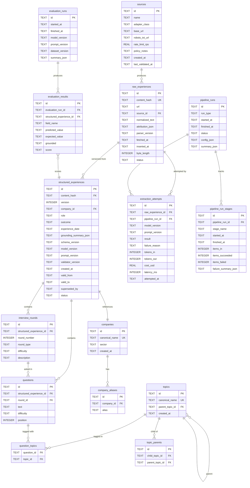

# PlacementIQ — Database Architecture

> **Document type:** Data Layer Design Document (implementation contract for storage)
> **Status:** V1 — frozen, pending Milestone 0
> **Owner:** Engineering
> **Last updated:** 2026-07-06

This document defines **how data is stored** in PlacementIQ. It is the contract every component that reads from or writes to persistent storage signs against. Schema changes that affect this contract require an explicit amendment to this document before they are made in code.

For **what** PlacementIQ is and **why** it exists, see [`docs/project.md`](project.md). For the pipeline that produces and consumes this data, see [`docs/architecture.md`](architecture.md). For the LLM extraction contract (prompts, schema, verifier), see [`docs/agents.md`](agents.md) (forthcoming).

---

## Database Design Goals

The schema exists to make the following properties true at all times.

| # | Goal | What it means in practice |
|---|---|---|
| D1 | **Raw data is immutable** | Once a raw record is written, no API mutates or deletes it. |
| D2 | **Structured data is auditable** | Every record in the Structured DB can be traced back to a specific raw experience and a specific extraction run. |
| D3 | **Re-extraction is non-destructive** | Re-running the extractor on the same raw experience produces a *new* version of the structured record, never overwrites. |
| D4 | **Deduplication is automatic** | The same source content, regardless of URL, is stored exactly once. |
| D5 | **Analytics are deterministic** | Given a version of the Structured DB, every canonical query returns the same answer. |
| D6 | **Confidence is computable from the data** | The Confidence Engine reads the Structured DB and produces a score without external signals. |
| D7 | **The schema is portable** | A future move from SQLite to Postgres requires no architectural change, only a DDL diff. |
| D8 | **The schema is testable** | A fixture database can be constructed in code and torn down per test, with no shared state. |

---

## Database Philosophy

The schema is shaped by three convictions, in priority order:

1. **Data outlives code and models.** Every record must remain meaningful when the LLM, the prompt, the parser, and the language are all replaced. That is what "immutable raw + versioned structured" buys us.
2. **Structure is the contract, not the model.** The schema is the single source of truth for what the system knows. Code is one consumer of the schema; analytics, eval, and the Confidence Engine are others. The LLM is not a consumer of the schema — it is a producer.
3. **Storage is cheap, confusion is expensive.** Versioning, attribution, and quarantine columns cost almost nothing to write and pay for themselves the first time a regression is debugged. The schema is biased toward "more columns, more context" over "fewer columns, faster writes."

---

## Why SQLite for Version 1?

SQLite is the right choice for V1 because the workload matches its strengths and its constraints are aligned with our goals.

### Workload fit

- **Dataset size:** V1 expects hundreds to low-thousands of experiences. SQLite is comfortable at this scale (the published ceiling is 281 TB, but realistic V1 is well under 1 GB).
- **Read pattern:** Analytics queries are point reads, aggregations, and small `SELECT`s. SQLite handles these with low overhead and no network round-trip.
- **Write pattern:** Ingestion is bursty and sequential, not concurrent. SQLite's writer-serialization is a non-issue at our concurrency level.
- **Operational cost:** Zero. No separate process, no auth configuration, no backups beyond file copy. This is a V1 product; the engineering effort saved is real engineering effort.

### Trade-offs versus PostgreSQL

| Property | SQLite (V1) | PostgreSQL (V2) |
|---|---|---|
| Setup cost | None | Server, auth, migrations tooling |
| Single-machine | Native | Supported, not native |
| Concurrent writes | Serialized | Concurrent |
| Concurrent reads | Supported (MVCC) | Supported, scales to replicas |
| JSON column type | JSON1 (text + functions) | Native JSONB (indexable) |
| Full-text search | FTS5 extension | tsvector + GIN |
| Migration | File copy | Logical replication / dump-restore |
| Hosting cost | $0 | $$ |
| Network latency | 0 | 1–10 ms per query |

We are choosing SQLite because **V1 has no concurrency that would benefit from a network hop to Postgres**. When the corpus or concurrency grows (see [`architecture.md` §Scalability](architecture.md#scalability-strategy)), the schema migrates; the application does not.

### Trade-offs versus MongoDB

| Concern | Why we don't use a document store |
|---|---|
| **The system is fundamentally relational** | Experiences belong to companies, contain questions, link to topics and rounds. A document store models this as nested arrays; SQL models it as foreign keys, and analytics (the actual workload) is *much* simpler in SQL. |
| **The "not a chatbot" contract requires SQL analytics** | If analytics are computed in the database, they are testable as SQL unit tests. A document store would push aggregation into the application code, where it's harder to test and easier to silently change. |
| **Schema discipline** | The LLM is constrained to a closed schema. A document store would let schema drift; a relational schema enforces it. |
| **Versioning** | Versioned rows are a single-table pattern in SQL. In a document store, the entire document is rewritten on every version — which is *less* auditable, not more. |

The one place a document store would beat us is raw HTML storage, which is opaque, large, and queried as a blob. We store raw HTML on the **filesystem** and metadata in SQLite, which is the best of both worlds: blob on disk, structured metadata in the DB.

---

## Overall Database Architecture

PlacementIQ has two stores plus an observability layer. The diagram below shows all V1 tables, their cardinality, and their relationships.



Two physical things to internalize:

- **Raw and structured are separate stores at the storage level too.** `raw_experiences` is the immutable substrate; `structured_experiences` is the derived, versioned view. The link between them is `content_hash`, not a foreign key cascade — they have different lifecycles.
- **The vocabulary tables (`companies`, `topics`) are the controlled vocabulary itself.** They are first-class tables, not enums. The LLM is constrained to values that exist in these tables; new entries are seeded by a human and never by the LLM.

---

## Table Specifications

Every table is specified with its purpose, columns, types, keys, and the rationale for non-obvious choices. Type annotations are described in implementation-agnostic terms; the actual SQL DDL is generated from this document.

### `sources`

**Purpose:** registry of allowlisted data sources. One row per source adapter instance.

| Column | Type | Constraint | Rationale |
|---|---|---|---|
| `id` | string (UUID) | PK | Stable identifier, URL-safe |
| `name` | string | unique, not null | Human-readable (e.g., "GeeksforGeeks Interview Experiences") |
| `adapter_class` | string | not null | Fully-qualified class name; the registry resolves to it at runtime |
| `base_url` | string | not null | Used for robots.txt resolution and link scoping |
| `robots_txt_url` | string | nullable | Explicit override; defaults to `<base>/robots.txt` |
| `rate_limit_rps` | real | not null | Requests-per-second limit; enforced by the Fetcher |
| `policy_notes` | text | nullable | Free-form notes for operators (ToS posture, attribution requirements) |
| `created_at` | timestamp | not null | Audit |
| `last_validated_at` | timestamp | nullable | When the adapter was last confirmed working against a fixture |

**Indexes:** unique on `name`, unique on `adapter_class`.

**Relationships:** one `source` produces many `raw_experiences`.

**Why this exists:** source-specific policy (rate limits, robots.txt, attribution) is encoded as data, not code. Adding a new source is an insert into this table plus a new `SourceAdapter` class.

### `raw_experiences`

**Purpose:** the immutable substrate. One row per distinct normalized interview experience.

| Column | Type | Constraint | Rationale |
|---|---|---|---|
| `id` | string (UUID) | PK | Internal stable identifier |
| `content_hash` | string (hex SHA-256) | unique, not null | The dedup key for the entire system |
| `url` | string | not null | Original source URL (informational; not unique — same content may be mirrored) |
| `source_id` | string (FK → sources.id) | not null | The source that produced this record |
| `normalized_text` | text | not null | The cleaned text. This is what the LLM sees |
| `attribution_json` | JSON | not null | Fetch headers, fetch timestamp, source-specific metadata |
| `parser_version` | string | not null | Which Parser produced this; lets us re-parse on upgrade |
| `fetched_at` | timestamp | not null | When the Fetcher retrieved the page |
| `inserted_at` | timestamp | not null | When the Parser wrote the record |
| `byte_length` | integer | not null | Length of `normalized_text`; useful for cost/latency planning |
| `status` | enum: `inserted`, `extraction_in_progress`, `extracted`, `quarantined_parse` | not null | Lifecycle state of this record |

**Indexes:**
- Unique on `content_hash` (the dedup key).
- On `(status, inserted_at)` to support the work queue: "find all `inserted` records older than X".
- On `source_id` for per-source reporting.

**Constraints:**
- `INSERT` is idempotent on `content_hash`. The storage layer uses `INSERT ... ON CONFLICT(content_hash) DO NOTHING` semantics. A second insert of the same content returns the existing row, not a duplicate.
- No `UPDATE` is permitted at the public API level. Schema-level enforcement: no application code holds a write cursor against this table.
- No `DELETE` is permitted.

**Why `content_hash` is the PK candidate but `id` is the PK:** the hash can collide in principle (astronomically unlikely for SHA-256, but not zero). A separate `id` is the durable internal pointer that `structured_experiences` and `extraction_attempts` reference. The hash remains the natural dedup key.

**Why `attribution_json` is JSON, not normalized columns:** the per-source metadata varies. Forcing it into columns either creates many nullable fields or per-source column sets, both of which are worse than JSON. The JSON is **read-only by analytics** — analytics never queries inside it.

**Why `byte_length`:** extraction cost is correlated with input length. Storing it lets us budget extraction runs without re-measuring.

### `structured_experiences`

**Purpose:** the versioned, derived record. One row per *accepted* extraction of a raw experience. The canonical "what the system knows about this experience" table.

| Column | Type | Constraint | Rationale |
|---|---|---|---|
| `id` | string (UUID) | PK | Stable identifier for this version |
| `content_hash` | string (FK → raw_experiences.content_hash) | not null | The raw experience this version derives from |
| `version` | integer | not null | Monotonically increasing per `content_hash`, starting at 1 |
| `company_id` | string (FK → companies.id) | not null | Canonical company, drawn from controlled vocabulary |
| `role` | string | not null | Free-form within a small controlled set (e.g., `SDE-1`, `SDE-2`, `Intern`) |
| `outcome` | enum: `selected`, `rejected`, `pending`, `unknown` | not null | Interview outcome |
| `experience_date` | date | nullable | When the interview happened, if reported |
| `grounding_summary_json` | JSON | not null | Per-field grounding flags from the Validator |
| `schema_version` | string | not null | Version of the closed schema this record conforms to |
| `model_version` | string | not null | LLM model version that produced this extraction |
| `prompt_version` | string | not null | Extraction prompt version |
| `validator_version` | string | not null | Validator version |
| `created_at` | timestamp | not null | When this version was written |
| `valid_from` | timestamp | not null | Same as `created_at` for the latest version |
| `valid_to` | timestamp | nullable | Null = currently the latest version |
| `superseded_by` | string (FK → structured_experiences.id) | nullable | The next version that replaced this one |
| `status` | enum: `active`, `superseded`, `quarantined` | not null | Lifecycle state |

**Indexes:**
- Unique on `(content_hash, version)` — only one row per version per experience.
- On `(content_hash, valid_to)` to find the current version quickly: `WHERE content_hash = ? AND valid_to IS NULL`.
- On `company_id` for company-scoped analytics.
- On `(model_version, prompt_version)` for ablation studies on extraction quality.
- On `status` for the "give me all active records" query.

**Constraints:**
- `version` is monotonically increasing per `content_hash`. A new version is only inserted if the prior version's `valid_to` is set in the same transaction.
- The "current version" is the row with `valid_to IS NULL`. There is exactly one such row per `content_hash` (enforced by partial unique index in Postgres; in SQLite, enforced by application logic in a single transaction).
- A `quarantined` version is one that the Validator rejected. It exists for debugging, not for analytics. Analytics queries must filter on `status = 'active'`.

**Why a "current version" view, not a separate table:** versioning and "current state" are the same concern. Splitting them creates the classic "which table do I write to" bug. With `valid_to` semantics, the "current" version is a one-line query and the history is a single scan.

**Why `superseded_by` is denormalized:** it costs one column and saves a recursive query. The value is set when a new version is inserted; analytics never needs to traverse it.

### `extraction_attempts`

**Purpose:** observability for the LLM extraction stage. One row per call to the LLM, regardless of outcome. This is the source of truth for cost, latency, and prompt-version performance.

| Column | Type | Constraint | Rationale |
|---|---|---|---|
| `id` | string (UUID) | PK | |
| `raw_experience_id` | string (FK → raw_experiences.id) | not null | What we tried to extract |
| `pipeline_run_id` | string (FK → pipeline_runs.id) | not null | Which run produced this attempt |
| `model_version` | string | not null | |
| `prompt_version` | string | not null | |
| `result` | enum: `success`, `schema_violation`, `refusal`, `provider_error`, `context_overflow` | not null | Categorical outcome |
| `failure_reason` | text | nullable | Free-form detail when `result != success` |
| `tokens_in` | integer | not null | |
| `tokens_out` | integer | not null | |
| `cost_usd` | real | not null | Computed at call time |
| `latency_ms` | integer | not null | |
| `attempted_at` | timestamp | not null | |

**Indexes:**
- On `(raw_experience_id, attempted_at)` to find all attempts for a given experience.
- On `(pipeline_run_id)` for run-level aggregation.
- On `(result, attempted_at)` for failure analytics.
- On `(model_version, prompt_version)` for cost and accuracy reports.

**Why this is its own table, not a column on `structured_experiences`:** there can be many attempts and zero or one successes. A success produces a `structured_experiences` row; an attempt that fails does not. Putting attempts on the success table would conflate the two.

### `companies`

**Purpose:** the controlled vocabulary for company names. One row per canonical company.

| Column | Type | Constraint | Rationale |
|---|---|---|---|
| `id` | string (UUID) | PK | |
| `canonical_name` | string | unique, not null | The form used in analytics (e.g., "Amazon") |
| `sector` | string | nullable | E.g., "Cloud", "Consumer Internet" — used for sector-level analytics in V1.1+ |
| `created_at` | timestamp | not null | |

**Indexes:** unique on `canonical_name`.

**Relationships:** one company has many aliases, many structured_experiences.

### `company_aliases`

**Purpose:** map source-text variations of company names to the canonical entity.

| Column | Type | Constraint | Rationale |
|---|---|---|---|
| `id` | string (UUID) | PK | |
| `company_id` | string (FK → companies.id) | not null | |
| `alias` | string | unique, not null | Source-text variation (e.g., "Amazon.com", "AWS", "Amazon India") |

**Indexes:** unique on `alias`.

**Why this is a separate table:** aliases are seeded by humans and grow over time. Putting them on the `companies` row would mean a long, changing column. A separate table is the cleanest representation and the easiest to extend.

### `topics`

**Purpose:** the controlled vocabulary for topics. Hierarchical via self-reference.

| Column | Type | Constraint | Rationale |
|---|---|---|---|
| `id` | string (UUID) | PK | |
| `canonical_name` | string | unique, not null | The form used in analytics (e.g., "DBMS.Indexing.B-Trees") |
| `parent_topic_id` | string (FK → topics.id) | nullable | Self-reference for hierarchy |
| `created_at` | timestamp | not null | |

**Indexes:** unique on `canonical_name`; on `parent_topic_id` for hierarchy traversal.

**Why a hierarchy, not a flat list:** the canonical question "What DBMS concepts appear frequently?" requires aggregation at the DBMS level. A flat list forces the LLM to emit one of N variants; a hierarchy lets us roll up from leaf to category at query time.

**Who can insert:** humans only. The LLM is constrained to existing topic IDs.

### `topic_parents`

**Purpose:** many-to-many topic ancestry for the rare case where a topic belongs to multiple parents. Most topics have one parent; this table allows the exceptions.

| Column | Type | Constraint | Rationale |
|---|---|---|---|
| `id` | string (UUID) | PK | |
| `child_topic_id` | string (FK → topics.id) | not null | |
| `parent_topic_id` | string (FK → topics.id) | not null | |

**Indexes:** unique on `(child_topic_id, parent_topic_id)`.

**Why this exists alongside `topics.parent_topic_id`:** the direct parent column is the common case. The M2M table is for the long tail. Most queries use the direct column; the M2M table is the escape hatch.

### `interview_rounds`

**Purpose:** the rounds of a single interview experience (e.g., Online Assessment, Technical Round 1, Technical Round 2, HR).

| Column | Type | Constraint | Rationale |
|---|---|---|---|
| `id` | string (UUID) | PK | |
| `structured_experience_id` | string (FK → structured_experiences.id) | not null | |
| `round_number` | integer | not null | 1-indexed ordering within the experience |
| `round_type` | enum: `oa`, `coding`, `system_design`, `technical`, `behavioral`, `hr` | not null | Controlled vocabulary |
| `difficulty` | enum: `easy`, `medium`, `hard`, `unknown` | not null | |
| `description` | text | nullable | Free-form summary of the round |

**Indexes:** on `(structured_experience_id, round_number)`; on `round_type` for cross-company analytics.

**Why a `round_type` enum, not free text:** the canonical question "Which companies ask System Design?" is a query on `round_type = 'system_design'`. Free text would make this query meaningless.

### `questions`

**Purpose:** the individual questions asked across an experience.

| Column | Type | Constraint | Rationale |
|---|---|---|---|
| `id` | string (UUID) | PK | |
| `structured_experience_id` | string (FK → structured_experiences.id) | not null | The experience this question belongs to |
| `round_id` | string (FK → interview_rounds.id) | nullable | The round it was asked in, if known |
| `text` | text | not null | The question text (normalized) |
| `difficulty` | enum: `easy`, `medium`, `hard`, `unknown` | not null | |
| `position` | integer | not null | Ordering within the experience |

**Indexes:** on `(structured_experience_id, position)`; on `round_id`; on `difficulty`.

### `question_topics`

**Purpose:** many-to-many between questions and topics.

| Column | Type | Constraint | Rationale |
|---|---|---|---|
| `question_id` | string (FK → questions.id) | not null | |
| `topic_id` | string (FK → topics.id) | not null | |

**Indexes:** composite PK on `(question_id, topic_id)`; on `topic_id` for reverse lookup.

**Why M2M:** a question can cover multiple topics (a "design a URL shortener" question spans System Design, Hashing, and Databases). One-to-many would force us to pick a primary topic and lose the rest.

### `pipeline_runs`

**Purpose:** one row per execution of the offline pipeline. The observability anchor.

| Column | Type | Constraint | Rationale |
|---|---|---|---|
| `id` | string (UUID) | PK | |
| `run_type` | enum: `full`, `incremental`, `single_url` | not null | What kind of run this was |
| `started_at` | timestamp | not null | |
| `finished_at` | timestamp | nullable | Null = still running |
| `status` | enum: `running`, `succeeded`, `failed`, `partial` | not null | |
| `config_json` | JSON | not null | The configuration of this run (sources, model, prompt version) |
| `summary_json` | JSON | nullable | Cost, duration, per-stage counts (denormalized for fast read) |

**Indexes:** on `started_at` for time-ordered reports; on `status` for "show me all failed runs".

### `pipeline_run_stages`

**Purpose:** one row per stage within a pipeline run. The fine-grained observability data.

| Column | Type | Constraint | Rationale |
|---|---|---|---|
| `id` | string (UUID) | PK | |
| `pipeline_run_id` | string (FK → pipeline_runs.id) | not null | |
| `stage_name` | enum: `crawl`, `fetch`, `parse`, `extract`, `validate`, `persist` | not null | |
| `started_at` | timestamp | not null | |
| `finished_at` | timestamp | nullable | |
| `items_in` | integer | not null | Items entering this stage |
| `items_succeeded` | integer | not null | |
| `items_failed` | integer | not null | |
| `failure_summary_json` | JSON | nullable | Categorized failure counts |

**Indexes:** on `(pipeline_run_id, stage_name)`; on `started_at`.

**Why per-stage rows, not columns on `pipeline_runs`:** there are N stages; an array of stage rows generalizes. It also makes the "compare stage X across runs" query trivial.

### `evaluation_runs`

**Purpose:** one row per execution of the evaluation harness against the manual eval set.

| Column | Type | Constraint | Rationale |
|---|---|---|---|
| `id` | string (UUID) | PK | |
| `started_at` | timestamp | not null | |
| `finished_at` | timestamp | nullable | |
| `model_version` | string | not null | The extraction config being evaluated |
| `prompt_version` | string | not null | |
| `dataset_version` | string | not null | Which version of the labeled dataset was used |
| `summary_json` | JSON | nullable | Field-level accuracy, grounding rate, etc. |

**Indexes:** on `started_at`; on `(model_version, prompt_version, dataset_version)` for trend analysis.

### `evaluation_results`

**Purpose:** per-field comparison of predicted vs expected for each labeled experience.

| Column | Type | Constraint | Rationale |
|---|---|---|---|
| `id` | string (UUID) | PK | |
| `evaluation_run_id` | string (FK → evaluation_runs.id) | not null | |
| `structured_experience_id` | string (FK → structured_experiences.id) | nullable | The evaluated record (nullable for failures) |
| `field_name` | string | not null | e.g., "company", "topics[0]", "rounds[1].difficulty" |
| `predicted_value` | text | nullable | What the system produced |
| `expected_value` | text | nullable | The label |
| `grounded` | boolean | nullable | Whether the predicted value was grounded in the source |
| `score` | real | not null | 0.0 to 1.0; field-level score (exact match, fuzzy, set Jaccard, etc.) |

**Indexes:** on `(evaluation_run_id, field_name)`; on `grounded` for grounding rate reporting.

**Why field-level, not record-level:** the eval harness needs to know *which fields* are failing. Record-level "1.0 / 0.0" is useless for debugging; field-level scores show that, e.g., topic taxonomy is at 92% but `difficulty` is at 71%.

---

## Versioning Strategy

Structured data is append-only with `valid_from` / `valid_to` semantics. The rules below are enforced in the storage layer and verified by tests.

### Rules

1. **The first version** of a record is `version = 1`, `valid_from = now`, `valid_to = NULL`, `superseded_by = NULL`, `status = 'active'`.
2. **A new version** is inserted in a single transaction that:
   - Updates the prior `active` row: sets `valid_to = now`, `status = 'superseded'`, `superseded_by = <new id>`.
   - Inserts the new row: `version = prior.version + 1`, `valid_from = now`, `valid_to = NULL`, `status = 'active'`.
3. **Quarantined versions** keep their row but with `status = 'quarantined'` and `valid_to = now`. They are not the "current" view, but they exist for debugging and for the eval harness.
4. **The "current" view** of a `content_hash` is the row where `valid_to IS NULL`. There is exactly one such row per `content_hash`.
5. **Re-extraction does not overwrite.** The new version is a new row. The old row is preserved with its provenance.

### Why this design

- **Auditable.** Every version records the `model_version`, `prompt_version`, and `validator_version` that produced it. A regression at any of those three is traceable to a specific set of structured rows.
- **Eval-harness-friendly.** "Compare v1 vs v2 of extraction on the labeled set" is a single `WHERE model_version = 'X' AND prompt_version = 'Y'` query.
- **Migrates cleanly to bitemporal.** If we ever need "as-of" queries ("what did the system know on date D?"), the `valid_from` / `valid_to` columns are the basis. We are not building that in V1, but we are not blocking it either.
- **No UPDATE except for the supersede operation.** The supersede update touches only the prior row's `valid_to`, `status`, and `superseded_by`. All other fields are immutable on the row.

### Postgres nuance

In SQLite, "exactly one active row per `content_hash`" is enforced by wrapping the supersede-and-insert in a single transaction with `BEGIN IMMEDIATE`. In Postgres, we get a partial unique index: `CREATE UNIQUE INDEX uniq_active_per_hash ON structured_experiences (content_hash) WHERE valid_to IS NULL;`. The application code does not change.

---

## Deduplication Strategy

Deduplication happens at two levels: URL-level (the Crawler) and content-level (the Parser). They serve different purposes.

### URL-level dedup (Crawler)

The Crawler maintains an in-memory set of seen URLs within a run. The Fetcher's cache can also dedup at the URL level across runs (same URL, cached response). This prevents the same URL from being processed twice in one run, but it does **not** prevent the same content from being processed twice under different URLs.

### Content-level dedup (Parser → Raw DB)

The Parser computes `content_hash = SHA-256(normalized_text)`. The Raw DB has a unique index on `content_hash`. The insert is idempotent:

- **First insert:** the record is created, the row is returned.
- **Subsequent inserts with the same content:** the unique constraint rejects the insert; the existing row is returned.

This is what makes the entire pipeline idempotent end-to-end. A second run with the same corpus produces no new raw records, no new extractions, no new structured records, and zero additional LLM calls.

### Why this design

- **URL-level dedup is necessary but not sufficient.** The same experience may be mirrored, syndicated, or repasted under a different URL. Catching this at the URL level requires global URL knowledge; catching it at the content level is a local computation and a unique constraint.
- **Content-hash dedup is the dedup key for the entire pipeline.** The extraction cache, the structured-write idempotency, and the eval-harness fixture IDs all key on `content_hash`.
- **Hashing the normalized text, not the raw HTML.** Two pages with different ad-tracking pixels or `<div>` wrappers can have the same content. Hashing the normalized text catches the case; hashing the raw HTML does not.

### Idempotent inserts

Every insert in the schema is idempotent. The implementation uses one of two patterns:

1. **Unique constraint + `ON CONFLICT DO NOTHING`** for tables where duplicates are a no-op (`raw_experiences`, `companies`, `topics`).
2. **Application-level check-then-insert in a transaction** for tables where the duplicate semantics are subtler (e.g., `structured_experiences` versioning).

No insert ever raises an error on a duplicate. The storage layer returns the existing row.

---

## Query Patterns

The Analytics Engine executes a small, finite set of canonical queries. The patterns below are representative. The exact SQL is in the engine; the *shape* of the query lives here.

### Why SQL, not LLM reasoning

- **Determinism.** A SQL query on a fixed DB returns the same answer every time. An LLM call does not.
- **Testability.** Canonical questions are unit tests against a fixture DB. There is no equivalent for an LLM answer.
- **Provenance.** The query plan shows exactly which rows contributed to a result. An LLM answer does not.
- **Cost.** A SQL query is a microsecond-scale operation. An LLM call is a second-scale, dollar-scale operation.
- **The "not a chatbot" contract.** If a question can be expressed as a SQL aggregation, expressing it as anything else is a violation of the architecture.

### Q1: "What does Amazon ask most?" — topic frequency by company

```sql
SELECT t.canonical_name AS topic, COUNT(*) AS question_count
FROM questions q
JOIN question_topics qt ON qt.question_id = q.id
JOIN topics t ON t.id = qt.topic_id
JOIN structured_experiences se ON se.id = q.structured_experience_id
WHERE se.company_id = :company_id
  AND se.status = 'active'
GROUP BY t.canonical_name
ORDER BY question_count DESC
LIMIT 10;
```

**Why this shape:** joins `questions` (the data) through `question_topics` (the M2M) to `topics` (the controlled vocabulary), filtered to the active version of each experience. The `LIMIT 10` is a UI concern, not a correctness concern.

### Q2: "Compare Amazon vs Oracle" — side-by-side topic distribution

```sql
SELECT t.canonical_name AS topic,
       SUM(CASE WHEN se.company_id = :amazon_id THEN 1 ELSE 0 END) AS amazon_count,
       SUM(CASE WHEN se.company_id = :oracle_id THEN 1 ELSE 0 END) AS oracle_count
FROM questions q
JOIN question_topics qt ON qt.question_id = q.id
JOIN topics t ON t.id = qt.topic_id
JOIN structured_experiences se ON se.id = q.structured_experience_id
WHERE se.company_id IN (:amazon_id, :oracle_id)
  AND se.status = 'active'
GROUP BY t.canonical_name
ORDER BY (amazon_count + oracle_count) DESC;
```

**Why this shape:** single query, conditional aggregation. Same `WHERE` filter on `status = 'active'`. The comparison is symmetric and is one scan.

### Q3: "Which companies have the hardest OAs?" — difficulty distribution by company, OA round

```sql
SELECT c.canonical_name AS company,
       r.difficulty,
       COUNT(*) AS round_count
FROM interview_rounds r
JOIN structured_experiences se ON se.id = r.structured_experience_id
JOIN companies c ON c.id = se.company_id
WHERE r.round_type = 'oa'
  AND se.status = 'active'
GROUP BY c.canonical_name, r.difficulty
ORDER BY company, round_count DESC;
```

**Why this shape:** aggregation by `company` and `difficulty` on the OA subset. The result is a small table suitable for direct UI rendering.

### Q4: "What DBMS concepts appear frequently?" — topic rollup by parent

```sql
SELECT parent.canonical_name AS category, COUNT(*) AS question_count
FROM questions q
JOIN question_topics qt ON qt.question_id = q.id
JOIN topics t ON t.id = qt.topic_id
JOIN topics parent ON parent.id = COALESCE(t.parent_topic_id, t.id)
WHERE parent.canonical_name LIKE 'DBMS.%' OR parent.canonical_name = 'DBMS'
  AND q.structured_experience_id IN (SELECT id FROM structured_experiences WHERE status = 'active')
GROUP BY parent.canonical_name
ORDER BY question_count DESC;
```

**Why this shape:** exploits the topic hierarchy. A leaf topic like "DBMS.Indexing.B-Trees" rolls up to "DBMS.Indexing" then "DBMS". The query uses `COALESCE` so leaf topics without a parent are still counted (as themselves).

### Q5: "Which companies ask System Design?" — round-type presence by company

```sql
SELECT c.canonical_name AS company, COUNT(DISTINCT se.id) AS experiences_with_sd
FROM structured_experiences se
JOIN companies c ON c.id = se.company_id
JOIN interview_rounds r ON r.structured_experience_id = se.id
WHERE r.round_type = 'system_design'
  AND se.status = 'active'
GROUP BY c.canonical_name
ORDER BY experiences_with_sd DESC;
```

**Why this shape:** distinct experience count per company. A company with one experience containing one system design round is correctly counted as 1, not N.

### Universal query conventions

- **Every analytics query filters on `structured_experiences.status = 'active'`.** This is the discipline that quarantined records are never aggregated.
- **Analytics queries never use `*` (star) selects.** Only the columns the result type declares.
- **Analytics queries are parameter-bound, not string-concatenated.** No SQL injection surface, no template injection.
- **The query registry** (the set of canonical templates) is finite and versioned. Adding a query is a code change that ships with tests, not a runtime decision.

---

## Performance Considerations

V1 is small. The performance budget is "queries under 100ms on a laptop with the V1 dataset" — comfortably met by SQLite with the indexes below.

### Expected dataset size (V1)

| Table | Row count | Notes |
|---|---|---|
| `raw_experiences` | 1k – 10k | Bound by the number of distinct experiences we crawl |
| `structured_experiences` | 1k – 10k active, plus superseded history | History grows linearly with re-extractions |
| `questions` | 5 – 50 per experience | 5k – 500k rows |
| `interview_rounds` | 2 – 6 per experience | 2k – 60k rows |
| `extraction_attempts` | 1 per extraction run per experience | Grows with re-extractions; for analytics, scoped by run |
| `pipeline_runs` | 1 per run | Maybe a few thousand per year |
| `pipeline_run_stages` | 6 per run | Tens of thousands per year |
| `evaluation_results` | ~20 experiences × ~10 fields per run | Small |

At these sizes, SQLite is comfortably over-provisioned. Performance issues would only appear at the 100k+ `questions` level, which V1 will not hit.

### Indexes (summary)

The full index list is in each table's specification. The critical ones for the analytics workload:

| Index | Purpose |
|---|---|
| `structured_experiences(content_hash, valid_to)` | The "current version" lookup |
| `structured_experiences(company_id, status)` | Company-scoped analytics |
| `questions(structured_experience_id, position)` | Question ordering within an experience |
| `question_topics(topic_id)` | Reverse: "which questions are tagged with X?" |
| `interview_rounds(structured_experience_id, round_number)` | Round ordering within an experience |
| `pipeline_runs(started_at)` | Time-ordered run reports |
| `extraction_attempts(pipeline_run_id)` | Run-level cost and accuracy aggregation |

### JSON column trade-offs

We use JSON for:

- `attribution_json` on `raw_experiences` — variable per source, rarely queried.
- `grounding_summary_json` on `structured_experiences` — per-field grounding flags, read by the Confidence Engine.
- `failure_summary_json` on `pipeline_run_stages` — failure categories, queried by reporting.
- `config_json` and `summary_json` on `pipeline_runs` — run-level metadata.

We do **not** use JSON for:

- Anything that analytics queries. If a field is in analytics, it is a real column.
- Anything that is a foreign-key target. JSON can hold an ID, but the relationship must exist in a foreign-key table.

In SQLite, JSON columns are TEXT with JSON1 functions for access. In Postgres, they would be JSONB with GIN indexing for any field we needed to query inside. V1 does not need that.

### Query efficiency

- The five canonical queries each touch at most 3–4 tables. SQLite handles this with sub-millisecond latency at V1 scale.
- Aggregation queries use `GROUP BY` on indexed columns. Indexes exist for every `GROUP BY` column the canonical queries touch.
- We do not pre-compute materialized views in V1. If a query becomes a bottleneck, we add one. The Analytics Engine interface does not change.

### What we deliberately do **not** optimize for in V1

- Concurrent writes. SQLite serializes them; we are not bottlenecked.
- Network latency. We are on a single machine.
- Sub-100ms analytics latency on a million-row dataset. We are not there.
- Read replicas. We are not there.

When any of these become real constraints, the migration to Postgres (see below) addresses them, and the schema migrates with it.

---

## Migration Strategy

The V1 schema is designed to be portable to Postgres without architectural change. This section describes the migration mechanics and the schema constraints that make it possible.

### Why the migration is realistic

1. **No SQLite-specific features are used.** Every column type maps cleanly to a Postgres type. The only SQLite-specific construct is the transaction isolation level for the supersede-and-insert pattern, which Postgres handles natively with `SERIALIZABLE` or with a partial unique index.
2. **JSON is portable.** SQLite JSON1 functions and Postgres JSONB have different APIs, but the data representation is the same.
3. **Foreign keys are portable.** The same FK constraints work in both.
4. **No stored procedures, triggers, or generated columns in V1.** All logic lives in the application layer. This means the migration is a DDL diff plus a driver swap, not a logic rewrite.

### Migration mechanics

The migration is a three-step process:

1. **Export from SQLite** using the standard SQLite `.dump` or a Python-based logical export.
2. **Translate DDL** from SQLite types to Postgres types. Most are no-ops (`TEXT` → `TEXT`, `INTEGER` → `BIGINT`, `REAL` → `DOUBLE PRECISION`, `TIMESTAMP` → `TIMESTAMPTZ`). The `JSON` column type is the one real change: it becomes `JSONB` in Postgres for indexability.
3. **Translate JSON paths.** Application code that used `json_extract()` in SQLite moves to `->` / `->>` operators in Postgres. The contract (what JSON is stored) does not change.
4. **Add Postgres-specific optimizations** that the architecture now enables:
   - Partial unique index for the "exactly one active row per content_hash" rule.
   - GIN index on `grounding_summary_json` if the Confidence Engine needs it.
   - `tsvector` column for full-text search on `normalized_text` if V1.1+ adds that.
5. **Switch the driver.** Application code that used `sqlite3` or `sqlalchemy.sqlite` switches to `psycopg` or `sqlalchemy.postgres`. The query layer's interface does not change.

### What does **not** change during migration

- The application code that *reads* the database. The query patterns in §Query Patterns are written to be portable.
- The contract between the storage layer and the rest of the system. The storage layer's public API does not expose SQLite-specific or Postgres-specific types.
- The data model. Same tables, same relationships, same constraints, same indexes (modulo the partial unique index addition).

### What we are not doing in V1 to prepare for migration

- **Not** using an ORM that locks us into a dialect. The storage layer uses parameterized SQL directly. ORM is a V1.1+ decision, and even then it would be a thin layer over portable SQL.
- **Not** writing SQLite-specific JSON paths into application code. JSON is read by the Confidence Engine using a small helper module; that module is the only place that touches JSON APIs.
- **Not** relying on SQLite's loose typing. Every column has a constraint, and the application validates inputs before insert.

---

## Testing Strategy

The schema is testable in three ways: fixture databases, transaction rollback, and schema validation. All three are required.

### Fixture databases

For every test, the storage layer creates a fresh SQLite database in memory (`:memory:`) or a temp file, applies the schema, loads the fixture data, runs the test, and discards the database. There is no shared state between tests.

Fixtures are defined as Python data (lists of dicts) and a small loader inserts them in dependency order. This is what makes the analytics correctness tests possible: the fixture DB is built once, and the five canonical queries are run against it, asserting known outputs.

### Transaction rollback

For tests that exercise the storage layer's mutating operations (e.g., the supersede-and-insert), each test runs in a transaction that is rolled back at teardown. This guarantees:

- No fixture data leaks between tests.
- Tests run in any order.
- Tests can be run in parallel.

The mechanism is a thin wrapper around the storage layer that opens a transaction, runs the test, and rolls back regardless of pass/fail.

### Deterministic testing

Three rules make database tests deterministic:

1. **All timestamps are injected.** The storage layer accepts a `clock` callable. Tests inject a frozen clock. No `datetime.now()` in the storage layer.
2. **All IDs are generated by a strategy.** Tests inject an ID generator (e.g., a counter or a fixed-sequence UUID). No `uuid.uuid4()` in the storage layer.
3. **All randomness is seeded.** Where the storage layer makes a non-deterministic choice, it accepts an RNG. Tests inject a seeded RNG.

These rules are enforced by the storage layer's public API. Tests that try to use a real clock or a real UUID will not compile.

### Schema validation

A `schema_check` test runs as part of CI. It:

1. Loads the schema from the canonical DDL.
2. Compares it against the schema actually present in a fresh database (via `pragma table_info` for SQLite, `information_schema` for Postgres).
3. Fails CI if they differ.

This catches drift between the documented schema and the implemented schema, which is the single most common source of database bugs in fast-moving projects.

### What we test specifically

- **Dedup:** inserting the same `content_hash` twice returns the existing row, not an error.
- **Versioning:** superseding a version updates the prior row's `valid_to` and inserts the new row in one transaction; rolling back leaves the prior row untouched.
- **Referential integrity:** inserting a `structured_experiences` row with a non-existent `content_hash` fails.
- **Active-only:** analytics queries against a DB with a mix of `active` and `superseded` rows return only the `active` ones.
- **Cascade-on-quarantine:** a `quarantined` `structured_experiences` row is reachable for debugging but excluded from analytics.
- **Eval set integrity:** the manual evaluation dataset is loaded and verified against the schema; missing fields fail.

---

## Database Constraints

These are non-negotiable engineering rules. Violations are bugs in the data layer, not in the code.

1. **Raw data is immutable.** No public API mutates or deletes `raw_experiences` rows. The only operation is idempotent insert.
2. **Structured data is append-only with versioning.** New versions are inserts. Old versions are preserved. Updates are permitted only on the supersede fields of the prior row (`valid_to`, `status`, `superseded_by`), and only inside the supersede transaction.
3. **No component bypasses the persistence layer.** Every read and write goes through `storage/`. Raw SQL in pipeline or analytics code is a code-review failure.
4. **Analytics is read-only.** The Analytics Engine's database role has no `INSERT`, `UPDATE`, or `DELETE` privileges. This is enforced at the database level in V2+; in V1 it is enforced by code review and tests.
5. **Every experience is traceable back to its source.** Given any `structured_experiences.id`, a SQL join retrieves the source URL, the source's policy, and the fetch timestamp. This is the audit trail.
6. **The LLM never writes to the schema directly.** The LLM's output is validated and persisted by the storage layer. The LLM has no database role.
7. **The controlled vocabularies are human-curated.** `companies.canonical_name`, `topics.canonical_name`, `round_type` values are seeded by humans. The LLM is constrained to existing values; it cannot insert new vocabulary.
8. **`status = 'active'` is the analytics contract.** Quarantined and superseded records are present for debugging and eval, never for analytics.
9. **Foreign keys are enforced.** No soft references. If a relationship exists, it has a `FOREIGN KEY` constraint.
10. **JSON columns are for opaque metadata only.** Anything queried by analytics is a real column with an index.
11. **All schema changes update this document first.** A code change to a table that does not have a corresponding amendment to this document is a documentation bug, even if the code is correct.
12. **The schema is portable.** No construct in this schema requires SQLite. The Postgres migration is mechanical.

---

## Future Database Evolution

The V1 schema is the foundation. The following changes are anticipated in V2+; the V1 design accommodates them without architectural change.

### V2

- **Postgres migration.** The full schema, indexes, and queries migrate. Application code is unchanged. New indexes (partial unique, GIN) are added.
- **Read replicas.** The Analytics Engine reads from a replica. The write path (ingestion) writes to the primary. The storage layer's role separation makes this straightforward.
- **Materialized views** for hot queries (e.g., company-level topic distribution, refreshed on a schedule). The Analytics Engine can read from a view without changing the query contract.
- **Full-text search** on `normalized_text` for V2's "find experiences similar to this one" feature. A `tsvector` column is added in the Postgres migration; the V1 SQLite schema does not need it.
- **Partitioning** of `extraction_attempts` and `pipeline_runs` by time. V1's size does not need this; V2's does.

### V3

- **Time-series storage** for the Confidence Engine's per-query metrics (latency, score distribution, drift). The schema for this lives alongside the relational schema and is populated by the same pipeline.
- **Cross-corpus federation.** If multiple colleges run independent PlacementIQ instances, a federated query layer reads from N Postgres instances. The schema is identical; the deployment differs.
- **Active-learning table** for the topic taxonomy. A new `topic_proposals` table surfaces candidate topics the extractor has seen, awaiting human review. It is the human-in-the-loop bridge between the LLM and the controlled vocabulary.

---

*End of document. For the SRS, see `project.md`. For the pipeline architecture, see `architecture.md`. For the LLM extraction contract, see `agents.md` (forthcoming).*
