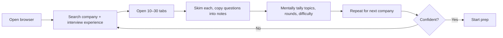
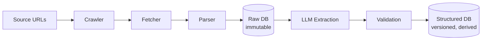
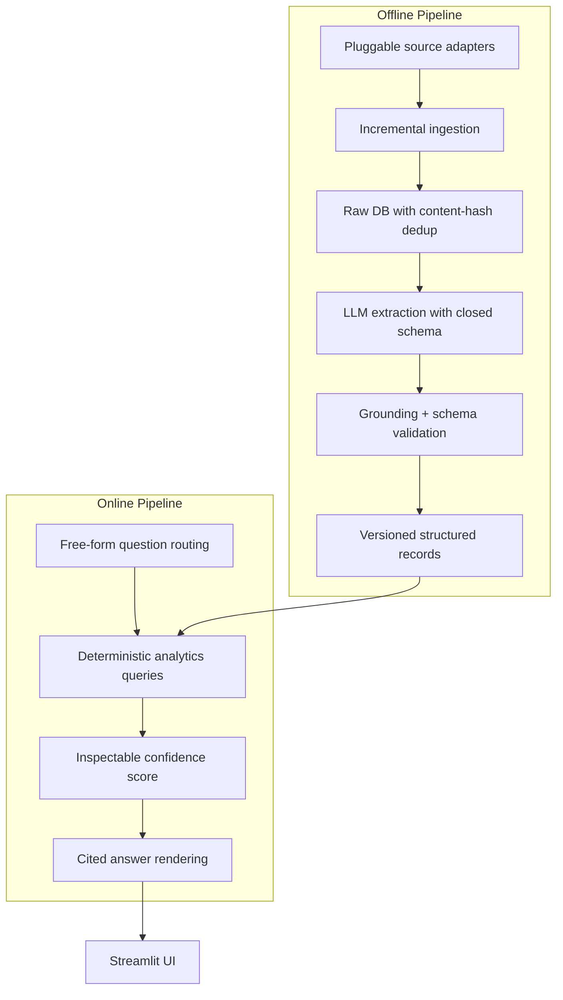
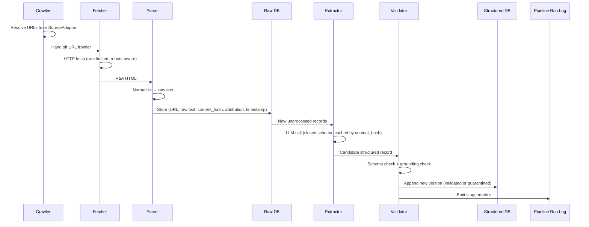
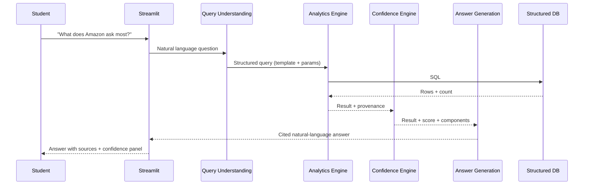
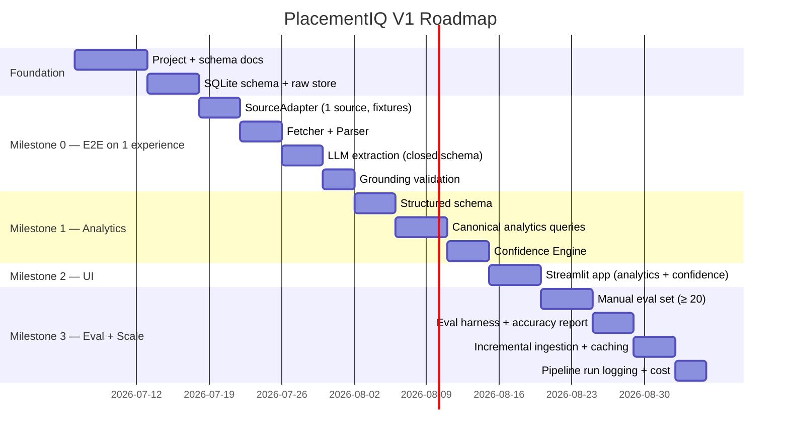

# PlacementIQ — Project Definition

> **Document type:** Software Requirements Specification (SRS) + Product Design Document
> **Status:** Frozen for V1
> **Owner:** Engineering
> **Last updated:** 2026-07-06

This document is the single source of truth for **what** PlacementIQ is, **why** it exists, and **what** V1 commits to. It is intentionally implementation-light. Concrete schema, module boundaries, and runtime behavior are defined downstream in `database.md`, `architecture.md`, and `agents.md`.

---

## 1. Project Vision

PlacementIQ is an **AI-powered Placement Intelligence Platform** that converts unstructured campus interview experiences into structured, queryable, analytics-driven intelligence.

Students should be able to ask questions like *"What does Amazon ask most?"*, *"Compare Amazon vs Oracle"*, and *"Which companies have the hardest Online Assessments?"* and receive answers that are **derived from real interview data**, not generated by a language model from its prior beliefs.

**The chatbot is the interface. Structured data is the product.** This is the central premise of the system and the lens through which every downstream decision is evaluated.

---

## 2. Problem Statement

Students preparing for campus placements currently do this manually for every target company:

- Read dozens of interview experience write-ups (blogs, Reddit threads, GeeksforGeeks posts, internal college groups).
- Mentally tally which topics appeared, which rounds were hardest, and which questions were repeated.
- Re-do this analysis from scratch for the next company.
- Try to remember which questions came from which source and how recent they were.

This workflow is:

- **Repetitive** — the same labor is performed per company.
- **Error-prone** — humans miscount, misattribute, and forget.
- **Non-scalable** — the corpus grows; human throughput does not.
- **Non-shareable** — every student reinvents the same analysis privately.

There is no existing tool that ingests this unstructured corpus and exposes it as a queryable analytics surface.

---

## 3. Why This Problem Exists

The data already exists. Hundreds of interview experiences are published publicly every placement season. The barrier is not data scarcity — it is **information extraction at scale**.

Three forces keep the problem unsolved:

1. **Source heterogeneity.** Experiences live on many sites with different HTML structures, conventions, and quality.
2. **Extraction ambiguity.** A "round" in one write-up is a "stage" in another. "DBMS" and "databases" and "joins" describe overlapping concepts. Without a controlled vocabulary, aggregation is meaningless.
3. **Trust deficit.** Students will not act on answers they cannot trace back to sources. A hallucinated response destroys the product; an honest, well-cited weak answer does not.

Any solution that does not address all three will look like a chatbot, and will be rightly distrusted.

---

## 4. Existing Workflow

The de-facto current workflow for a serious candidate is:

Properties of this workflow:

- **Linear time cost** in number of companies and experiences read.
- **No memory across companies** — every comparison is rebuilt from scratch.
- **No provenance** — when the student asks "did Amazon really ask B-trees?", the answer is "I think so, I read it somewhere."
- **No confidence** — the student has no way to know whether their mental model is based on 3 experiences or 30.

---

## 5. Proposed Solution

PlacementIQ replaces the manual workflow with a **data pipeline + analytics engine**:

Underneath the UI, an **offline pipeline** continuously turns the public corpus into a queryable Structured Database:

The boundary is intentional and load-bearing: **the LLM touches data only after it has been fetched, parsed, and stored as raw text.** Everything above the LLM is deterministic. Everything below it is derived, validated, and versioned. This is what allows the system to claim that its answers come from data, not from the model's prior.

---

## 6. Project Objectives

In priority order:

1. **Correctness of structured data.** Every record in the Structured Database must be derivable from a specific raw source and verifiable against it.
2. **Answer provenance.** Every answer must be traceable back to the experiences that produced it.
3. **Reproducibility.** Re-running the pipeline on the same raw inputs must produce the same structured outputs.
4. **Iterative extensibility.** New sources, new fields, and new analytics queries must be addable without rewrites.
5. **Cost discipline.** The system must operate within a defined LLM budget; LLM calls are cached and deduped.
6. **Interview defensibility.** Every component, schema choice, and pipeline stage must withstand a Staff-level engineering review.

---

## 7. Target Users

| User | Primary need | Success looks like |
|---|---|---|
| **Student preparing for placements** | Fast, trustworthy intelligence on target companies | Asks a question, gets a cited answer in seconds |
| **Student comparing companies** | Side-by-side topic / round / difficulty analysis | "Amazon vs Oracle" returns a real comparison, not a paragraph |
| **Engineering reviewer (interview)** | A system that demonstrates data engineering and AI discipline | Walks through the pipeline, schema, eval, and confidence formula without flinching |

V1 explicitly does **not** target:

- Recruiters or HR (different problem, different data).
- Career counselors at scale (V1 has no multi-user or auth surface).
- Non-placement interview prep (system design, behavioral, etc. are downstream scope).

---

## 8. Functional Requirements

Functional requirements are tagged **[V1]** (must ship), **[V1.1]** (defer unless trivial), or **[Future]**.

### 8.1 Ingestion

| ID | Requirement | Tag |
|---|---|---|
| F-ING-1 | System shall crawl a defined, allowlisted set of sources via a pluggable `SourceAdapter` interface. | V1 |
| F-ING-2 | System shall fetch URLs with rate limiting and `robots.txt` compliance. | V1 |
| F-ING-3 | System shall parse raw HTML into normalized raw text, preserving source attribution. | V1 |
| F-ING-4 | System shall deduplicate raw content via SHA-256 of normalized text. | V1 |
| F-ING-5 | System shall support incremental ingestion (only fetch / extract new content on subsequent runs). | V1 |
| F-ING-6 | System shall quarantine failed items and record reasons. | V1 |

### 8.2 Extraction

| ID | Requirement | Tag |
|---|---|---|
| F-EXT-1 | System shall extract structured fields (company, role, topics, rounds, questions, difficulty, outcome) from each raw experience using an LLM constrained to a closed JSON schema. | V1 |
| F-EXT-2 | System shall validate extracted records for schema correctness and grounding in the source text. | V1 |
| F-EXT-3 | System shall store every structured record as a new version (append-only history). | V1 |
| F-EXT-4 | System shall support manual correction of extracted records without losing prior versions. | V1.1 |

### 8.3 Analytics

| ID | Requirement | Tag |
|---|---|---|
| F-ANL-1 | System shall answer topic-distribution queries (e.g., "What does Amazon ask most?"). | V1 |
| F-ANL-2 | System shall answer cross-company comparison queries (e.g., "Amazon vs Oracle"). | V1 |
| F-ANL-3 | System shall answer round-distribution queries (e.g., "Which companies have the hardest OAs?"). | V1 |
| F-ANL-4 | System shall answer topic-coverage queries (e.g., "Which companies ask System Design?"). | V1 |
| F-ANL-5 | System shall execute analytics as deterministic SQL/template queries against the Structured DB. | V1 |

### 8.4 Confidence

| ID | Requirement | Tag |
|---|---|---|
| F-CON-1 | System shall compute a confidence score for every analytics result from measurable factors: sample size, grounding rate, source diversity, recency, extraction quality. | V1 |
| F-CON-2 | System shall expose the score and its components to the user. | V1 |
| F-CON-3 | System shall not present an answer as authoritative when confidence is below a defined threshold; it shall surface the gap. | V1 |

### 8.5 Presentation

| ID | Requirement | Tag |
|---|---|---|
| F-UI-1 | System shall expose a Streamlit UI for ad-hoc querying. | V1 |
| F-UI-2 | System shall expose the analytics layer behind a clean internal API so the UI is replaceable. | V1 |
| F-UI-3 | System shall display source attribution alongside every answer. | V1 |

---

## 9. Non-Functional Requirements

| ID | Requirement | Target |
|---|---|---|
| NF-COR-1 | Reproducibility | Re-running extraction on the same raw input + model version produces identical structured output. |
| NF-COR-2 | Data integrity | Raw DB is immutable once written. |
| NF-COST-1 | LLM cost ceiling | Total LLM spend per ingestion run is bounded and reported. |
| NF-COST-2 | Caching | Identical raw content never re-triggers extraction. |
| NF-OBS-1 | Observability | Every pipeline run records: stage, item counts, failures, cost, duration. |
| NF-MAINT-1 | Component isolation | Each pipeline stage is independently invokable and testable. |
| NF-MAINT-2 | Source extensibility | Adding a new source requires only a new `SourceAdapter`; no pipeline changes. |
| NF-SEC-1 | Source ethics | Robots.txt respected; rate-limited; no credentialed scraping. |
| NF-LEG-1 | Legal posture | Public interview experiences stored for analysis with attribution; not republished as full text outside the UI. |

---

## 10. Core Features

The V1 feature set is deliberately small. Each feature maps to a specific student pain point and to a specific pipeline stage.

| Feature | What it is | Why it matters |
|---|---|---|
| **Pluggable source adapters** | Each source is a class behind a common interface | Lets us add sources without touching the pipeline; enables fixture-based testing |
| **Incremental ingestion** | Only new content is processed on subsequent runs | Keeps costs flat as the corpus grows; makes daily refreshes feasible |
| **Content-hash dedup** | SHA-256 of normalized raw text is the dedup key | The single mechanism that makes "caching" and "idempotency" real, not aspirational |
| **Closed-schema extraction** | LLM must produce JSON against a fixed schema; values constrained to controlled vocabularies | Prevents the LLM from inventing topics, companies, or roles |
| **Grounding validation** | A second pass checks each extracted field against the source text | The only thing that makes the Structured DB trustworthy |
| **Versioned records** | Every structured record is append-only; corrections create new versions | Enables an eval harness that compares extraction v1 vs v2; protects against silent data loss |
| **Deterministic analytics** | Every answer is a SQL/template query against the Structured DB | The "not a chatbot" guarantee is enforceable |
| **Inspectable confidence** | Score and components visible to the user, not a black-box probability | Distinguishes a Staff design from a student project; builds user trust |

---

## 11. High-Level Workflow

### 11.1 Offline (ingestion)

Key properties of this workflow:

- **Idempotent**: re-running it on unchanged data is a no-op (content hash).
- **Observable**: every stage emits counts and failures.
- **Recoverable**: failed items are quarantined with reason, not lost.
- **Cache-friendly**: extraction is keyed on content hash, so the LLM is never called twice for the same text.

### 11.2 Online (query)

Key property: **the LLM at the end is a renderer, not a reasoner.** Given a structured result, it produces prose. It does not generate facts.

---

## 12. Technology Stack

| Layer | V1 Choice | Role |
|---|---|---|
| Language | **Python 3.11+** | Standard for data + AI; mature ecosystem. |
| HTTP fetching | **httpx** | Async, typed, modern; replaces requests for new work. |
| HTML parsing | **BeautifulSoup4 + selectolax** | Tolerant HTML parser; selectolax for performance on large docs. |
| LLM SDK | **Anthropic Python SDK** (Claude) | Primary extraction model. |
| Schema validation | **Pydantic v2** | Strict typed schemas; JSON-schema export for closed-prompt extraction. |
| Structured DB | **SQLite** | Single-file, zero-ops, sufficient for V1 corpus. |
| Raw storage | **SQLite + filesystem** | Raw HTML on disk (immutable), metadata in DB. |
| Deduplication | **SHA-256** (hashlib) | Standard, deterministic, no external dependency. |
| UI | **Streamlit** | Rapid V1 iteration; explicitly a placeholder. |
| Testing | **pytest** | Standard; eval harness uses pytest fixtures. |
| Linting / format | **ruff + black** | Fast, opinionated, minimal config. |
| Type checking | **mypy (strict on core modules)** | Catches schema drift at the boundary. |

---

## 13. Technology Selection Rationale

### Why Python

The data-engineering + AI workflow is Python-native. Every library we need (HTTP, parsing, LLM SDK, Pydantic, SQLite driver, Streamlit) is Python-first. Choosing anything else would add friction with no V1 benefit.

### Why SQLite for V1

- The expected corpus (hundreds to low-thousands of experiences) fits comfortably in SQLite.
- Zero operations cost; no separate server.
- Strong typing via SQLite + Pydantic gives us a real schema.
- The schema and queries are designed to be **portable**: when the data outgrows SQLite, the migration target is Postgres, not a redesign. We commit to writing SQL that is portable, not to staying on SQLite forever.

### Why httpx over requests / aiohttp

- Async-native, but usable synchronously.
- Typed responses, timeouts, and connection pooling that work out of the box.
- One library covers both batch ingestion (async fan-out) and ad-hoc fetches.

### Why BeautifulSoup4 + selectolax

- BeautifulSoup4 is the most tolerant HTML parser; handles real-world broken markup.
- selectolax is a C-backed parser for throughput when we process large volumes.
- LXML alone is faster but more brittle on malformed HTML; we accept the trade.

### Why Pydantic v2

- Pydantic models double as JSON schemas, which we export to constrain the LLM at extraction time.
- Validation errors are structured and inspectable, which is what the Validation stage depends on.
- Strict mode catches coercion bugs (e.g., a topic string being silently cast to a number).

### Why Anthropic SDK

- Strong structured-output support, including tool-use and JSON modes.
- Cost and latency are competitive for the extraction workload.
- The choice of model is independent of the choice of SDK; the boundary is narrow enough that swapping providers is a single module.

### Why Streamlit (and the caveat)

- Lowest-friction path to a working demo and an internal tool.
- Single-file apps are easy to reason about for V1.
- **Caveat:** Streamlit is not a production frontend. The analytics layer is exposed behind a clean Python API so a real frontend (FastAPI + React, or any other) can replace Streamlit without touching the analytics code. This is a non-negotiable architectural property, not a future nice-to-have.

### Why SHA-256 for dedup

- Deterministic, available in stdlib.
- Stable across runs and machines.
- The cost of a hash on a few KB of text is negligible; the cost of re-extracting the same content is not.

### Why append-only versioned structured records

- Re-extraction is a real operation (prompt changes, model upgrades, schema evolution). We need history.
- The eval harness naturally benefits: compare v1 vs v2 against the labeled set.
- SQLite handles this with a `valid_from` / `valid_to` pattern or a `version` column on the same primary key — both are simple, both are portable.

---

## 14. Project Scope

### In Scope (V1)

- Ingestion from **one to two allowlisted sources** via `SourceAdapter` implementations.
- Extraction of: company, role, topics, rounds, questions, difficulty, outcome.
- Validation: schema correctness + grounding verification.
- Analytics for the five canonical question types (see §10).
- Confidence scoring with visible components.
- Streamlit UI with source attribution and confidence panel.
- Manual eval dataset of ≥ 20 labeled experiences.
- Pipeline run logging and cost tracking.

### In Scope (V1.1, if time permits)

- Manual correction flow for extracted records.
- Additional sources (a third `SourceAdapter`).
- Cross-source dedup (same experience published on two sites).

---

## 15. Out of Scope (V1)

- Authentication, multi-user, per-user history.
- Production frontend (FastAPI + React) — designed for, not built.
- Real-time ingestion (cron / on-demand only).
- Non-English-language sources.
- Behavioral, system-design-prep, or resume content (downstream products).
- Mobile UI.
- Public API for third parties.
- Auto-correction of extracted records by the LLM.
- Vector search / RAG as a primary answer path. **Answers come from SQL against the Structured DB; embedding-based retrieval is a V1.1+ feature, if at all.**

---

## 16. Success Metrics

V1 is considered successful when **all** of the following are measurable and meet target:

| Metric | Target | Why it matters |
|---|---|---|
| **End-to-end pipeline runs on one experience** | Under 5 minutes human time, on a single machine | Proves the loop works before we scale. |
| **Extraction accuracy** | ≥ 85% field-level F1 on the manual eval set | The Structured DB is only as good as the extractor. |
| **Grounding rate** | ≥ 90% of extracted fields are grounded in the source | The claim "answers come from data" only holds if extraction is grounded. |
| **Analytics correctness** | 100% of canonical questions return a verifiable, reproducible result | The "not a chatbot" guarantee. |
| **Incremental run cost** | Re-running ingestion on unchanged sources costs ~0 LLM tokens | Caching and dedup are real. |
| **Confidence calibration** | Confidence is monotonically related to actual accuracy on a held-out subset | The user can trust the number. |
| **Time to add a new source** | One new file (a `SourceAdapter`) + re-run; no pipeline changes | The extensibility promise is architectural, not aspirational. |

---

## 17. Risks and Challenges

| Risk | Likelihood | Impact | Mitigation |
|---|---|---|---|
| **LLM extraction drift across model versions** | High | Medium | Pin model versions in extraction config; treat re-extraction as a versioned operation. |
| **Source layout changes break the parser** | High | Medium | `SourceAdapter` isolates source-specific code; parser tests use fixtures, not network. |
| **Controlled vocabulary is too narrow** (extractor drops valid topics) | Medium | High | Iteratively grow vocabulary from the eval set; vocabulary has a hierarchy, not a flat list. |
| **Controlled vocabulary is too broad** (extractor invents topics) | Medium | High | Closed enum in the extraction prompt; grounding check rejects ungrounded topics. |
| **Legal / ToS pushback from a source** | Medium | High | Allowlist sources; respect robots.txt; rate limit; attribution everywhere; pluggable adapter means we can drop a source in one place. |
| **Corpus too small for confident answers** | High (early) | Medium | Confidence Engine surfaces this honestly; UI shows "low confidence — 4 experiences" rather than fabricating. |
| **Scope creep toward "chatbot with RAG"** | High | High | Architectural review: any new feature that bypasses the analytics engine or treats the LLM as a primary reasoner is rejected. |
| **LLM cost runaway** | Medium | Medium | Per-run budget, dedup cache, batched extraction, fixture-based test runs that never hit the LLM. |

---

## 18. Future Scope

These are explicitly **out of scope for V1** but designed-in wherever possible:

- **Postgres migration** when corpus size or concurrency demands it. Schema is written portably.
- **FastAPI + React frontend** replacing Streamlit. Analytics layer is decoupled.
- **Additional source adapters** (Reddit, college internal portals via user upload, etc.).
- **Cross-source dedup and entity resolution** beyond content hashing.
- **Topic taxonomy expansion** with a hierarchical, semi-curated vocabulary.
- **Embedding-based semantic search** as a *secondary* path, never replacing SQL analytics.
- **User accounts, history, and saved queries.**
- **Public API for partner colleges.**
- **Pluggable evaluation harnesses** for new question types.

---

## 19. Development Roadmap

The roadmap is sequenced so that the **first deployable artifact is a working end-to-end loop on a single experience**, not a half-built crawler. Every milestone ends in something runnable.

### Milestone definitions

**Milestone 0 — One experience end-to-end.**
A single URL enters the pipeline, is fetched, parsed, extracted, validated, and lands in the Structured DB. **No UI yet.** Output is a row in the DB and a log line. *If this milestone is not green, nothing else matters.*

**Milestone 1 — Analytics + Confidence.**
The five canonical questions return deterministic results from the Structured DB. The Confidence Engine produces an inspectable score for each result.

**Milestone 2 — UI.**
Streamlit app that lets a user ask a question, see the result, see the confidence panel, and click through to source attribution.

**Milestone 3 — Evaluation and hardening.**
Manual eval set, eval harness, accuracy report, incremental ingestion verified end-to-end, pipeline run logging in place.

---

## 20. Engineering Principles

These are the rules every contributor follows. They are not aspirational; they are how disagreements get resolved.

### 20.1 Data is the product, not the model

If a feature can be implemented as a query against the Structured DB, it must be. The LLM is allowed to *render* an answer, never to *invent* one. Any design that treats the LLM as a primary reasoner is rejected.

### 20.2 The LLM is a bounded, validated component

The LLM is invoked only at the Extraction stage, against a closed schema, with a deterministic verifier. The output is treated as a candidate, not a fact, until the verifier passes.

### 20.3 Raw data is sacred

Once a raw record is written, it is not modified. Re-extraction writes a new version of the structured record; it does not rewrite raw. This is what makes the system auditable.

### 20.4 Idempotency is not optional

Every stage must be safe to re-run on the same input. Dedup is implemented via SHA-256 of normalized raw text. Caching is the default, not the optimization.

### 20.5 Build the loop before the scale

Milestone 0 is one experience, end-to-end, on a single machine. We do not parallelize, distribute, or scale what does not yet work. We do not start Milestone 1 until Milestone 0 is green.

### 20.6 Every component is independently testable

Each pipeline stage has a fixture-based test that does not require the network, the LLM, or the previous stage. Integration tests verify the loop. This is what makes the system debuggable.

### 20.7 Confidence is a first-class engineering concern, not a UX label

Confidence is a deterministic function of measurable factors. The formula is documented, version-controlled, and visible to the user. It is not a learned model and not a vibe.

### 20.8 Decisions are documented at the time they are made

Whenever a design choice is made (closed enum, SHA-256, append-only, SQLite), the reason is recorded in the relevant doc (`database.md` / `architecture.md`). Future contributors do not have to reconstruct the reasoning from git history.

### 20.9 The architecture is a constraint, not a suggestion

This document and `database.md` define the contract. New features that require violating the contract (e.g., "let the LLM query the DB directly", "store mutable raw records") are rejected by default and require an explicit amendment to the relevant doc.

### 20.10 The system must be explainable in an interview

Every schema choice, every pipeline stage, every component boundary should withstand the question "why is it this way?" If it cannot, it is not yet ready to ship.

---

## Appendix A — Glossary

| Term | Definition |
|---|---|
| **Raw DB** | Immutable store of fetched HTML and normalized text, keyed by content hash, with full attribution. |
| **Structured DB** | Versioned, derived store of typed records (companies, experiences, rounds, questions, topics) produced by the extraction + validation pipeline. |
| **SourceAdapter** | Pluggable interface that, given a source name, returns a URL frontier to crawl. |
| **Grounding** | Property of an extracted field: the value is entailed by (or directly present in) the source text. |
| **Confidence** | Deterministic, inspectable score for an analytics result, computed from sample size, grounding rate, source diversity, recency, and extraction quality. |
| **Quarantine** | State for items that failed validation, with a recorded reason. Quarantined items do not enter the Structured DB but are retained for debugging. |
| **Canonical question** | One of the five reference questions (e.g., "What does Amazon ask most?") that every V1 analytics query must answer. |

---

## Appendix B — Doc Map

This is the entry point. The rest of the system is specified downstream:

- **`database.md`** — the schema. Defines Raw DB, Structured DB, controlled vocabularies, dedup, versioned records, and pipeline run logging. **Read this next.**
- **`architecture.md`** — module boundaries, interfaces, and runtime behavior of each pipeline stage.
- **`agents.md`** — the LLM extraction prompt, the JSON schema, the grounding verifier, and the rationale for each.
- **`roadmap.md`** — milestone breakdown, ticket-level work, and acceptance criteria.
- **`CLAUDE.md`** — contributor onboarding, dev setup, and project conventions.

---

*End of document.*
