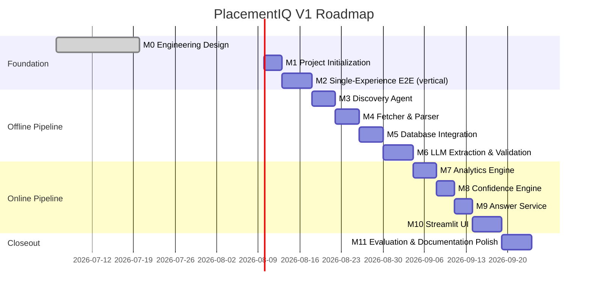

# PlacementIQ — Development Roadmap

> **Document type:** Execution plan, milestone breakdown, and acceptance criteria
> **Status:** V1 — active
> **Owner:** Engineering
> **Last updated:** 2026-07-06

This document is the engineering execution plan for PlacementIQ. It assumes the architecture in [`docs/architecture.md`](architecture.md), the schema in [`docs/database.md`](database.md), the component contracts in [`docs/agents.md`](agents.md), and the project scope in [`docs/project.md`](project.md) are frozen. It does not re-litigate any of those. It answers one question: **in what order, with what deliverables, and with what acceptance criteria, do we build it?**

---

## Development Philosophy

The plan is shaped by three convictions, in priority order.

1. **Build the loop before the scale.** Milestone 0 (one experience, end-to-end) is the most important deliverable in the project. A half-built crawler is worth less than a working single-item loop. We do not start parallel work until the loop is green.
2. **Milestones are vertical, not horizontal.** A milestone ships a *thin slice through the entire stack* — schema, code, tests, and the relevant documentation — not a "build all the parsers" or "build all the analytics." Vertical slices produce deployable artifacts and surface integration bugs early.
3. **Each milestone ends in something runnable.** Every milestone has a *Definition of Done* that includes a command someone can run and a result they can see. If a milestone has no runnable artifact, it is not done.

Three operational rules apply throughout:

- **Tests are written alongside the code, not after.** A milestone that ships code without tests has not shipped.
- **Documentation is updated in the same commit as the code it describes.** A milestone that diverges the code from the docs has not shipped.
- **The eval set grows with the system.** Every milestone that touches extraction, validation, or analytics adds (or annotates) labeled examples.

---

## Project Milestones

The V1 plan is twelve milestones. The first is complete; the next ten are sequenced by dependency; the last is the eval-and-polish closeout.

The dependency graph is linear because the architecture is linear — each milestone's deliverable is the next milestone's input. A small amount of parallelism is possible (e.g., M5 schema and M6 extraction prompt can be drafted in parallel), but the *acceptance* of M5 blocks M6's completion.

---

## Milestone Breakdown

Each milestone is defined by: goal, scope, deliverable, acceptance criteria, and Definition of Done. Milestones do not overlap; the next milestone's goal assumes the previous milestone's deliverables are merged and green.

### M0 — Engineering Design *(Complete)*

| Field | Value |
|---|---|
| **Status** | ✅ Done (2026-07-06) |
| **Goal** | Lock the architecture, schema, and component contracts in writing. |

**Scope.**
- `docs/project.md` — SRS, scope, success metrics.
- `docs/architecture.md` — pipeline, components, boundaries.
- `docs/database.md` — schema, dedup, versioning.
- `docs/agents.md` — per-component contracts.
- `README.md` — public landing page.

**Deliverable.** A frozen set of design documents that the implementation milestones build against.

**Acceptance criteria.** Every component name, table name, and interface in the design docs has a stated rationale. The "not a chatbot" boundary is enforced by the LLM-component list. The schema is portable to Postgres without architectural change.

**Definition of done.** All five documents merged. Architecture freeze announced.

---

### M1 — Project Initialization

| Field | Value |
|---|---|
| **Status** | 🔜 Next |
| **Goal** | Stand up the repository so the team can start building. |

**Scope.**
- Repo layout matches the directory structure in `docs/architecture.md` (`src/placementiq/{ingestion,storage,extraction,analytics,ui,pipeline}`, `tests/`).
- Python 3.11+ environment, package manager pinned, `pyproject.toml` with the planned dependencies (httpx, beautifulsoup4, selectolax, pydantic, anthropic-sdk, streamlit, pytest, mypy, ruff, black).
- `pytest`, `mypy`, `ruff`, `black` all configured and passing on an empty source tree.
- `pre-commit` hook set up.
- `docs/CLAUDE.md` (contributor onboarding) drafted.
- A `make` (or `task`) target per common operation: `test`, `lint`, `typecheck`, `run-pipeline`, `run-ui`.

**Deliverable.** A green CI run on an empty repo. A new contributor can clone, install, and run `make test` successfully.

**Acceptance criteria.**
- All four tooling checks pass on the empty tree.
- Directory layout matches `docs/architecture.md`.
- `pyproject.toml` pins the dependency versions that match the rationale in `docs/project.md` §12.

**Definition of done.**
- CI is green.
- `docs/CLAUDE.md` is merged.
- The empty-tree test command is documented in the README's Getting Started section.

---

### M2 — Single-Experience End-to-End (the First Vertical Slice)

| Field | Value |
|---|---|
| **Status** | 📋 Planned |
| **Goal** | One interview experience flows through the entire pipeline on a single machine. The output is a row in the Structured DB. No UI yet. |

**Scope.**
- Hard-coded URL + hard-coded `SourceAdapter` (no Discovery yet — that is M3).
- Fetcher fetches the URL (no rate limit, no `robots.txt` compliance in this milestone — just a working HTTP call).
- Parser normalizes the HTML and computes `content_hash`.
- Raw DB receives the row (idempotent insert).
- LLM Extraction produces a `StructuredRecord` against a draft schema.
- Validation produces a grounding summary (or a quarantine).
- Structured DB receives the active version (or a quarantine row).
- A short Python script (`scripts/run_single.py` or equivalent) wires it all together.
- One printed log line at each stage boundary: `crawled → fetched → parsed → extracted → validated → persisted`.

**Deliverable.** A command someone can run that prints the pipeline trace and shows a row in the Structured DB.

**Acceptance criteria.**
- The command runs on a chosen fixture URL and produces a structured record end-to-end.
- Running it twice produces zero new LLM calls (cache hit on `content_hash`).
- The structured record's fields trace back to substrings of the source text.
- The pipeline does not crash on a fetch error, parse error, or extraction error; each is logged.

**Definition of done.**
- The end-to-end command is documented in `docs/CLAUDE.md`.
- The pipeline trace log is checked in as a fixture for future tests.
- A short note is added to `docs/architecture.md` confirming M2 was the first vertical slice.

**Why this milestone exists.** If M2 is not green, **nothing else matters**. Every architectural risk (LLM contract, schema versioning, grounding check) is exposed by this single run.

---

### M3 — Discovery Agent

| Field | Value |
|---|---|
| **Status** | 📋 Planned |
| **Goal** | The pipeline knows how to find URLs from a `SourceAdapter`, not just consume hard-coded ones. |

**Scope.**
- The `SourceAdapter` interface is finalized.
- One concrete adapter is implemented (the one chosen for V1).
- Discovery enumerates the adapter's URL list with pagination.
- URL normalization (tracking-param stripping, canonical form).
- In-memory URL dedup within a run.
- Discovery emits a `URLFrontierItem` stream that the Fetcher consumes.

**Deliverable.** A run that, given an adapter, produces a list of URLs in the run log and hands them off to the Fetcher.

**Acceptance criteria.**
- Discovery is fixture-tested with a recorded list page; the output URL list matches exactly.
- An adapter that raises `SourceLayoutError` does not fail the run.
- Re-running Discovery on the same source within a run produces no duplicate URLs.

**Definition of done.**
- The `SourceAdapter` interface is documented in `docs/agents.md` (or a referenced addendum).
- One adapter ships with the repo, with a recorded fixture.
- A run-from-discovery command is added to the Makefile.

---

### M4 — Fetcher & Parser

| Field | Value |
|---|---|
| **Status** | 📋 Planned |
| **Goal** | The Fetcher and Parser are production-shaped: rate limiting, `robots.txt`, fetch cache, retry policy, idempotent inserts, parser version stamping. |

**Scope.**
- Fetcher: rate limiting (token bucket per source), `robots.txt` resolution, fetch cache with TTL, retry with exponential backoff (max 3).
- Parser: HTML normalization, `content_hash` (SHA-256), idempotent insert into `raw_experiences`, `parser_version` stamping, source-specific selector logic delegated to the adapter.
- Both components expose the typed contracts from `docs/agents.md`.

**Deliverable.** The M2 vertical slice, but with production-shaped fetching and parsing.

**Acceptance criteria.**
- A `robots.txt` disallow produces a `FetchFailure(reason="robots_disallowed")` and is recorded in the run log.
- A 5xx response produces exactly 3 attempts, then a typed failure.
- Re-parsing the same content produces zero new rows (unique constraint on `content_hash`).
- The fetcher's cache returns the same response on a second call within the TTL.

**Definition of done.**
- The retry and rate-limit behaviors are fixture-tested (no real network).
- A `rate_limit_test` and a `retry_test` are in the test suite.
- A run with a deliberate source outage produces a clean run log with per-item failures, not a crash.

---

### M5 — Database Integration

| Field | Value |
|---|---|
| **Status** | 📋 Planned |
| **Goal** | The Persistence Layer is the only path to the database. Every read and write goes through it. |

**Scope.**
- The Persistence Layer module is implemented for every table in `docs/database.md`.
- The schema is applied via a versioned migration tool (Alembic or equivalent) — *not* a single SQL file.
- The supersede-and-insert pattern is implemented as a single transaction.
- Foreign-key enforcement is enabled.
- `pragma_table_info` / `information_schema` schema-check test is wired into CI.
- The fixture-database pattern is in place for every test that touches storage.
- The `pipeline_runs` and `pipeline_run_stages` tables start receiving real per-stage metrics.

**Deliverable.** A test suite where the fixture DB is constructed in code and torn down per test, with no shared state.

**Acceptance criteria.**
- Every component that previously wrote raw SQL now goes through the Persistence Layer. (Grep for raw SQL in `src/` returns matches only in the storage package.)
- The schema-check test fails CI if the live schema drifts from the canonical DDL.
- The supersede-and-insert test verifies atomicity: a forced mid-transaction error leaves the prior `active` row intact.
- The fixture DB pattern is used by every test in the suite.

**Definition of done.**
- `docs/database.md` is unchanged (this milestone *implements* it; it doesn't redocument it).
- The migration tool is configured and the initial migration is committed.
- A schema-drift bug is reproduced and fixed, to prove the test works.

---

### M6 — LLM Extraction & Validation

| Field | Value |
|---|---|
| **Status** | 📋 Planned |
| **Goal** | The Extractor and Validator produce grounded, versioned structured records from raw text. |

**Scope.**
- The closed JSON schema (Pydantic) is finalized and exported as a JSON schema for the LLM call.
- The extraction prompt is versioned (`prompt_version`); the first version is checked in.
- The Extractor caches by `(content_hash, prompt_version, model_version)`.
- The Validator returns per-field grounding flags with evidence pointers.
- Quarantine path: a record with any ungrounded field is *not* partially stored.
- Every attempt is recorded in `extraction_attempts` (cost, tokens, latency, result).
- A first version of the manual eval set (≥ 20 labeled experiences across ≥ 5 companies) is checked in.

**Deliverable.** A pipeline that, on the V1 source corpus, produces a `structured_experiences` table whose active rows have a measured grounding rate.

**Acceptance criteria.**
- Extraction accuracy on the labeled set meets the threshold in `docs/project.md` §16.
- Grounding rate on the labeled set is ≥ 90%.
- Cost per experience is logged and within budget.
- Re-extraction with a new prompt version produces a new `structured_experiences` row, not an overwrite.
- A forced ungrounded field causes quarantine, not partial storage.

**Definition of done.**
- The eval set lives in the repo as data, not a spreadsheet.
- The extraction prompt and the schema are reviewed and versioned.
- A re-extraction dry-run (same content, new prompt version) is documented in `docs/agents.md`'s "Future Improvements" or a follow-up ADR.

---

### M7 — Analytics Engine

| Field | Value |
|---|---|
| **Status** | 📋 Planned |
| **Goal** | The five canonical questions are answered by deterministic SQL templates. |

**Scope.**
- The template registry is implemented: one function per canonical question, with parameterized SQL.
- The five canonical questions from `docs/project.md` are wired:
  1. Topic frequency by company.
  2. Cross-company topic comparison.
  3. Difficulty distribution by company, by round type.
  4. Topic rollup by parent.
  5. Round-type presence by company.
- Every template filters on `structured_experiences.status = 'active'`.
- A fixture DB is built for each template, with a known correct result.

**Deliverable.** A function the Answer Service can call: `analytics.run(query) -> AnalyticsResult`.

**Acceptance criteria.**
- Each canonical question returns the correct result on its fixture DB.
- An inactive (superseded or quarantined) record never appears in any template's output.
- A malformed query produces `AnalyticsError`, not a SQL injection or a crash.
- The SQL executed is returned in the result for audit.

**Definition of done.**
- The template registry is documented in `docs/agents.md`'s Analytics Engine spec.
- A test asserts that exactly five templates are registered (so adding a template is a deliberate commit).

---

### M8 — Confidence Engine

| Field | Value |
|---|---|
| **Status** | 📋 Planned |
| **Goal** | Every analytics result carries an inspectable confidence score, with named components. |

**Scope.**
- The confidence formula is finalized and documented (it is the only place this milestone defines something new).
- `Confidence { score, components, band, rationale }` is the public return type.
- The five components (sample size, grounding rate, source diversity, recency, extraction quality) are each computable from the data the Analytics Engine has.
- Missing components are reported as `0.0` and labelled, not silently dropped.
- Monotonicity invariants are tested: more data raises confidence; lower grounding lowers it; etc.

**Deliverable.** A function the Answer Service can call: `confidence.score(result, meta) -> Confidence`.

**Acceptance criteria.**
- The formula is a pure function: same inputs always produce the same score.
- The score's components are returned and visible to the test.
- A zero-sample result produces a `low`-band score with a rationale that names the missing sample size.
- A high-grounding, multi-source, recent corpus produces a `high`-band score.

**Definition of done.**
- The formula is documented in a short section in `docs/architecture.md` or a referenced addendum.
- The monotonicity tests are in CI.
- The band thresholds (`low` / `medium` / `high`) are documented and have rationale.

---

### M9 — Answer Service

| Field | Value |
|---|---|
| **Status** | 📋 Planned |
| **Goal** | A single public entrypoint turns a question string into a `RenderedAnswer`. |

**Scope.**
- The Router maps free-form questions to `AnalyticsQuery { template_id, params }`.
- The Answer Service composes Router → Analytics → Confidence → Renderer.
- `UnknownQuery` is returned for questions outside the canonical set, with a short clarification prompt.
- The Renderer is implemented with templates per result type; the LLM is optional for prose in this milestone (templates are sufficient).
- A `RenderedAnswer { text, sources, confidence_panel }` is returned.

**Deliverable.** A function the UI can call: `answer(question) -> RenderedAnswer | AnswerError`.

**Acceptance criteria.**
- Each canonical question produces a `RenderedAnswer` with text, sources, and a confidence panel.
- A non-canonical question produces a `clarification_needed` error, not a hallucinated answer.
- The Renderer is template-based; no LLM call is required for the answer to be correct.
- The Router is fixture-tested: given a question, the resolved template is correct.

**Definition of done.**
- The Answer Service is the only public entrypoint. The UI does not import any other module.
- The clarification path is tested with a fixture of out-of-scope questions.

---

### M10 — Streamlit UI

| Field | Value |
|---|---|
| **Status** | 📋 Planned |
| **Goal** | A user can ask a question in a browser and see a cited, confident answer. |

**Scope.**
- A Streamlit app with a single input box, a results pane, and a confidence panel.
- The app calls `answer(question)` and renders the result.
- Source links are clickable.
- The confidence panel shows the score, the band, and the components.
- Loading and error states are handled (clarification, data error, no data).
- A small set of seed questions is provided as clickable chips for first-time users.

**Deliverable.** A `streamlit run` command that produces a usable demo.

**Acceptance criteria.**
- The UI runs end-to-end on a populated Structured DB.
- The UI is a thin shell: it imports only the Answer Service. No DB, no LLM, no analytics in the UI module.
- Source links open in a new tab and resolve to the original experience URLs.
- The confidence panel matches the documented formula.

**Definition of done.**
- A short demo recording is checked in (or a static screenshot set, if recording is impractical).
- The README's Getting Started section is updated with the actual `streamlit run` command.
- The known caveat ("Streamlit is a V1 placeholder; FastAPI + React is the V2 frontend") is preserved in the README and the code comments.

---

### M11 — Evaluation & Documentation Polish

| Field | Value |
|---|---|
| **Status** | 📋 Planned |
| **Goal** | The V1 is measurable, the docs match the code, and the eval set is the contract. |

**Scope.**
- The eval set grows to ≥ 20 labeled experiences (or whatever the current threshold is; see `docs/project.md` §16).
- An eval harness runs as part of CI; it fails the build when accuracy drops below threshold.
- All four design docs are re-read in the order README → project → database → architecture → agents. Any divergence from the code is fixed in the doc, not the code (unless the doc was wrong, in which case the code is right and the doc is updated).
- `docs/CLAUDE.md` is finalized for new contributors.
- A short `CONTRIBUTING.md` is added (or merged into the README).
- The LICENSE file is selected and committed.
- A `CHANGELOG.md` entry for V1 is drafted.

**Deliverable.** A V1 release that is *measurable, documented, and explainable.*

**Acceptance criteria.**
- The eval harness is green; the accuracy threshold from `docs/project.md` §16 is met.
- The five canonical questions return correct results on the live system.
- `make test`, `make lint`, `make typecheck`, and the eval harness all pass in CI.
- The README's claims about installation, running, and demo are all actually true.
- A reviewer with no prior context can clone, install, run the UI, and answer the five canonical questions.

**Definition of done.**
- V1 is tagged.
- The CHANGELOG entry is published.
- A retrospective note is added to the repo (or a follow-up doc) recording what was hard, what was wrong, and what to change for V2.

---

## Deliverables for Each Milestone

| Milestone | Primary Deliverable | Secondary Deliverables | Demo Command |
|---|---|---|---|
| M0 | Frozen design docs | — | — |
| M1 | Repo with CI green | `docs/CLAUDE.md`, Makefile | `make test` |
| M2 | One experience end-to-end | Pipeline trace fixture | `make run-single` |
| M3 | `SourceAdapter` + Discovery | URL frontier fixture | `make run-discovery` |
| M4 | Fetcher + Parser hardened | Rate-limit, retry, robots tests | `make run-pipeline` |
| M5 | Persistence Layer | Schema migration, schema-check CI | `make schema-check` |
| M6 | Extractor + Validator + eval set | Versioned prompt, grounding check | `make run-extract` |
| M7 | Analytics Engine + 5 templates | Per-template fixture DBs | `make run-analytics` |
| M8 | Confidence Engine | Monotonicity tests | (called by M9) |
| M9 | Answer Service | Router fixtures | `make answer Q="..."` |
| M10 | Streamlit UI | Demo recording | `streamlit run ...` |
| M11 | V1 release | Eval harness, polished docs | `make verify` |

The "Demo Command" column is the runnable artifact that proves the milestone is done. If a milestone has no runnable command, it is not done.

---

## Acceptance Criteria

A milestone is accepted when *all* of the following are true:

| # | Criterion | What it means in practice |
|---|---|---|
| A1 | **The milestone's demo command works on a clean clone.** | A reviewer with no prior context can run the command and see the expected output. |
| A2 | **All tests pass.** | The milestone's tests are in the suite, and CI is green. |
| A3 | **The docs match the code.** | The relevant design doc has been re-read and any divergence is reconciled (in whichever direction is correct). |
| A4 | **The Definition of Done checklist is complete.** | Every box in the milestone's DoD is checked. |
| A5 | **The next milestone's prerequisites are met.** | A reviewer can pick up the next milestone's ticket without asking "what was M2, again?" |

A milestone is **not** accepted if any of these fail. Partial acceptance ("the code works but the docs are wrong") is not a thing.

---

## Dependencies Between Milestones

The graph below is what determines the order. It is intentionally linear; deviating from it is a sign that an architectural assumption is being broken.

```mermaid
flowchart LR
    M0[M0: Design] --> M1[M1: Init]
    M1 --> M2[M2: E2E]
    M2 --> M3[M3: Discovery]
    M3 --> M4[M4: Fetcher & Parser]
    M4 --> M5[M5: Database]
    M5 --> M6[M6: LLM Extraction]
    M6 --> M7[M7: Analytics]
    M7 --> M8[M8: Confidence]
    M8 --> M9[M9: Answer Service]
    M9 --> M10[M10: UI]
    M10 --> M11[M11: Eval & Polish]
```

**Hard dependencies** (cannot be parallelized without breaking the architecture):

- M5 blocks M6, M7, M8, M9. The Persistence Layer is the contract every later component signs against.
- M6 blocks M7. Analytics reads structured data; structured data requires extraction.
- M7 blocks M8, M9. Confidence is computed from analytics results; the Answer Service composes both.
- M9 blocks M10. The UI calls only the Answer Service.

**Soft dependencies** (parallelizable with coordination):

- The extraction prompt (M6) can be drafted in parallel with the schema migration (M5). Acceptance still blocks on M5.
- The eval set (M6) can be assembled in parallel with M3–M5. The set is independent of the code that consumes it.
- The Streamlit UI skeleton (M10) can be stubbed during M9 to surface API questions earlier. Acceptance still blocks on M9.

**Anti-dependencies** (do not do these in parallel):

- Writing analytics templates before extraction is settled → templates will be rewritten.
- Writing the Streamlit UI before the Answer Service contract is stable → UI rework.
- Tuning the confidence formula before the analytics result shape is stable → formula rework.

---

## Risks & Mitigation

| Risk | Likelihood | Impact | Mitigation |
|---|---|---|---|
| **M2 takes longer than a week** — the first vertical slice is where every architectural risk surfaces | High | High | Treat M2 as a *learning* milestone, not a delivery milestone. If it takes two weeks, it takes two weeks. The alternative is shipping a brittle vertical slice and discovering the brittleness in M6. |
| **LLM grounding rate is below 90%** | Medium | High | Iterate on the extraction prompt and the controlled vocabulary. Add labeled examples to the eval set per failed extraction. Do not loosen the 90% threshold to ship. |
| **Topic taxonomy is too narrow or too broad** | High | High | The eval set is the spec. If a labeler can't classify an experience against the taxonomy, the taxonomy is wrong. Grow the taxonomy from the eval set, not from the LLM. |
| **A canonical question cannot be expressed in SQL** | Medium | Medium | This is a schema problem, not a query problem. If "compare Amazon vs Oracle" cannot be expressed, the schema is missing a join. Fix the schema. |
| **Source layout changes break the parser** | High | Medium | The `SourceAdapter` isolates source-specific code. Parser tests use fixtures, not network. A broken source produces `FetchFailure` or `ParseFailure` per item, not a run crash. |
| **Eval harness is too lenient or too strict** | Medium | High | The threshold is set in `docs/project.md` §16. If it's wrong, change it there first. Do not silently change thresholds in code. |
| **Confidence formula is not monotonic** | Low | High | Monotonicity is a tested invariant in M8. If a test fails, the formula is wrong, not the test. |
| **Scope creep toward "chatbot with RAG"** | High | High | Any new feature that bypasses the analytics engine or treats the LLM as a primary reasoner is rejected. Architecture review: does this feature route through `answer()`? |
| **LLM cost runaway** | Medium | Medium | Per-run budget enforced in M6. The dedup cache (M2) makes the steady-state cost near zero. A budget alert in M11. |
| **M11 slips because docs lag code** | Medium | Medium | The rule "doc updates in the same commit as the code" prevents this. A PR that changes code without updating the relevant doc is rejected at review. |

---

## Testing & Validation Strategy

The testing strategy is layered; each layer catches a different class of bug.

| Layer | What it tests | When it runs | What it does NOT touch |
|---|---|---|---|
| **Unit tests (per component)** | The component's logic against fixtures | On every commit, on every PR | Network, LLM, other components |
| **Integration tests (per pipeline stage)** | The stage's interaction with the Persistence Layer | On every commit, on every PR | Network, LLM |
| **Pipeline tests (M2 fixture)** | The full offline loop on a fixture corpus | On every commit, on every PR | Live sources, live LLM (uses a fixture LLM or mock) |
| **Eval harness** | Extraction accuracy on the manual eval set | On every commit, on every PR | UI |
| **End-to-end smoke** | One URL → one answer, including the live LLM | Nightly + on release | None — this is the one test that hits the network |
| **Schema drift test (M5+)** | Live schema matches canonical DDL | On every commit, on every PR | — |

**Fixtures are code, not spreadsheets.** The eval set, the per-template fixture DBs, and the HTML fixtures for `SourceAdapter` testing all live in the repo as data files. They are version-controlled, reviewed, and treated as production assets.

**Mocking discipline.** LLM calls are mocked at the SDK boundary, not at the network boundary. This means a "mock LLM" in tests is a class that implements the same interface as the real SDK client. Swapping the mock for the real client is a one-line change in the test's setup. No monkey-patching.

**Coverage target.** ≥ 80% line coverage on `src/placementiq/`, with the Persistence Layer and the Analytics Engine at ≥ 90%. Coverage is a guardrail, not a goal; a milestone is not done because it added tests that hit the coverage number.

---

## Version Roadmap

### V1 — Single-corpus placement intelligence *(this document)*

The V1 plan is what is above. Scope: SQLite, one to two allowlisted sources, Streamlit UI, five canonical questions, ≥ 20 labeled experiences in the eval set.

### V2 — Operational scale

- **Postgres migration.** Triggered by corpus size > 50k or concurrent read > 100 QPS.
- **Real frontend** (FastAPI + React) replacing Streamlit. The `answer()` contract is the wire protocol.
- **Embedding-based retrieval** as a *secondary* path for "find experiences similar to this one." SQL remains the primary path.
- **Manual correction flow** for extracted records (the versioned schema already supports it).
- **Cross-source entity resolution** beyond content-hash dedup.

### V3 — Federated and productized

- **Active learning** for the topic taxonomy (human-in-the-loop on `topic_proposals`).
- **Federated corpus** across colleges with privacy-preserving ingestion.
- **Public API** for partner integrations; rate limiting and auth added without changing the core.
- **A generic extraction service** that is domain-agnostic — PlacementIQ becomes one instance of a reusable pattern.

---

## Definition of Done

A V1 release is *done* when **all** of the following are true:

| # | Criterion | Owner | Check |
|---|---|---|---|
| D1 | M0–M11 are all accepted (each DoD met) | Eng | ☐ |
| D2 | `make verify` (test + lint + typecheck + eval) is green in CI | Eng | ☐ |
| D3 | The five canonical questions return correct results on the live system | Eng | ☐ |
| D4 | Extraction accuracy ≥ the threshold in `docs/project.md` §16 | Eng | ☐ |
| D5 | The README's installation, run-pipeline, and run-UI commands are all true | Eng | ☐ |
| D6 | A new contributor can clone → install → run UI → ask a question in under 10 minutes | Eng | ☐ |
| D7 | A reviewer reading the design docs in order finds no divergence from the code | Eng | ☐ |
| D8 | The LICENSE is selected and committed | Eng | ☐ |
| D9 | The V1 retrospective is written and committed | Eng | ☐ |
| D10 | V1 is tagged | Eng | ☐ |

When all ten are checked, V1 ships. Any unchecked item is a release blocker.

---

## Future Enhancements

These are explicitly **post-V1**. They are listed here so V1 is not silently re-scoped to absorb them.

- **Distributed workers** for parallel ingestion. The architecture supports it (the `pipeline_jobs` pattern is sketched in `docs/architecture.md`); V1 is single-process.
- **Streaming ingestion** from a source that supports webhooks or RSS. V1 is pull-only.
- **Multi-language sources.** V1 is English-only.
- **Student accounts, query history, saved questions.** V1 has no auth surface.
- **Native mobile UI.** V1 is web-only.
- **A "prep mode"** that takes a target company and produces a personalized study plan. This is a *separate product* built on top of the analytics surface, not a feature of V1.
- **LLM-as-a-coach** for follow-up questions after an answer. Out of scope for V1 because it risks the chatbot regression; the architecture allows it as a V3+ feature *only* if it is bounded to the structured result and never reaches back into the source text.

---

*End of document. For the architecture, see `docs/architecture.md`. For the schema, see `docs/database.md`. For component contracts, see `docs/agents.md`. For the project definition, see `docs/project.md`.*
